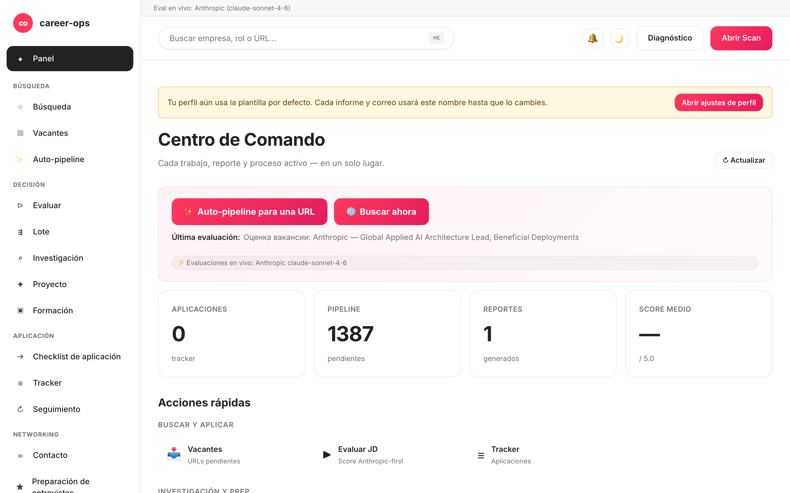

# career-ops-ui

> Una interfaz web limpia, estilo documentación técnica, para la pipeline de búsqueda de empleo con IA [career-ops](https://github.com/santifer/career-ops).
> Busca, evalúa, investiga a fondo, postula y haz seguimiento de cada oferta desde una sola pestaña del navegador — en lugar de saltar entre Claude Code, terminales y archivos markdown.

[English](README.md) | **Español** | [Português (Brasil)](README.pt-BR.md) | [한국어](README.ko-KR.md) | [日本語](README.ja.md) | [Русский](README.ru.md) | [简体中文](README.zh-CN.md) | [繁體中文](README.zh-TW.md) | [Français](README.fr.md)

[](#tests)
[](#tests)
[](#tests)
[](#requirements)
[](LICENSE)
[](https://github.com/Fighter90/career-ops-ui/releases/tag/v1.69.2)

> **🆕 Última versión — v1.69.2**
>
> **fix(test): `npm test` ya no sobrescribe tus `config/profile.yml` / `data/scan-history.tsv` reales.** Un test (`critical-fixes.test.mjs`) importaba `prompts.mjs` (→ `paths.mjs`) en la parte superior del archivo, así que `PROJECT_ROOT` se resolvía al directorio padre **real** antes de que el test fijara `CAREER_OPS_ROOT` a un directorio temporal — y `PUT /api/profile` filtraba una fixture «Acceptance Test» a tu perfil en cada ejecución. Ahora el módulo se carga con `import()` dinámico tras fijar la variable de entorno, y `tests/test-root-isolation.test.mjs` protege toda la suite. Sin cambios de código de producción.
>
> _Suite completa **1086/1086** en verde · i18n + docs sincronizados en los 9 idiomas._

<!-- DO NOT REVERT: locale-specific dashboard screenshot (dashboard-es.png). Each README uses its own ./images/dashboard-<locale>.png — never replace with dashboard-en.png. Generated by scripts/capture-dashboard-screenshots.mjs. -->


## Sobre career-ops

[career-ops](https://career-ops.org) es un sistema open-source de búsqueda de empleo que se ejecuta como slash-comandos dentro de cualquier CLI de programación con IA (Claude Code, Codex, OpenCode, Qwen CLI — otras CLIs compatibles con Claude también funcionan vía la misma superficie de slash-comandos). Es agnóstico del modelo. Evalúa cada puesto contra tu CV con una rúbrica de seis dimensiones en escala 0.0–5.0, genera CVs en PDF adaptados a cada oferta y registra cada postulación de forma local — sin cuentas en la nube, sin telemetría, sin envío automático.

**Este repositorio (career-ops-ui)** es una interfaz web pulida construida sobre el CLI. El CLI sigue siendo el responsable del relleno de formularios (vía Playwright MCP) y de los slash-comandos; la SPA aporta una superficie tipo CRM sobre los mismos archivos `cv.md` / `data/applications.md` / `reports/`. Ambos comparten los mismos datos.

**Umbrales de acción por puntuación** (extraídos de [career-ops.org/docs](https://career-ops.org/docs)):

| Puntuación | Siguiente paso |
|---|---|
| **≥ 4.5** | `/career-ops apply` — encaje alto, postula de inmediato |
| **4.0 – 4.4** | postula, o `/career-ops contacto` para una presentación cálida |
| **3.5 – 3.9** | `/career-ops deep` — investiga antes |
| **< 3.5** | descarta salvo que tengas un motivo concreto |

**Guías canónicas** en [career-ops.org/docs](https://career-ops.org/docs):

- [What is career-ops](https://career-ops.org/docs/introduction/what-is-career-ops)
- [Scan job portals](https://career-ops.org/docs/introduction/guides/scan-job-portals)
- [Apply for a job](https://career-ops.org/docs/introduction/guides/apply-for-a-job)
- [Batch-evaluate offers](https://career-ops.org/docs/introduction/guides/batch-evaluate-offers)
- [Set up Playwright](https://career-ops.org/docs/introduction/guides/set-up-playwright)

## Lanza e inicializa con un solo comando

> **Importante — career-ops-ui es un panel *encima de* [`santifer/career-ops`](https://github.com/santifer/career-ops).** Se ejecuta **dentro** de un proyecto career-ops como `career-ops/web-ui/` y lee tu `cv.md`, `config/`, `data/` desde la carpeta padre mediante `../`. **No funciona de forma independiente** — también necesitas el repositorio padre `career-ops`. No lo clones por separado y ejecutes `init`; usa una de las dos opciones siguientes.

### Opción 1 — un solo curl (recomendado: configura todo)

```bash
curl -fsSL https://raw.githubusercontent.com/Fighter90/career-ops-ui/main/bin/setup.sh | bash
```

Clona **ambos** repositorios, organiza la estructura `career-ops/web-ui/`, instala dependencias, ejecuta el doctor y arranca el servidor en http://127.0.0.1:4317 — luego abre el panel.

### Opción 2 — añadir la UI a un proyecto career-ops existente

Si ya tienes career-ops configurado y solo quieres el panel, clona la UI **dentro** de él como `web-ui`:

```bash
cd career-ops                                                   # ← tu proyecto career-ops existente
git clone https://github.com/Fighter90/career-ops-ui.git web-ui
cd web-ui
npm install
npx career-ops-ui init        # interactive: pick LLM provider + paste its key → parent career-ops/.env
```

La estructura de `web-ui/` anidada es exactamente lo que permite a la UI resolver tu `../cv.md`, `../config/`, `../data/`. Ejecuta `npm link` **una vez** si prefieres escribir `career-ops-ui <verb>` en lugar de `npx career-ops-ui <verb>`.

### Los verbos CLI

```bash
career-ops-ui setup    # bootstrap: install deps → doctor → run (SKIP_START=1 to stop before run)
career-ops-ui init     # pick LLM provider + paste its key (interactive)
career-ops-ui doctor   # verify Node / project / keys / Playwright (exit 0 ⇔ all required green)
career-ops-ui run      # launch the server at http://127.0.0.1:4317
career-ops-ui open     # open + RAISE the dashboard tab in your browser
career-ops-ui help     # list every verb
```

Antepón `npx ` (p.ej. `npx career-ops-ui run`) si no ejecutaste `npm link`. Tras `setup`/`run` la pestaña se abre **y se trae al frente** automáticamente; define `NO_OPEN=1` para desactivar la apertura automática (headless / CI).

### Elige tu proveedor LLM

`init` es el asistente de proveedor — elige **Claude / Claude Code** (`ANTHROPIC_API_KEY`), **Gemini / Gemini CLI** (`GEMINI_API_KEY`), **Codex / OpenCode CLI** (`OPENAI_API_KEY`), o **Auto** (Anthropic → Gemini como respaldo). Las claves se escriben con el eco suprimido y se guardan en el `career-ops/.env` del proyecto padre a través de la misma ruta validada que usa la pestaña de claves API de `#/config`. Forma no interactiva para CI:

```bash
career-ops-ui init --provider claude --anthropic-key sk-ant-… --yes
career-ops-ui init --provider gemini --gemini-key …          --yes
career-ops-ui init --provider auto   --openai-key sk-…       --yes
```

O hazlo a mano: `echo "ANTHROPIC_API_KEY=sk-ant-…" >> career-ops/.env`. El proveedor define `LLM_PROVIDER` (`auto` | `claude` | `gemini`); cámbialo cuando quieras desde **`#/config` → claves API** sin reiniciar.

### Solución de problemas con `init`

Si `career-ops-ui init` falla o el comando no se encuentra (habitual justo después de un `git pull`):

```bash
cd career-ops/web-ui
npm install
npx career-ops-ui init        # npx runs the local bin even without `npm link`
```

Asegúrate de:

- Ejecutar desde **dentro de `career-ops/web-ui/`** — no desde un clon independiente `career-ops-ui/`.
- Que la **carpeta padre `career-ops/` exista** y contenga `cv.md` y `config/`. Si clonaste career-ops-ui por separado, muévelo (o vuelve a clonarlo) para que quede en `career-ops/web-ui/` — o simplemente ejecuta el curl de la opción 1, que organiza la estructura por ti.
- `career-ops-ui doctor` (o `npx career-ops-ui doctor`) imprime exactamente qué falta.

---

## ¿Por qué?

[career-ops](https://github.com/santifer/career-ops) es un potente sistema de búsqueda de empleo basado en Claude Code: pegas una oferta (JD) → obtienes una puntuación de encaje 0-5, un PDF optimizado para ATS y una entrada en el tracker. Funciona muy bien dentro de Claude Code, pero los datos quedan repartidos entre `cv.md`, `data/applications.md`, `reports/*.md`, `data/pipeline.md`, `portals.yml` y `config/profile.yml` — fácil de perder y difícil de revisar de un vistazo.

`career-ops-ui` añade encima una UI pulida:

- **Auto-pipeline** — pega una URL en `#/auto`, un clic: validar → obtener → evaluar → guardar informe → añadir al tracker, con stepper accesible en vivo y enlaces directos a los artefactos.
- **Explora** el tracker, los reportes y la pipeline como si fuera un CRM.
- **Lanza** escaneos (Greenhouse / Ashby / Lever / Workable / SmartRecruiters / Workday **y** hh.ru / Habr Career / Trudvsem / GetMatch / GeekJob) y observa los logs SSE en vivo.
- **Evalúa** una oferta en vivo vía Anthropic (preferido) o Gemini, o consigue un prompt copy-paste para Claude Code si no hay API key configurada.
- **Investigación profunda** de empresas en vivo vía el SDK de Anthropic, con los archivos cv / profile / mode incrustados automáticamente.
- **Edita** `cv.md` con vista previa markdown lado a lado y saneamiento XSS en el servidor.
- **Mantén** el sistema: doctor, verify, normalize, dedup, merge — cada uno con un solo clic.
- **Multi-CLI:** se opera de forma idéntica desde Claude Code, Codex, Cursor, Aider o Gemini CLI — los shims `CLAUDE.md` / `AGENTS.md` / `GEMINI.md` apuntan a una única fuente de verdad.

Es puramente aditivo: nada dentro de `career-ops/` se modifica. Tus personalizaciones siguen siendo tuyas.

---

## Inicio rápido

### 1. Instala primero career-ops

```bash
git clone https://github.com/santifer/career-ops.git
cd career-ops
```

Sigue el [onboarding de career-ops](https://github.com/santifer/career-ops#first-run--onboarding) para que existan `cv.md`, `config/profile.yml` y `portals.yml`.

### 2. Coloca career-ops-ui dentro

```bash
git clone https://github.com/Fighter90/career-ops-ui.git web-ui
```

Tu árbol queda así:

```
career-ops/
├─ cv.md
├─ portals.yml
├─ config/
├─ data/
├─ modes/
├─ reports/
├─ scan.mjs … doctor.mjs … (etc)
└─ web-ui/                 ← este repositorio
   ├─ bin/start.sh
   ├─ package.json
   ├─ server/
   ├─ public/
   └─ tests/
```

### 3. Arranca

```bash
bash web-ui/bin/start.sh
```

El script:

1. Comprueba que Node ≥ 18.
2. Ejecuta `npm install` (solo en el primer arranque, dos dependencias — Express + js-yaml).
3. Arranca el servidor Express en `127.0.0.1:4317`.
4. Abre http://127.0.0.1:4317/ en tu navegador predeterminado.

Puerto / host personalizados:

```bash
PORT=8080 bash web-ui/bin/start.sh
HOST=0.0.0.0 PORT=4317 bash web-ui/bin/start.sh   # expone en la LAN
```

Si has clonado el repositorio en otra ubicación (no como `career-ops/web-ui`), apunta a career-ops mediante una variable de entorno:

```bash
CAREER_OPS_ROOT=/path/to/career-ops bash bin/start.sh
```

---

## Primera ejecución — estado limpio

`career-ops/data/pipeline.md` viene con dos URLs de fixture de QA (`example.com/qa-fixture-*`) para que la suite de pruebas se ejecute de forma hermética. En un clon nuevo verás Pipeline mostrando `2 pendientes` — no son ofertas reales. Bórralas antes de tu primer escaneo:

```bash
make clean-test-fixtures
npm start
```

Abre http://127.0.0.1:4317. El contador de Pipeline debe mostrar `0 pendientes`.

---

## Requisitos

| | |
| --- | --- |
| **Node.js** | ≥ 18 (usa `fetch` nativo y `node:test`) |
| **career-ops** | Clonado y con onboarding completado — ver arriba |
| **Opcional** | `GEMINI_API_KEY` en el `.env` del proyecto padre (modelo gratuito `gemini-2.0-flash`) para evaluar ofertas con un clic. En caso contrario, la UI devuelve un prompt copy-paste para Claude. |
| **Opcional** | Ejecuta desde una IP rusa / VPN si hh.ru devuelve 403. Habr Career funciona desde cualquier IP sin restricciones. |
| **Opcional** | Playwright (ya es dependencia transitiva de career-ops) para la suite de tests e2e. |

---

## Lo que obtienes — por página

| Página           | Qué hace                                                                                                            |
| ---------------- | ------------------------------------------------------------------------------------------------------------------- |
| **Dashboard**    | Conteos agregados (apps / pipeline / reports), puntuación media, desglose por estado, últimas 5 postulaciones + último reporte. |
| **Scan**         | **🌐 Botón único de Scan** — recorre cada fuente habilitada en una sola pasada (Greenhouse / Ashby / Lever / Workable / SmartRecruiters / Workday para EN, hh.ru + Habr Career + Trudvsem + GetMatch + GeekJob para RU). Logs SSE en vivo + tabla de resultados clickable con badges de localización / Remote-Hybrid / indicador de reubicación / salario / filtros de fuente y chips dinámicos de stack / nivel / palabra clave. La tarjeta Active-Companies lista cada board rastreado con el estado de su API. |
| **Pipeline**     | CRUD sobre `data/pipeline.md`. Proxy de previsualización en el servidor (resistente a SSRF, validación por salto de redirecciones, tope de 8 KB en el cuerpo). Salta directo de una URL a la evaluación. |
| **Evaluate**     | Pega la oferta → **Anthropic primero** (preferido cuando ambas claves están presentes), luego Gemini, luego fallback de prompt manual. La ruta de Anthropic incrusta cv / profile / `_shared.md` / `oferta.md` automáticamente (REVIEW-A1). Guardar la oferta en `jds/` es opcional. |
| **Deep research**| Misma cadena de fallback que Evaluate. Anthropic en vivo devuelve ~10-30 KB de markdown fundamentado, guardado en `interview-prep/<empresa>-<rol>.md`. |
| **Modes**        | 7 páginas de modo genéricas (`/#/project`, `/#/training`, `/#/followup`, `/#/batch`, `/#/contacto`, `/#/interview-prep`, `/#/patterns`) con el mismo fallback Anthropic / Gemini / manual. Cada página incluye una pista contextual en línea que describe qué hace el modo (v1.22.0 M-1). |
| **Apply helper** | Genera una lista de comprobación para postular; el relleno real del formulario con Playwright sigue en `/career-ops apply` dentro de Claude Code. |
| **Tracker**      | Tabla filtrable sobre `data/applications.md` (estado, puntuación, texto libre). Botones de un solo clic para `normalize-statuses.mjs` / `dedup-tracker.mjs` / `merge-tracker.mjs`. Los escapes de pipe y de salto de línea son GFM-compliant — nombres como `"Acme \| Co"` hacen el viaje de ida y vuelta sin pérdida. |
| **Reports**      | Navega y lee cada reporte bajo `reports/` con la cabecera parseada (Score / Legitimacy / URL).                     |
| **CV**           | Editor markdown en vivo de `cv.md` con vista previa lado a lado + `cv-sync-check.mjs` con un solo clic + 📁 Upload CV. Saneamiento XSS en el servidor al guardar (`<script>`, `javascript:`, handlers `on*=`). |
| **Profile**      | Vista de solo lectura de `config/profile.yml` + arquetipos — resumen adaptado a la UI.                             |
| **App settings** | Editor in-UI para las claves del `.env` padre: `ANTHROPIC_API_KEY`, `GEMINI_API_KEY`, overrides de modelo, puerto / host. Los secretos van enmascarados al leer. |
| **Health**       | Todas las comprobaciones de instalación como badges OK / OPTIONAL / FAIL + botones para ejecutar `doctor.mjs` y `verify-pipeline.mjs`. |
| **Help**         | Guía de usuario en Markdown dentro de la app (`/#/help`), localizada para los 8 idiomas soportados (en / es / pt-BR / ko-KR / ja / ru / zh-CN / zh-TW). |
| **Activity log** | Rastro de auditoría de cada request que cambia estado (escrituras, ejecuciones, escaneos). Secretos redactados. |
| **Notificaciones** 🔔 *(v1.58.34 / v1.58.35)* | Campana superior con badge rojo de no leídos. Click → drawer derecho con las últimas 50 toasts (por pestaña, por sesión) — Éxito / Error / Info-progreso, cada una con hora local, mensaje y, si aplica, postfix `(MÉTODO /ruta · HTTP NNN)` en `<details>`. La ayuda **§18** documenta cada categoría. El drawer se abre **solo** al hacer clic en la campana (o Enter / Space); se cierra con ×, Esc, o haciendo clic de nuevo. |

Atajos de teclado globales:

- `Ctrl+K` / `Cmd+K` — pone el foco en la búsqueda global.
- Pegar una URL en la búsqueda global la añade automáticamente a la pipeline.
- `Esc` — cierra cualquier modal abierto.

---

## Scan

Escaneo de portales sin coste de tokens que efectivamente devuelve vacantes. **Un botón 🌐 Scan** en la UI ejecuta cada fuente configurada en una única pasada:

- **Greenhouse / Ashby / Lever / Workable / SmartRecruiters / Workday** — boards-api públicas para cada empresa de `portals.yml::tracked_companies` con un patrón ATS reconocible. La lista incluida cubre Stripe, GitLab, Vercel, Cloudflare, Datadog, Discord, Elastic, Grafana Labs, CockroachDB, Fastly, Twilio, Coinbase, Reddit, Robinhood, Affirm, Lyft, Linear, Supabase, PostHog, Ramp, Modal Labs, Railway, Browserbase, JetBrains — amplíala o recórtala libremente.
- **Tablones RSS** — cualquier tablón de empleo que publique un feed RSS/Atom (LaraJobs, WeWorkRemotely, RemoteOK, golangprojects, …). Añade `provider: rss` y la URL del feed a `portals.yml` — no se necesitan cambios de código.
- **hh.ru** — scraping del HTML de `hh.ru/search/vacancy`. Funciona desde cualquier IP, sin clave ni proxy. (La API JSON `api.hh.ru` ya no se usa: ahora devuelve 403 a cualquier cliente programático sin importar IP/User-Agent; la web sirve resultados completos a cualquier cliente tipo navegador, igual que Habr Career.)
- **Habr Career** — scraping HTML de `career.habr.com/vacancies`. Funciona desde cualquier IP, sin autenticación.

### Adaptador RSS

Apunta el escáner a cualquier tablón basado en RSS añadiendo una entrada con `provider: rss` y la clave `rss:` (o `feed_url:`) a `portals.yml`:

```yaml
tracked_companies:
  - name: LaraJobs
    provider: rss
    rss: https://larajobs.com/feed
    enabled: true
  - name: WeWorkRemotely
    provider: rss
    rss: https://weworkremotely.com/remote-jobs.rss
    enabled: true
```

El adaptador analiza bloques `<item>` con un pequeño parser basado en expresiones regulares (sin biblioteca XML). Extrae `title`, `link` (→ `url`), `pubDate` (→ `date`) y `description` (→ `snippet`, sin etiquetas HTML). El trabajo remoto se detecta por `/remote|anywhere/i` en el título o descripción; el nombre de la empresa se obtiene de `dc:creator`, del patrón «Empresa — Puesto» en el título o del hostname del feed. Se aplica el mismo flujo de normalización → filtrado → deduplicación → incorporación al pipeline que para los adaptadores ATS.

Todas las fuentes pasan por la misma pipeline: normalizar → filtrar (`title_filter.positive` / `title_filter.negative`) → deduplicar contra `data/scan-history.tsv` + `data/pipeline.md` + `data/applications.md` → añadir a `data/pipeline.md` → guardar el conjunto completo de resultados en `data/last-scan.json` para la tabla filtrable de la UI.

Configuración vía `portals.yml`:

```yaml
title_filter:
  positive: [backend, engineer, senior, tech lead, golang, php]
  negative: [junior, intern, frontend, ios, android]
tracked_companies:
  - { name: Stripe, enabled: true, careers_url: https://job-boards.greenhouse.io/stripe }
  - { name: Linear, enabled: true, careers_url: https://jobs.ashbyhq.com/linear }
  # ...
russian_portals:
  sources: ["hh", "habr"]   # una o ambas
  area: 113                  # 1=Moscú, 2=SPb, 113=Rusia, 1001=remote
  per_page: 50
  only_remote: false
  queries: ["Senior PHP", "Senior Go", "Tech Lead"]
```

Todas las fuentes fluyen por un único endpoint SSE: `/api/stream/scan?source=ats|regional|both`. El botón **🌐 Scan** de la UI invoca `source=both` para que todos los adaptadores (Greenhouse / Ashby / Lever / Workable / SmartRecruiters / Workday + hh.ru + Habr Career + Trudvsem + GetMatch + GeekJob) se ejecuten en una sola conexión. Respeta `AbortSignal` al desconectarse el cliente — sin fetches huérfanos.

---

## Arquitectura

```
career-ops-ui/
├─ CLAUDE.md                 # instrucciones de agente a nivel de proyecto (canónicas)
├─ AGENTS.md                 # shim Codex / Aider / CLI genérico → CLAUDE.md
├─ GEMINI.md                 # shim Gemini CLI → CLAUDE.md
├─ .aiignore                 # lista de exclusión para herramientas de IA
├─ .claude/                  # configuración del agente Claude Code
│  ├─ agents/                # 3 subagents específicos del proyecto (route, view, test isolation)
│  └─ commands/               # stubs de slash-comandos
├─ bin/start.sh              # launcher one-shot (check Node → npm install → server → open browser)
├─ package.json              # 2 dependencias runtime: express, js-yaml
├─ server/
│  ├─ index.mjs              # orquestador ~130 LOC: middleware + 12 llamadas register<Topic>Routes(app) + catch-all SPA
│  └─ lib/
│     ├─ paths.mjs           # rutas absolutas a archivos de career-ops (consciente de CAREER_OPS_ROOT)
│     ├─ parsers.mjs         # parsers markdown / pipeline / report (escapes de pipe GFM-compliant)
│     ├─ runner.mjs          # runNodeScript() + streamNodeScript() con escalado SIGTERM→SIGKILL + tope de 30 min
│     ├─ security.mjs        # isValidJobUrl, stripDangerousMarkdown, sanitizeJobDescription, isPubliclyExposed, sanitizePathName
│     ├─ safe-fetch.mjs      # fetch con DNS pinning para defensa frente a rebind (v1.21.0, B-1)
│     ├─ file-lock.mjs       # mutex por path para escrituras read-modify-write (v1.21.0, H-6)
│     ├─ rate-limit.mjs      # limitador en memoria por IP para endpoints LLM (v1.21.0, H-5)
│     ├─ prompts.mjs         # bundleProjectContext, buildEvaluationPrompt, buildDeepPrompt, buildModePrompt
│     ├─ store.mjs           # safeReadApps/Pipeline/Reports, checkProfileCustomized, ensureRussianPortalsDefaults
│     ├─ anthropic.mjs       # adaptador mínimo del SDK Anthropic (runAnthropic, hasAnthropicKey, hasGeminiKey)
│     ├─ env-config.mjs      # round-trip de .env con enmascarado de secretos + validación
│     ├─ activity-log.mjs    # middleware de audit trail JSONL (secretos redactados)
│     ├─ dotenv.mjs          # cargador dotenv minúsculo
│     ├─ en-scanner.mjs      # orquestador in-process Greenhouse/Ashby/Lever (consciente de AbortSignal)
│     ├─ ru-scanner.mjs      # orquestador in-process hh.ru + Habr (consciente de AbortSignal)
│     ├─ sources/
│     │  ├─ greenhouse.mjs   # cliente boards-api.greenhouse.io
│     │  ├─ ashby.mjs        # cliente api.ashbyhq.com
│     │  ├─ lever.mjs        # cliente api.lever.co
│     │  ├─ hh.mjs           # cliente api.hh.ru (consciente de UA)
│     │  └─ habr.mjs         # parser HTML de career.habr.com (sin cheerio, solo regex)
│     └─ routes/             # 12 módulos de rutas — uno por tema (P-2)
│        ├─ activity.mjs     # /api/activity
│        ├─ config.mjs       # /api/config (round-trip al .env padre)
│        ├─ content.mjs      # /api/cv, /api/profile, /api/portals, /api/modes
│        ├─ health.mjs       # /api/health, /api/dashboard
│        ├─ help.mjs         # /api/help/:lang
│        ├─ jds.mjs          # CRUD /api/jds
│        ├─ llm.mjs          # /api/evaluate, /api/deep, /api/mode/:slug, /api/apply-helper, /api/interview-prep*
│        ├─ pipeline.mjs     # /api/pipeline + proxy de preview resistente a SSRF
│        ├─ reports.mjs      # /api/reports
│        ├─ runners.mjs      # /api/run/* + /api/stream/{scan,liveness,pdf} + /api/output/pdfs
│        ├─ scan.mjs         # /api/stream/scan-{ru,en} + /api/scan-results
│        └─ tracker.mjs      # /api/tracker
├─ public/                   # SPA estática — sin build step
│  ├─ index.html
│  ├─ css/app.css            # design tokens (paleta estilo docs)
│  └─ js/
│     ├─ api.js              # wrapper de fetch + estado del banner de conexión + helpers de UI + renderer markdown seguro
│     ├─ router.js           # router basado en hash con fallback 404 + soporte de alias
│     ├─ app.js              # arranque + handlers de teclado globales + drawer del sidebar en móvil
│     ├─ lib/{i18n,skills}.js
│     └─ views/              # un archivo por página (dashboard, scan, pipeline, evaluate, deep, apply, tracker, reports, cv, settings, health, config, help, activity, mode-page)
├─ docs/                     # referencia pública: arquitectura, API, data-flows, SDD, conventions, reviews
│  ├─ PROJECT.md             # qué / por qué / para quién
│  ├─ ROADMAP.md             # milestone actual + historial completado
│  ├─ PRODUCTION-READINESS.md # evaluación honesta del estado de despliegue
│  ├─ sdd/{SDD-GUIDE,CONVENTIONS}.md
│  ├─ architecture/{OVERVIEW,SERVER,FRONTEND,API,DATA-FLOWS}.md
│  └─ reviews/REVIEW-*.md
└─ tests/                    # 1000 unit + 70 Playwright + 23 e2e:full + 20 e2e:smoke
   ├─ parsers.test.mjs       # parsers markdown / pipeline / report (funciones puras)
   ├─ api.test.mjs           # cada endpoint, servidor efímero, sin red
   ├─ {ru,en}-scanner.test.mjs   # fetch mockeado
   ├─ pipeline-preview.test.mjs   # validación por salto de redirecciones (REVIEW-B1)
   ├─ ssrf-redirect-rebind.test.mjs   # defensa frente a DNS rebind para safe-fetch (v1.21.0)
   ├─ concurrent-tracker-write.test.mjs   # mutex de escritura por path (v1.21.0 H-6)
   ├─ rate-limit.test.mjs    # limitador LLM por IP (v1.21.0 H-5)
   ├─ path-traversal.test.mjs    # consolidación de sanitizePathName (v1.21.0 H-4)
   ├─ anthropic.test.mjs     # adaptador SDK + log-guard (REVIEW-B4)
   ├─ url-validation.test.mjs    # barrido de rechazo SSRF (FIX-M3 + M6 + M7)
   ├─ cv-xss.test.mjs        # round-trip de stripDangerousMarkdown con decodificación de entidades (v1.22.0 M-4)
   ├─ jd-sanitize.test.mjs   # sanitizeJobDescription
   ├─ help.test.mjs / help-ui.test.mjs    # paridad i18n en los 8 locales
   ├─ playwright-smoke.mjs   # 32 flujos de navegador (CV save, tracker, pipeline, evaluate, config, etc.)
   └─ e2e{,-comprehensive}.mjs   # walkthrough Playwright completo
```

### ¿Por qué sin build step?

Vanilla HTML/CSS/JS mantiene la superficie expuesta al mínimo: un `npm install` de dos dependencias y ya estás corriendo. Sin Webpack, sin Vite, sin `node_modules` infernal. Toda la UI pesa < 30 KB minificada. Si quieres hot-reload durante el desarrollo, `npm run dev` usa el `--watch` nativo de Node.

### Spec-Driven Development

Los cambios no triviales pasan por la pipeline GSD (skills `gsd-*` de `superpowers@claude-plugins-official`):

```
discuss → spec → plan → execute → verify → review
```

Referencia pública: [`docs/sdd/SDD-GUIDE.md`](docs/sdd/SDD-GUIDE.md). Todos los artefactos de planificación viven bajo `.planning/` (gitignored). El árbol `docs/` es el contrato público de larga vida.

---

## Referencia de la API

Todos los endpoints bajo `/api/*`. JSON in / JSON out salvo que se indique lo contrario.

### Health y dashboard

| Método | Path                     | Respuesta                                                                    |
| ------ | ------------------------ | ---------------------------------------------------------------------------- |
| GET    | `/api/health`            | `{ ok, warnings, version, parentVersion, checks: [{name, ok, required, value?}] }` |
| GET    | `/api/dashboard`         | `{ counts, avgScore, byStatus, recent, pipeline, lastReport }`               |
| GET    | `/api/status/providers`  | `{ activeProvider, activeModel, keysConfigured }` — disponibilidad de LLM para el banner de onboarding + sugerencia de coste ⚡ (v1.55.3) |
| GET    | `/api/activity?limit&type` | tail del audit trail `data/activity.jsonl`                                 |
| GET    | `/api/help/:lang`        | guía de usuario in-app localizada (fallback: `en.md`)                        |

### App settings (round-trip al .env padre)

| Método | Path             | Propósito                                                              |
| ------ | ---------------- | ---------------------------------------------------------------------- |
| GET    | `/api/config`    | claves de entorno conocidas con secretos enmascarados                  |
| POST   | `/api/config`    | valida + escribe `.env` padre; aplica los cambios a `process.env` en caliente |

### Archivos de datos

| Método | Path                                | Propósito                                                              |
| ------ | ----------------------------------- | ---------------------------------------------------------------------- |
| GET    | `/api/tracker`                      | `{ rows: [applications.md parseado] }`                                 |
| POST   | `/api/tracker`                      | body `{ company, role, score?, status?, url?, notes?, date? }` — dedup-aware (case-insensitive en company + role) |
| GET    | `/api/pipeline`                     | `{ urls: [...] }`                                                      |
| POST   | `/api/pipeline`                     | body `{ url }` → añade a `data/pipeline.md` con dedup + `isValidJobUrl` |
| GET    | `/api/pipeline/preview?url=…`       | proxy de fetch en el servidor (check SSRF por salto, ≤3 redirects, tope 8 KB) |
| DELETE | `/api/pipeline?url=…`               | elimina una URL                                                        |
| GET    | `/api/reports`                      | lista parseada de `reports/*.md`                                       |
| GET    | `/api/reports/:slug`                | markdown completo + cabecera parseada                                  |
| GET    | `/api/jds`                          | lista de archivos JD guardados                                         |
| GET    | `/api/jds/:name`                    | text/plain — JD en bruto                                               |
| POST   | `/api/jds`                          | body `{ text, slug? }` → guarda en `jds/`                              |
| DELETE | `/api/jds/:name`                    | unlink (sufijo `.txt` obligatorio)                                     |
| GET    | `/api/cv`                           | `{ markdown }`                                                         |
| PUT    | `/api/cv`                           | body `{ markdown }` → escribe `cv.md` (XSS-stripped, ≤1 MB)            |
| GET    | `/api/profile`                      | `{ profile: yaml-parsed, raw: text }`                                  |
| GET    | `/api/portals`                      | `{ portals: yaml-parsed, raw: text }`                                  |
| GET    | `/api/modes`                        | lista de archivos de modo                                              |
| GET    | `/api/modes/:name`                  | text/plain — prompt de modo en bruto                                   |
| GET    | `/api/output/pdfs`                  | lista de PDFs generados                                                |
| GET    | `/api/output/pdfs/:name`            | descarga (`Content-Disposition: attachment`)                          |
| GET    | `/api/interview-prep`               | lista de archivos deep-research guardados                              |
| GET    | `/api/interview-prep/:name`         | `{ name, markdown }`                                                   |
| DELETE | `/api/interview-prep/:name`         | unlink (sufijo `.md` obligatorio)                                      |

### Script runners (buffered, one-shot)

| Método | Path                    | Envuelve                    |
| ------ | ----------------------- | --------------------------- |
| POST   | `/api/run/doctor`       | `node doctor.mjs`           |
| POST   | `/api/run/verify`       | `node verify-pipeline.mjs`  |
| POST   | `/api/run/normalize`    | `node normalize-statuses.mjs` |
| POST   | `/api/run/dedup`        | `node dedup-tracker.mjs`    |
| POST   | `/api/run/merge`        | `node merge-tracker.mjs`    |
| POST   | `/api/run/sync-check`   | `node cv-sync-check.mjs`    |

Todos los runs buffered tienen un tope de 60 s; escalado SIGTERM → SIGKILL tras 5 s de gracia.

### Streams (SSE)

| Método | Path                          | Streamea                            |
| ------ | ----------------------------- | ----------------------------------- |
| GET    | `/api/stream/scan`            | `node scan.mjs` legacy (subproceso) |
| GET    | `/api/stream/scan?source=ats\|regional\|both` | SSE consolidada del scanner in-process — query: `dryRun=1`, `company=…` (solo ATS). |
| GET    | `/api/stream/liveness`        | `node check-liveness.mjs`           |
| GET    | `/api/stream/pdf`             | `node generate-pdf.mjs`             |

Tipos de evento SSE:

```
event: start    data: { script, args?, writeFiles? }
event: log      data: { stream: "stdout"|"stderr", line: string }
event: done     data: { code, counts?, errors? }
event: error    data: { message }
```

### Endpoints LLM (Anthropic primero → Gemini → fallback manual)

| Método | Path                                | Propósito                                                                        |
| ------ | ----------------------------------- | -------------------------------------------------------------------------------- |
| POST   | `/api/evaluate`                     | body `{ jd, save? }` → evaluación de JD (secciones A–G según `oferta.md`)        |
| POST   | `/api/evaluate/test-gemini`         | smoke check de `GEMINI_API_KEY`                                                  |
| POST   | `/api/evaluate/test-anthropic`      | smoke check de `ANTHROPIC_API_KEY`                                               |
| POST   | `/api/deep`                         | body `{ company, role?, run? }` → prompt deep-research o markdown fundamentado en vivo |
| POST   | `/api/mode/:slug`                   | runner genérico de modo; allowlist: `batch`, `contacto`, `followup`, `interview-prep`, `patterns`, `project`, `training` |
| POST   | `/api/apply-helper`                 | body `{ url, jd? }` → checklist de postulación                                   |
| GET    | `/api/scan-results`                 | `{ en: {when, fresh[], filtered[], errors[]}, ru: { ... } }` — último scan       |
| GET    | `/api/scan/regional/config`         | configuración efectiva del scanner regional (queries, negatives, sources).      |

Cuando se establece `run: true` en `/api/deep` o `/api/mode/:slug`, el servidor prefiere Anthropic (cuando ambas claves están presentes), incrusta `cv.md` + `config/profile.yml` + `modes/_shared.md` + el template del modo correspondiente en un bloque `<project_context>`, y devuelve el markdown fundamentado del modelo directamente. Tope blando: 200 KB en el prompt ensamblado — el overflow devuelve 413. Estos endpoints, además, comparten un rate limit en memoria por IP (v1.21.0, H-5): no-op en loopback, 10 req/min/IP cuando `HOST=0.0.0.0`, configurable vía `LLM_RATE_LIMIT="N/Ws"`; al excederse devuelven 429 + `Retry-After`.

---

## Tests

```bash
npm test                       # 1000 tests unit/integración
npm run test:e2e               # 20 smoke e2e (arranca su propio servidor)
npm run test:e2e:full          # 23 e2e completos
npm run test:e2e:browser       # 32 smoke Playwright en navegador
npm run test:coverage          # igual que `npm test` más cobertura V8
```

| Suite                       | Tests | Qué cubre                                                                                                  |
| --------------------------- | ----- | ---------------------------------------------------------------------------------------------------------- |
| `node --test tests/*.test.mjs` (unit + integración) | **1000** | Cada endpoint, servidor efímero, sin red. Incluye parser, scanner (mockeado), runner, anthropic, security headers, XSS, JD sanitize, validación de URL, DNS rebind, mutex de archivo, rate limit, path traversal y paridad i18n. |
| `tests/e2e.mjs` (smoke)      | 20    | Playwright headless: cada ruta renderiza, flujos básicos.                                                  |
| `tests/e2e-comprehensive.mjs` | 23   | Walkthrough Playwright completo: 11 rutas + 12 flujos funcionales.                                         |
| `tests/playwright-smoke.mjs` (`npm run test:e2e:browser`) | **32** | Smoke con navegador: render del dashboard, navegación, cambio de idioma, 404, health, tracker round-trip (BF-1), añadir a pipeline + barrido de URL inválida, reports vacío, evaluate manual fallback, claves de config enmascaradas, CV PUT XSS strip, pipeline preview 400. |
| **Total**                   | **~530** | **0 fallos, 0 flakes**                                                                                  |

Cobertura: ~93% línea / ~83% rama vía `--experimental-test-coverage`.

Los parsers son funciones puras (sin I/O) — probados contra fragmentos de datos reales de `applications.md`, `pipeline.md` y `reports/*.md`. Los tests de API arrancan la app Express en un puerto efímero y ejercitan cada endpoint extremo a extremo. Los tests del scanner mockean `fetch` para que pasen incluso si hh.ru bloquea tu IP. El smoke de Playwright corre contra el servidor in-process y resuelve Playwright vía el `node_modules` del proyecto padre — sin añadir dependencias en `web-ui/`.

CI ejecuta la matriz unit + e2e + Playwright en cada push a `main` contra Node 18 / 20 / 22.

---

## Configuración

Variables de entorno (leídas al arranque del servidor, todas opcionales salvo que se indique):

| Var                  | Valor por defecto  | Propósito                                                                          |
| -------------------- | ------------------ | ---------------------------------------------------------------------------------- |
| `PORT`               | `4317`             | Puerto de bind de Express                                                          |
| `HOST`               | `127.0.0.1`        | Host de bind de Express. La CSP se aplica cuando es non-loopback; gate de auth previsto para v2.0.0. |
| `CAREER_OPS_ROOT`    | `..` desde el script | Dónde encontrar `cv.md`, `data/`, `portals.yml`, `modes/`, etc.                  |
| `ANTHROPIC_API_KEY`  | sin definir        | Habilita el modo live de `/api/evaluate`, `/api/deep`, `/api/mode/:slug` (preferido cuando ambas claves están definidas). |
| `ANTHROPIC_MODEL`    | `claude-sonnet-4-6` | Override del modelo Anthropic.                                                    |
| `GEMINI_API_KEY`     | sin definir        | Se reenvía a `gemini-eval.mjs` y se usa como fallback en `/api/evaluate`.          |
| `GEMINI_MODEL`       | `gemini-2.0-flash` | Override del modelo Gemini.                                                        |
| `OPENAI_API_KEY`     | unset              | Eval en vivo headless (3º en el orden `auto`) + flujo Codex/OpenAI CLI del padre.  |
| `OPENAI_MODEL`       | `gpt-5-codex`      | Override del modelo OpenAI.                                                        |
| `QWEN_API_KEY`       | unset              | Eval en vivo headless vía DashScope (compatible OpenAI, 4º en el orden `auto`).    |
| `QWEN_MODEL`         | `qwen-max`         | Override del modelo Qwen.                                                          |
| `OPENROUTER_API_KEY` | unset              | Eval en vivo headless vía OpenRouter — una clave, 300+ modelos (5º / último en `auto`). |
| `OPENROUTER_MODEL`   | `openrouter/auto`  | id `vendor/model`. Catálogo cargado en vivo desde `GET /api/openrouter/models`.    |
| `LLM_RATE_LIMIT`     | `10/60s`           | Rate limit por IP en endpoints LLM. Formato `N/Ws`. No-op en loopback.             |
| `(el servidor usa un UA por defecto)` | sin definir | Override del User-Agent de hh.ru (ayuda a reducir 403 desde IPs no rusas)   |

Extensión de `portals.yml` reconocida por esta UI (añádelo a tu archivo existente en el proyecto padre):

```yaml
russian_portals:
  sources: ["hh", "habr"]
  area: 113          # id de área de hh.ru
  per_page: 50
  only_remote: false
  queries: ["Senior PHP", "Тимлид Go", ...]
```

También puedes extender cualquier entrada de empresa con una URL `api:` explícita. Ver [`docs/portals-examples.md`](docs/portals-examples.md) (en este repositorio) para bloques listos para pegar de 24 empresas verificadas.

---

## Notas de seguridad

- El servidor hace bind a `127.0.0.1` por defecto — nunca se expone a internet sin un `HOST=0.0.0.0` explícito.
- **Saneamiento de paths (v1.21.0)**: cada parámetro de ruta `:name` / `:slug` pasa por `sanitizePathName()` en `server/lib/security.mjs` — elimina caracteres fuera de `[\w-.]`, descarta dot-runs iniciales, colapsa dot-runs internos, recorta a 200 caracteres y devuelve 400 si queda vacío. Sustituye 10 copias duplicadas de regex que antes dejaban pasar `..pdf` / `....md`.
- **Defensa frente a DNS rebind (v1.21.0)**: `/api/pipeline/preview` y `/api/auto-pipeline` enrutan a través de `server/lib/safe-fetch.mjs::safeGet` — una sola resolución DNS, conexión TCP fijada al IP resuelto, SNI/Host apuntando al hostname original. Sin segunda consulta DNS, sin ventana TOCTOU.
- **Mutex de escritura concurrente (v1.21.0)**: `tracker.mjs`, `pipeline.mjs` (POST + DELETE) y el paso tracker de `auto-pipeline.mjs` envuelven el read-modify-write en `withFileLock(path, fn)` de `server/lib/file-lock.mjs`. Los POST concurrentes ya no pierden filas (condición de carrera resuelta).
- **Rate limit de LLM (v1.21.0)**: `/api/evaluate`, `/api/deep`, `/api/mode/:slug` y `/api/auto-pipeline` llevan el `llmRateLimit` de `server/lib/rate-limit.mjs`. **No-op en loopback**; 10 req/min/IP con `HOST=0.0.0.0`. Configurable vía `LLM_RATE_LIMIT="N/Ws"`. Devuelve 429 + `Retry-After`.
- **Saneamiento XSS en CV (refuerzo de v1.22.0)**: `stripDangerousMarkdown` ahora es consciente de entidades — decodifica `&lt;`, `&gt;`, `&#NN;`, `&#xHH;` antes del regex de strip, de modo que payloads como `&lt;script&gt;` y `java&#115;cript:` no puedan pasarse de contrabando.
- **Pistas visuales redundantes (v1.22.0, WCAG 1.4.1)**: en formularios, los campos con error incorporan un icono además del color, evitando depender únicamente del color para transmitir estado (M-3).
- Las invocaciones de subproceso usan `spawn` con arrays de argumentos — **sin interpolación de shell, jamás**. El runner `bash` usa `--noprofile --norc` para ignorar `~/.bashrc`.
- Los endpoints de streaming matan el proceso hijo al desconectarse el cliente (sin scanners huérfanos).
- Los endpoints de escritura solo tocan paths conocidos de career-ops: `data/`, `jds/`, `cv.md`, `config/`, `portals.yml`, `output/`, `reports/`, `interview-prep/`, `modes/_profile.md`. Nunca en otra ubicación.
- El banner de conexión hace ping a `/api/health` con backoff exponencial (3 s → 6 s → 12 s → 24 s → 60 s) mientras está desconectado y se limpia automáticamente al recuperarse (v1.22.0 M-6).

---

## Limitaciones

Los modos completamente impulsados por LLM (`oferta`, `deep`, `contacto`, `apply`, `batch`, `patterns`, `followup`) necesitan un LLM para ejecutarse de verdad. La web UI te ofrece tres opciones:

1. **Anthropic (preferido)** — establece `ANTHROPIC_API_KEY` en el `.env` del proyecto padre. Enruta a través de `runAnthropic` con `cv.md` / `config/profile.yml` / `modes/_shared.md` / template del modo incrustados automáticamente (REVIEW-A1). Verificado en vivo desde v1.8.0+ con `claude-sonnet-4-6` devolviendo 26 KB de markdown fundamentado en una llamada deep-research.
2. **`gemini-eval.mjs`** como fallback — funciona sin más configuración cuando solo `GEMINI_API_KEY` está definida.
3. **Prompt copy-paste** — cuando ninguna clave está definida, la UI genera un prompt listo, formateado para Claude Code / ChatGPT / Gemini Web.

El flujo existente de relleno de formularios con Playwright `/career-ops apply` dentro de Claude Code sigue siendo la única forma de auto-rellenar formularios de postulación de verdad — el *Apply helper* de la UI genera una lista de comprobación en su lugar.

Para la evaluación de production-readiness (gates de despliegue, registro de riesgos, trabajo diferido), ver [`docs/PRODUCTION-READINESS.md`](docs/PRODUCTION-READINESS.md). Resumen: listo para single-tenant loopback; la exposición a la LAN espera al gate de autenticación P-12 en v2.0.

---

## Localización

La interfaz incluye **8 idiomas** — `en`, `es`, `pt-BR`, `ko`, `ja`, `ru`, `zh-CN`, `zh-TW`. Desde **v1.60.0 (I18N-SPLIT)** las traducciones viven **un archivo por idioma** en [`public/js/lib/locales/`](public/js/lib/locales/) — `i18n-dict.<lang>.js`, una tabla plana `clave → texto` — más `i18n-dict.aliases.js`. [`i18n-dict.js`](public/js/lib/i18n-dict.js) los ensambla en `window.__I18N_DICT`; [`i18n.js`](public/js/lib/i18n.js) resuelve `t('clave', 'fallback')`. Sin paso de compilación ni fetch — el traductor edita un solo archivo de idioma.

**Añadir o cambiar un texto:** añade la misma clave a los 8 archivos de idioma (la paridad está protegida por tests), úsala con `data-i18n="scan.newButton"` o `t('scan.newButton')`, y ejecuta `npm test`.

```js
// public/js/lib/locales/i18n-dict.en.js   →   'scan.newButton': 'Run scan',
// public/js/lib/locales/i18n-dict.es.js   →   'scan.newButton': 'Ejecutar búsqueda',
```

📖 **Guía completa:** [`docs/LOCALIZATION.md`](docs/LOCALIZATION.md) — el layout por idioma, el mecanismo `@alias`, cómo añadir un idioma nuevo y todas las comprobaciones de CI.

---

## Contribuir

Issues y PRs bienvenidos. Reglas de la casa:

- Ejecuta `npm test` antes de hacer push — **1000 checks en verde** es el mínimo (más 70 Playwright si tocas la UI).
- Los cambios no triviales pasan por la pipeline GSD. Ver [`docs/sdd/SDD-GUIDE.md`](docs/sdd/SDD-GUIDE.md).
- No modifiques nada del proyecto padre `career-ops/` desde dentro de este repositorio. Todo el sentido es que sea una capa no invasiva. Reglas duras en [`CLAUDE.md`](CLAUDE.md).
- Conventional commits: `feat`, `fix`, `refactor`, `docs`, `test`, `chore`, `perf`, `ci`. Scope opcional: `feat(scan):`. Breaking change: `feat!:`.
- Los tests deben ser CI-isolated — bootstrap de fixtures vía `mkdtempSync` o `CAREER_OPS_ROOT=$(mktemp -d)`.

¿Operas el repositorio desde un CLI distinto a Claude (Codex, Aider, Cursor, Gemini)? Lee [`AGENTS.md`](AGENTS.md) o [`GEMINI.md`](GEMINI.md) — ambos hacen shim al canónico `CLAUDE.md`.

---

---

## 🌍 Primeros pasos — tras la instalación

Tras la instalación con un solo comando tienes dos clones git vacíos, andamiados con
archivos starter `cv.md`, `config/profile.yml`, `portals.yml`, `data/applications.md`
y `data/pipeline.md` que contienen marcadores **EDIT ME**. La página Health
debería estar toda en verde en el primer arranque. Sustituye los placeholders por
tus datos reales:

### 1. Crea tu CV (`cv.md`)

Tienes tres opciones:

- **Opción A — pegar un currículum existente:** abre `career-ops/cv.md`, sustituye
  los placeholders EDIT-ME por tu currículum real en markdown limpio
  (secciones: Summary, Experience, Projects, Education, Skills). Cuanto más
  simple, mejor — `career-ops` lo lee como texto plano.
- **Opción B — subir desde la UI:** clic en **CV** en el sidebar →
  **📁 Upload CV** → elige tu archivo `.md` / `.txt` → revisa la vista previa →
  clic en **💾 Save**.
- **Opción C — pásale tu URL de LinkedIn a Claude Code:** abre Claude Code en
  `career-ops/`, ejecuta `/career-ops`, pega tu URL de LinkedIn y pide
  *"extrae mi CV de esto y escríbelo a cv.md"*.

Haz cada métrica específica (p. ej. *"reduje la latencia p99 en un 38%"* en lugar de
*"mejoré el rendimiento"*). La pipeline de evaluación lee las métricas directamente
de este archivo.

### 2. Edita tu perfil (`config/profile.yml`)

```bash
$EDITOR career-ops/config/profile.yml
```

Sustituye los placeholders de nombre completo, email, ubicación, LinkedIn, roles
objetivo, arquetipos y salario objetivo. Los **arquetipos** son el campo más
importante — son la base con la que cada JD se compara contra ti.

### 3. Ajusta el scanner (`portals.yml`)

```bash
$EDITOR career-ops/portals.yml
```

Establece `title_filter.positive` (p. ej. `"PHP"`, `"Go"`, `"Backend"`, `"Senior"`)
y `title_filter.negative` (p. ej. `"Junior"`, `"Java"`, `"iOS"`) según tu
stack y tu seniority. La lista `tracked_companies` incluida ya trae
3 boards Greenhouse / Ashby verificados (GitLab, Vercel, Linear). Para 24+ bloques
adicionales listos para pegar, ver [`docs/portals-examples.md`](docs/portals-examples.md).

Si quieres escaneo de hh.ru / Habr Career, edita el bloque `russian_portals:`
que creó el script de setup — añade tus consultas de búsqueda (p. ej. `"Senior PHP"`,
`"Тимлид Go"`).

### 4. (Opcional) Claves de API de LLM

La UI prefiere Anthropic sobre Gemini cuando ambas están presentes. Una, otra o
ninguna funcionan — sin clave, **Evaluate** devuelve un prompt copy-paste
para Claude Code en su lugar.

```bash
# Anthropic (preferida)
echo "ANTHROPIC_API_KEY=sk-ant-..." >> career-ops/.env
# Gemini (fallback)
echo "GEMINI_API_KEY=AIza..." >> career-ops/.env
```

O configúralas vía la página **App settings** en la UI (`/#/config`) — mismo
archivo, enmascaradas al leer, aplicadas a `process.env` de inmediato.

### 5. Verifica y empieza a trabajar

Refresca la página Health — cada check obligatorio debería estar en verde. Después:

1. Clic en **🌐 Scan** → espera ~5 segundos → Greenhouse / Ashby / Lever / Workable / SmartRecruiters / Workday +
   hh.ru / Habr Career se escanean, las vacantes aparecen en la tabla inferior.
2. Clic en cualquier título → la oferta original se abre en una nueva pestaña.
3. Filtra por chips de stack (PHP / Go / Backend / Senior) hasta que veas
   algo prometedor.
4. Copia la URL → pégala en **Pipeline** → clic en **Evaluate** para
   puntuarla 0-5 en vivo (Anthropic / Gemini) u obtener un prompt manual.
5. Los reportes aterrizan en `reports/`, el tracker en `data/applications.md`,
   la investigación profunda en vivo en `interview-prep/`. Todo visible en la UI.

> Las traducciones de esta guía viven en cada README específico por idioma:
> [English](README.md) · [Português (Brasil)](README.pt-BR.md) ·
> [한국어](README.ko-KR.md) · [日本語](README.ja.md) ·
> [Русский](README.ru.md) · [简体中文](README.zh-CN.md) ·
> [繁體中文](README.zh-TW.md)

---

## Licencia

MIT. Ver [LICENSE](LICENSE).

Construido sobre [career-ops](https://github.com/santifer/career-ops) por [santifer](https://santifer.io). Gracias por la brillante pipeline.

## Colaboradores

Gracias a todas las personas que ayudan a construir career-ops-ui. El proyecto lo mantiene [Fighter90](https://github.com/Fighter90) y mejora gracias a las contribuciones de la comunidad — consulta la lista completa en el [gráfico de colaboradores](https://github.com/Fighter90/career-ops-ui/graphs/contributors).

[](https://github.com/Fighter90/career-ops-ui/graphs/contributors)
