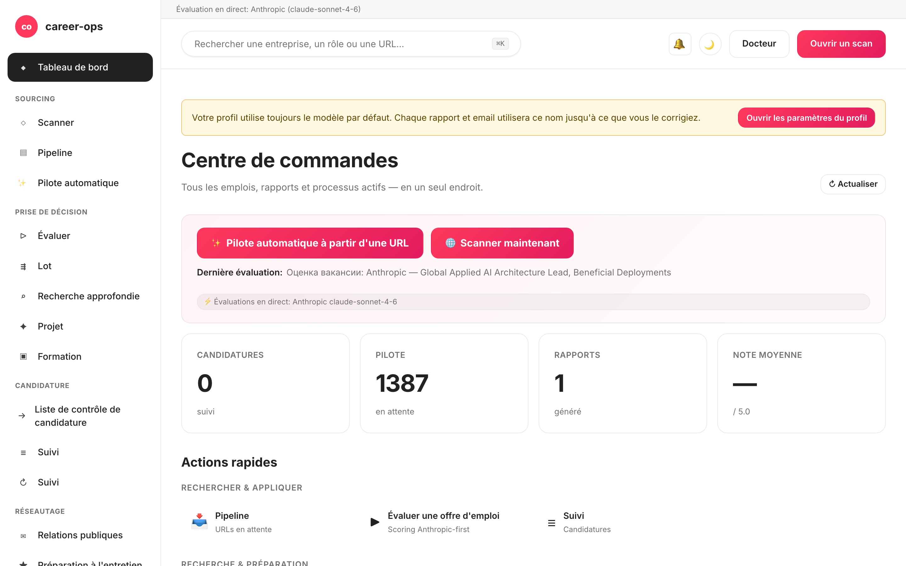

# career-ops-ui

> Une interface web épurée, façon documentation, pour le pipeline de recherche d'emploi IA [career-ops](https://github.com/santifer/career-ops).
> Cherchez, évaluez, approfondissez, postulez et suivez chaque offre depuis un seul onglet de navigateur — au lieu de jongler entre Claude Code, des terminaux et des fichiers markdown.

[English](README.md) | [Español](README.es.md) | [Português (Brasil)](README.pt-BR.md) | [한국어](README.ko-KR.md) | [日本語](README.ja.md) | [Русский](README.ru.md) | [简体中文](README.zh-CN.md) | [繁體中文](README.zh-TW.md) | **Français**

[](#tests)
[](#tests)
[](#tests)
[](#requirements)
[](LICENSE)
[](https://github.com/Fighter90/career-ops-ui/releases/tag/v1.69.2)

> **🆕 Dernière version — v1.69.2**
>
> **fix(test) : `npm test` n'écrase plus vos `config/profile.yml` / `data/scan-history.tsv` réels.** Un test (`critical-fixes.test.mjs`) importait `prompts.mjs` (→ `paths.mjs`) en haut du fichier, donc `PROJECT_ROOT` se résolvait vers le dossier parent **réel** avant que le test ne fixe `CAREER_OPS_ROOT` sur un dossier temporaire — et `PUT /api/profile` injectait une fixture « Acceptance Test » dans votre profil à chaque exécution. Le module est désormais chargé via `import()` dynamique après avoir fixé la variable d'environnement, et `tests/test-root-isolation.test.mjs` protège toute la suite. Aucun changement de code de production.
>
> _Suite complète **1086/1086** au vert · i18n + docs synchronisés dans les 9 langues._



## À propos de career-ops

[career-ops](https://career-ops.org) est un système de recherche d'emploi open-source qui s'exécute sous forme de commandes slash dans n'importe quel CLI de codage IA (Claude Code, Codex, OpenCode, Qwen CLI — d'autres CLI compatibles Claude fonctionnent aussi via la même surface de commandes slash). Indépendant du modèle. Il évalue chaque offre par rapport à votre CV avec une grille à six dimensions de 0,0 à 5,0, génère des CV PDF sur mesure, et suit chaque candidature localement — pas de comptes cloud, pas de télémétrie, pas de soumission automatique.

**Ce dépôt (career-ops-ui)** est une interface web soignée par-dessus. Le CLI continue de gérer le remplissage de formulaires (via Playwright MCP) et les modes en commandes slash ; la SPA vous offre une surface navigateur de style CRM sur les mêmes fichiers `cv.md` / `data/applications.md` / `reports/`. Les deux partagent les mêmes données.

**Seuils d'action par score** (depuis [career-ops.org/docs](https://career-ops.org/docs)) :

| Score | Étape suivante |
|---|---|
| **≥ 4.5** | `/career-ops apply` — forte adéquation, foncez tout de suite |
| **4.0 – 4.4** | postulez, ou `/career-ops contacto` pour une intro chaleureuse |
| **3.5 – 3.9** | `/career-ops deep` — recherchez d'abord |
| **< 3.5** | passez sauf raison précise |

**Guides canoniques** sur [career-ops.org/docs](https://career-ops.org/docs) :

- [What is career-ops](https://career-ops.org/docs/introduction/what-is-career-ops)
- [Scan job portals](https://career-ops.org/docs/introduction/guides/scan-job-portals)
- [Apply for a job](https://career-ops.org/docs/introduction/guides/apply-for-a-job)
- [Batch-evaluate offers](https://career-ops.org/docs/introduction/guides/batch-evaluate-offers)
- [Set up Playwright](https://career-ops.org/docs/introduction/guides/set-up-playwright)

## Lancer et initialiser en une commande

> **Important — career-ops-ui est un tableau de bord *au-dessus de* [`santifer/career-ops`](https://github.com/santifer/career-ops).** Il s'exécute **à l'intérieur** d'un projet career-ops sous `career-ops/web-ui/` et lit vos `cv.md`, `config/`, `data/` depuis le dossier parent via `../`. Il **ne fonctionne pas de manière autonome** — vous avez également besoin du dépôt parent `career-ops`. Ne le clonez pas seul et ne lancez pas `init` ; utilisez l'une des deux options ci-dessous.

### Option 1 — un seul curl (recommandé : configure tout)

```bash
curl -fsSL https://raw.githubusercontent.com/Fighter90/career-ops-ui/main/bin/setup.sh | bash
```

Clone **les deux** dépôts, organise la structure `career-ops/web-ui/`, installe les dépendances, lance le doctor et démarre le serveur sur http://127.0.0.1:4317 — puis ouvre le tableau de bord.

### Option 2 — ajouter l'UI à un projet career-ops existant

Si vous avez déjà career-ops configuré et souhaitez seulement le tableau de bord, clonez l'UI **à l'intérieur** de celui-ci en tant que `web-ui` :

```bash
cd career-ops                                                   # ← votre projet career-ops existant
git clone https://github.com/Fighter90/career-ops-ui.git web-ui
cd web-ui
npm install
npx career-ops-ui init        # interactive: pick LLM provider + paste its key → parent career-ops/.env
```

La structure `web-ui/` imbriquée est précisément ce qui permet à l'UI de résoudre vos `../cv.md`, `../config/`, `../data/`. Exécutez `npm link` **une fois** si vous préférez taper `career-ops-ui <verb>` au lieu de `npx career-ops-ui <verb>`.

### Les verbes CLI

```bash
career-ops-ui setup    # bootstrap: install deps → doctor → run (SKIP_START=1 to stop before run)
career-ops-ui init     # pick LLM provider + paste its key (interactive)
career-ops-ui doctor   # verify Node / project / keys / Playwright (exit 0 ⇔ all required green)
career-ops-ui run      # launch the server at http://127.0.0.1:4317
career-ops-ui open     # open + RAISE the dashboard tab in your browser
career-ops-ui help     # list every verb
```

Préfixez avec `npx ` (ex. `npx career-ops-ui run`) si vous n'avez pas exécuté `npm link`. Après `setup`/`run` l'onglet s'ouvre **et est ramené au premier plan** automatiquement ; définissez `NO_OPEN=1` pour désactiver l'ouverture automatique (headless / CI).

### Choisir votre fournisseur LLM

`init` est l'assistant de fournisseur — choisissez **Claude / Claude Code** (`ANTHROPIC_API_KEY`), **Gemini / Gemini CLI** (`GEMINI_API_KEY`), **Codex / OpenCode CLI** (`OPENAI_API_KEY`), ou **Auto** (repli Anthropic → Gemini). Les clés sont saisies avec l'écho supprimé et écrites dans le `career-ops/.env` parent via le même chemin validé qu'utilise l'onglet clés-API de `#/config`. Forme non interactive pour la CI :

```bash
career-ops-ui init --provider claude --anthropic-key sk-ant-… --yes
career-ops-ui init --provider gemini --gemini-key …          --yes
career-ops-ui init --provider auto   --openai-key sk-…       --yes
```

Ou définissez-le manuellement : `echo "ANTHROPIC_API_KEY=sk-ant-…" >> career-ops/.env`. Le fournisseur définit `LLM_PROVIDER` (`auto` | `claude` | `gemini`) ; changez-le à tout moment depuis **`#/config` → clés API** sans redémarrer.

### Dépannage de `init`

Si `career-ops-ui init` échoue ou si la commande est introuvable (fréquent juste après un `git pull`) :

```bash
cd career-ops/web-ui
npm install
npx career-ops-ui init        # npx runs the local bin even without `npm link`
```

Assurez-vous :

- D'exécuter depuis **l'intérieur de `career-ops/web-ui/`** — pas depuis un clone autonome `career-ops-ui/`.
- Que le **dossier parent `career-ops/` existe** et contient `cv.md` et `config/`. Si vous avez cloné career-ops-ui seul, déplacez-le (ou re-clonez-le) pour qu'il se trouve à `career-ops/web-ui/` — ou exécutez simplement le curl de l'option 1, qui organise la structure pour vous.
- `career-ops-ui doctor` (ou `npx career-ops-ui doctor`) affiche exactement ce qui manque.

---

## Pourquoi ?

[career-ops](https://github.com/santifer/career-ops) est un puissant système de recherche d'emploi piloté par Claude Code : collez une offre → obtenez un score d'adéquation 0-5, un PDF optimisé ATS, et une entrée de suivi. Il fonctionne très bien dans Claude Code, mais les données vivent à travers `cv.md`, `data/applications.md`, `reports/*.md`, `data/pipeline.md`, `portals.yml`, `config/profile.yml` — faciles à perdre, difficiles à survoler.

`career-ops-ui` pose une UI soignée par-dessus :

- **Auto-pipeline** — collez une URL d'offre sur `#/auto`, cliquez une fois : valider → récupérer → évaluer → enregistrer le rapport → ajouter au tracker, avec un stepper accessible en direct et des liens profonds vers les artefacts.
- **Parcourez** le tracker, les rapports et le pipeline comme un CRM.
- **Déclenchez** des scans (Greenhouse / Ashby / Lever / Workable / SmartRecruiters / Workday **et** hh.ru / Habr Career / Trudvsem / GetMatch / GeekJob) et regardez les journaux SSE en direct.
- **Évaluez** une offre en live via Anthropic (préféré) ou Gemini, ou obtenez un prompt à copier-coller pour Claude Code si aucune clé API n'est définie.
- **Recherche approfondie** d'entreprises en live via le SDK Anthropic, avec les fichiers cv / profil / mode inlinés automatiquement.
- **Éditez** `cv.md` avec un aperçu markdown côte à côte et une désinfection XSS côté serveur.
- **Maintenez** le système : doctor, verify, normalize, dedup, merge — un clic chacun.
- **Multi-CLI :** piloté à l'identique depuis Claude Code, Codex, Cursor, Aider ou Gemini CLI — les shims `CLAUDE.md` / `AGENTS.md` / `GEMINI.md` pointent vers une source unique de vérité.

Ce sont de pures additions : rien dans `career-ops/` ne change. Toutes vos personnalisations restent les vôtres.

---

## Démarrage rapide

### 1. Installez d'abord career-ops

```bash
git clone https://github.com/santifer/career-ops.git
cd career-ops
```

Suivez l'[onboarding career-ops](https://github.com/santifer/career-ops#first-run--onboarding) pour que `cv.md`, `config/profile.yml` et `portals.yml` existent.

### 2. Déposez career-ops-ui à l'intérieur

```bash
git clone https://github.com/Fighter90/career-ops-ui.git web-ui
```

Votre arborescence ressemble maintenant à :

```
career-ops/
├─ cv.md
├─ portals.yml
├─ config/
├─ data/
├─ modes/
├─ reports/
├─ scan.mjs … doctor.mjs … (etc)
└─ web-ui/                 ← this repo
   ├─ bin/start.sh
   ├─ package.json
   ├─ server/
   ├─ public/
   └─ tests/
```

### 3. Lancez

```bash
bash web-ui/bin/start.sh
```

Le script :

1. Vérifie Node ≥ 18.
2. `npm install` (uniquement au premier lancement, trois dépendances — Express + js-yaml + multer).
3. Démarre le serveur Express sur `127.0.0.1:4317`.
4. Ouvre http://127.0.0.1:4317/ dans votre navigateur par défaut.

Port / hôte personnalisés :

```bash
PORT=8080 bash web-ui/bin/start.sh
HOST=0.0.0.0 PORT=4317 bash web-ui/bin/start.sh   # expose on LAN
```

Si vous avez cloné le dépôt ailleurs (pas comme `career-ops/web-ui`), pointez vers career-ops via une variable d'environnement :

```bash
CAREER_OPS_ROOT=/path/to/career-ops bash bin/start.sh
```

---

## Premier lancement — état propre

`career-ops/data/pipeline.md` est livré avec deux URL de fixture QA (`example.com/qa-fixture-*`) pour que la suite de tests s'exécute de façon hermétique. Sur un clone neuf, le Pipeline affichera `2 pending` — ce ne sont pas de vraies offres. Purgez-les avant votre premier scan :

```bash
make clean-test-fixtures        # removes pipeline.md fixture rows + qa-fixture-* applications.md rows
npm start
```

Ouvrez http://127.0.0.1:4317. Le compteur du Pipeline doit maintenant indiquer `0 pending`. Le Makefile est idempotent — le relancer sur une arborescence propre est un no-op.

---

## Prérequis

| | |
| --- | --- |
| **Node.js** | ≥ 18 (utilise les `fetch`, `node:test` natifs) |
| **career-ops** | Cloné et configuré — voir ci-dessus |
| **Optionnel** | `GEMINI_API_KEY` dans le `.env` du projet parent (modèle du palier gratuit `gemini-2.0-flash`) pour l'évaluation d'offre en un clic. Sinon l'UI renvoie un prompt à copier-coller pour Claude. |
| **Optionnel** | Lancez depuis une IP / un VPN russe si hh.ru renvoie 403. Habr Career fonctionne depuis n'importe quelle IP. |
| **Optionnel** | Playwright (déjà une dépendance transitive de career-ops) pour la suite de tests e2e. |

---

## Ce que vous obtenez — par page

| Page             | Ce qu'elle fait                                                                                                    |
| ---------------- | ------------------------------------------------------------------------------------------------------------------ |
| **Dashboard**    | Compteurs agrégés (candidatures / pipeline / rapports), score moyen, répartition par statut, 5 dernières candidatures + dernier rapport. |
| **Scan**         | **🌐 Bouton Scan unique** — exécute chaque source activée d'un coup (Greenhouse / Ashby / Lever / Workable / SmartRecruiters / Workday pour l'EN, hh.ru + Habr Career + Trudvsem + GetMatch + GeekJob pour le RU). Journal SSE en direct + tableau de résultats cliquable avec lieu / badge Remote-Hybrid / drapeau de relocalisation / salaire / filtres de source et puces dynamiques de stack / niveau / mot-clé. La carte Active-Companies liste chaque site suivi avec sa santé d'API. |
| **Pipeline**     | CRUD sur `data/pipeline.md`. Proxy d'aperçu côté serveur (anti-SSRF, validation de redirection par saut, plafond de corps de 8 Ko). Sautez directement d'une URL à l'évaluation. |
| **Evaluate**     | Collez l'offre → **Anthropic d'abord** (préféré quand les deux clés sont présentes), puis Gemini, puis repli prompt manuel. La voie Anthropic inline cv / profil / `_shared.md` / `oferta.md` automatiquement (REVIEW-A1). Sauvegarde de l'offre dans `jds/` optionnelle. |
| **Deep research**| Même chaîne de repli qu'Evaluate. L'Anthropic live renvoie ~10-30 Ko de markdown ancré enregistré dans `interview-prep/<company>-<role>.md`. |
| **Modes**        | 7 pages de mode génériques (`/#/project`, `/#/training`, `/#/followup`, `/#/batch`, `/#/contacto`, `/#/interview-prep`, `/#/patterns`) avec le même repli Anthropic / Gemini / manuel. |
| **Apply helper** | Génère une checklist de soumission ; le remplissage réel via Playwright reste dans `/career-ops apply` dans Claude Code. |
| **Tracker**      | Tableau filtrable sur `data/applications.md` (statut, score, texte libre). `normalize-statuses.mjs` / `dedup-tracker.mjs` / `merge-tracker.mjs` en un clic. Les échappements de barre + retour ligne sont conformes GFM — des noms comme `"Acme \| Co"` font l'aller-retour sans perte. |
| **Reports**      | Parcourez et lisez chaque rapport sous `reports/` avec en-tête analysé (Score / Légitimité / URL). |
| **CV**           | Éditeur markdown live pour `cv.md` avec aperçu côte à côte + `cv-sync-check.mjs` en un clic + 📁 Import CV. Désinfection XSS côté serveur à la sauvegarde (`<script>`, `javascript:`, gestionnaires `on*=`). |
| **Profile**      | Vue en lecture seule de `config/profile.yml` + archétypes — résumé adapté à l'UI. |
| **App settings** | Éditeur dans l'UI pour les clés `.env` parent : `ANTHROPIC_API_KEY`, `GEMINI_API_KEY`, surcharges de modèle, port / hôte. Secrets masqués à la lecture. |
| **Health**       | Toutes les vérifications de config en badges OK / OPTIONAL / FAIL + boutons pour lancer `doctor.mjs` et `verify-pipeline.mjs`. |
| **Help**         | Guide utilisateur Markdown dans l'app (`/#/help`), localisé pour les 9 langues prises en charge (en / es / fr / pt-BR / ko-KR / ja / ru / zh-CN / zh-TW). |
| **Activity log** | Journal d'audit de chaque requête modifiant l'état (écritures, exécutions, scans). Secrets caviardés. |
| **Notifications** 🔔 *(v1.58.34 / v1.58.35)* | Cloche dans la barre du haut avec badge rouge de non-lus. Cliquez pour faire glisser un tiroir listant les 50 derniers toasts (par onglet, par session) — Success / Error / Info-progress, chacun avec un horodatage localisé, le message humain, et tout postfixe `(METHOD /path · HTTP NNN)` rangé dans un `<details>`. L'aide **§18** documente chaque catégorie. Le tiroir s'ouvre **uniquement** au clic sur la cloche (ou clavier Entrée / Espace) ; se ferme via ×, Échap, ou re-clic sur la cloche. |

Raccourcis clavier globaux :

- `Ctrl+K` / `Cmd+K` — focalise la recherche globale. L'indice du pied de page s'adapte par plateforme (⌘K sur macOS/iOS, Ctrl+K ailleurs) avec le verbe localisé (v1.58.20).
- Coller une URL dans la recherche globale l'ajoute automatiquement au pipeline.
- `Échap` — ferme toute modale ouverte **ou** le tiroir de notifications (v1.58.34).

---

## Scan

Scan de portails sans coût en tokens qui renvoie réellement des offres. **Un bouton 🌐 Scan** dans l'UI exécute chaque source configurée en une seule passe :

- **Greenhouse / Ashby / Lever / Workable / SmartRecruiters / Workday** — boards-api public pour chaque entreprise de `portals.yml::tracked_companies` avec un pattern ATS reconnaissable. La liste fournie couvre Stripe, GitLab, Vercel, Cloudflare, Datadog, Discord, Elastic, Grafana Labs, CockroachDB, Fastly, Twilio, Coinbase, Reddit, Robinhood, Affirm, Lyft, Linear, Supabase, PostHog, Ramp, Modal Labs, Railway, Browserbase, JetBrains — étendez ou réduisez librement.
- **Tableaux RSS** — tout tableau d'offres d'emploi exposant un flux RSS/Atom (LaraJobs, WeWorkRemotely, RemoteOK, golangprojects, …). Ajoutez `provider: rss` et l'URL du flux dans `portals.yml` — aucune modification du code nécessaire.
- **hh.ru** — scraping du HTML de `hh.ru/search/vacancy`. Fonctionne depuis n'importe quelle IP, sans clé ni proxy. (L'API JSON `api.hh.ru` n'est plus utilisée : elle renvoie désormais 403 à tout client programmatique quels que soient l'IP/User-Agent ; le site sert des résultats complets à tout client de type navigateur, comme Habr Career.)
- **Habr Career** — scraping HTML de `career.habr.com/vacancies`. Fonctionne depuis n'importe quelle IP, sans auth.

### Adaptateur RSS

Pointez le scanner vers n'importe quel tableau basé sur RSS en ajoutant une entrée avec `provider: rss` et la clé `rss:` (ou `feed_url:`) dans `portals.yml` :

```yaml
tracked_companies:
  - name: LaraJobs
    provider: rss
    rss: https://larajobs.com/feed
    enabled: true
  - name: WeWorkRemotely
    provider: rss
    rss: https://weworkremotely.com/remote-jobs.rss
    enabled: true
```

L'adaptateur analyse les blocs `<item>` avec un petit parseur basé sur des expressions régulières (aucune bibliothèque XML nécessaire). Il extrait `title`, `link` (→ `url`), `pubDate` (→ `date`) et `description` (→ `snippet`, balises HTML supprimées). Le travail à distance est détecté par `/remote|anywhere/i` dans le titre ou la description ; le nom de l'entreprise est extrait de `dc:creator`, du pattern « Entreprise — Poste » dans le titre, ou du nom d'hôte du flux. Le même flux normalisation → filtrage → déduplification → ajout au pipeline s'applique comme pour les adaptateurs ATS.

Toutes les sources passent par le même pipeline : normaliser → filtrer (`title_filter.positive` / `title_filter.negative`) → dédupliquer contre `data/scan-history.tsv` + `data/pipeline.md` + `data/applications.md` → ajouter à `data/pipeline.md` → enregistrer l'ensemble complet des résultats dans `data/last-scan.json` pour le tableau filtrable de l'UI.

Configurez via `portals.yml` :

```yaml
title_filter:
  positive: [backend, engineer, senior, tech lead, golang, php]
  negative: [junior, intern, frontend, ios, android]
tracked_companies:
  - { name: Stripe, enabled: true, careers_url: https://job-boards.greenhouse.io/stripe }
  - { name: Linear, enabled: true, careers_url: https://jobs.ashbyhq.com/linear }
  # ...
russian_portals:
  sources: ["hh", "habr"]   # one or both
  area: 113                  # 1=Moscow, 2=SPb, 113=Russia, 1001=remote
  per_page: 50
  only_remote: false
  queries: ["Senior PHP", "Senior Go", "Tech Lead"]
```

Toutes les sources passent par un endpoint SSE unique : `/api/stream/scan?source=ats|regional|both`. Le bouton **🌐 Scan** appelle `source=both` pour que chaque adaptateur (Greenhouse / Ashby / Lever / Workable / SmartRecruiters / Workday + hh.ru + Habr Career + Trudvsem + GetMatch + GeekJob) tourne dans une seule connexion. Respecte `AbortSignal` à la déconnexion du client — pas de fetch orphelin.

---

## Architecture

```
career-ops-ui/
├─ CLAUDE.md                 # project-level agent instructions (canonical)
├─ AGENTS.md                 # Codex / Aider / generic CLI shim → CLAUDE.md
├─ GEMINI.md                 # Gemini CLI shim → CLAUDE.md
├─ .aiignore                 # exclusion list for AI tools
├─ .claude/                  # Claude Code agent config
│  ├─ agents/                # 3 project-specific subagents (route, view, test isolation)
│  └─ commands/               # slash-command stubs
├─ bin/start.sh              # one-shot launcher (Node check → npm install → server → open browser)
├─ package.json              # 2 runtime deps: express, js-yaml
├─ server/
│  ├─ index.mjs              # ~130 LOC orchestrator: middleware + 12 register<Topic>Routes(app) calls + SPA catch-all
│  └─ lib/
│     ├─ paths.mjs           # absolute paths to career-ops files (CAREER_OPS_ROOT aware)
│     ├─ parsers.mjs         # markdown / pipeline / report parsers (GFM-compliant pipe escapes)
│     ├─ runner.mjs          # runNodeScript() + streamNodeScript() with SIGTERM→SIGKILL escalation + 30 min cap
│     ├─ security.mjs        # isValidJobUrl, stripDangerousMarkdown, sanitizeJobDescription, isPubliclyExposed
│     ├─ prompts.mjs         # bundleProjectContext, buildEvaluationPrompt, buildDeepPrompt, buildModePrompt
│     ├─ store.mjs           # safeReadApps/Pipeline/Reports, checkProfileCustomized, ensureRussianPortalsDefaults
│     ├─ anthropic.mjs       # minimal Anthropic SDK adapter (runAnthropic, hasAnthropicKey, hasGeminiKey)
│     ├─ env-config.mjs      # .env round-trip with secret masking + validation
│     ├─ activity-log.mjs    # JSONL audit trail middleware (secrets redacted)
│     ├─ dotenv.mjs          # tiny dotenv loader
│     ├─ en-scanner.mjs      # in-process Greenhouse/Ashby/Lever orchestrator (AbortSignal aware)
│     ├─ ru-scanner.mjs      # in-process hh.ru + Habr orchestrator (AbortSignal aware)
│     ├─ sources/
│     │  ├─ greenhouse.mjs   # boards-api.greenhouse.io client
│     │  ├─ ashby.mjs        # api.ashbyhq.com client
│     │  ├─ lever.mjs        # api.lever.co client
│     │  ├─ hh.mjs           # api.hh.ru client (UA-aware)
│     │  └─ habr.mjs         # career.habr.com HTML parser (no cheerio, regex only)
│     └─ routes/             # 12 route modules — one per topic (P-2)
│        ├─ activity.mjs     # /api/activity
│        ├─ config.mjs       # /api/config (parent .env round-trip)
│        ├─ content.mjs      # /api/cv, /api/profile, /api/portals, /api/modes
│        ├─ health.mjs       # /api/health, /api/dashboard
│        ├─ help.mjs         # /api/help/:lang
│        ├─ jds.mjs          # /api/jds CRUD
│        ├─ llm.mjs          # /api/evaluate, /api/deep, /api/mode/:slug, /api/apply-helper, /api/interview-prep*
│        ├─ pipeline.mjs     # /api/pipeline + SSRF-safe preview proxy
│        ├─ reports.mjs      # /api/reports
│        ├─ runners.mjs      # /api/run/* + /api/stream/{scan,liveness,pdf} + /api/output/pdfs
│        ├─ scan.mjs         # /api/stream/scan-{ru,en} + /api/scan-results
│        └─ tracker.mjs      # /api/tracker
├─ public/                   # static SPA — no build step
│  ├─ index.html
│  ├─ css/app.css            # design tokens (docs-style palette)
│  └─ js/
│     ├─ api.js              # fetch wrapper + connection-banner state + UI helpers + safe markdown renderer
│     ├─ router.js           # hash-based router with 404 fallback + alias support
│     ├─ app.js              # boot + global keyboard handlers + mobile sidebar drawer
│     ├─ lib/{i18n,skills}.js
│     └─ views/              # one file per page (dashboard, scan, pipeline, evaluate, deep, apply, tracker, reports, cv, settings, health, config, help, activity, mode-page)
├─ docs/                     # public reference: architecture, API, data-flows, SDD, conventions, reviews
│  ├─ PROJECT.md             # what / why / for-whom
│  ├─ ROADMAP.md             # current milestone + completed history
│  ├─ PRODUCTION-READINESS.md # honest deployment-gate assessment
│  ├─ sdd/{SDD-GUIDE,CONVENTIONS}.md
│  ├─ architecture/{OVERVIEW,SERVER,FRONTEND,API,DATA-FLOWS}.md
│  └─ reviews/REVIEW-*.md
└─ tests/                    # 1001 unit + 70 Playwright + 23/23 e2e:full + 20 e2e:smoke (baseline @ v1.61.0)
   ├─ parsers.test.mjs       # markdown / pipeline / report parsers (pure functions)
   ├─ api.test.mjs           # every endpoint, ephemeral server, no network
   ├─ {ru,en}-scanner.test.mjs   # mocked fetch
   ├─ pipeline-preview.test.mjs   # per-hop redirect validation (REVIEW-B1)
   ├─ anthropic.test.mjs     # SDK adapter + log-guard test (REVIEW-B4)
   ├─ url-validation.test.mjs    # SSRF reject sweep (FIX-M3 + M6 + M7)
   ├─ cv-xss.test.mjs        # stripDangerousMarkdown round-trip
   ├─ jd-sanitize.test.mjs   # sanitizeJobDescription
   ├─ help.test.mjs / help-ui.test.mjs    # i18n parity across all 9 locales
   ├─ playwright-smoke.mjs   # 12 browser flows (CV save, tracker, pipeline, evaluate, config, etc.)
   └─ e2e{,-comprehensive}.mjs   # full Playwright walkthrough
```

### Pourquoi pas d'étape de build ?

Du HTML/CSS/JS vanilla garde la surface minuscule : un seul `npm install` de deux dépendances et vous tournez. Pas de Webpack, pas de Vite, pas de `node_modules` infernal. Toute l'UI fait < 30 Ko minifiée. Si vous voulez du hot-reload en développement, `npm run dev` utilise le `--watch` intégré de Node.

### Développement piloté par les specs

Les changements non triviaux passent par le pipeline GSD (skills `gsd-*` de `superpowers@claude-plugins-official`) :

```
discuss → spec → plan → execute → verify → review
```

Référence publique : [`docs/sdd/SDD-GUIDE.md`](docs/sdd/SDD-GUIDE.md). Tous les artefacts de planification vivent sous `.planning/` (gitignored). L'arborescence `docs/` est le contrat public durable.

---

## Référence API

Tous les endpoints sous `/api/*`. JSON entrant / JSON sortant sauf mention contraire.

### Health & dashboard

| Method | Path                     | Response                                                                    |
| ------ | ------------------------ | --------------------------------------------------------------------------- |
| GET    | `/api/health`            | `{ ok, warnings, version, parentVersion, checks: [{name, ok, required, value?}] }` |
| GET    | `/api/dashboard`         | `{ counts, avgScore, byStatus, recent, pipeline, lastReport }`              |
| GET    | `/api/status/providers`  | `{ activeProvider, activeModel, keysConfigured }` — disponibilité LLM pour la bannière d'onboarding + indice de coût ⚡ (v1.55.3) ; inclut `openrouter` (v1.57.0) |
| GET    | `/api/openrouter/models` | `{ models:[{id,name,context_length}], fallback, cached }` — proxy du catalogue OpenRouter pour le menu de modèles de `#/config` (v1.57.0) |
| GET    | `/api/activity?limit&type` | fin du journal d'audit `data/activity.jsonl`                              |
| GET    | `/api/help/:lang`        | guide utilisateur localisé dans l'app (repli : `en.md`)                     |

### App settings (aller-retour .env parent)

| Method | Path             | Purpose                                                                |
| ------ | ---------------- | ---------------------------------------------------------------------- |
| GET    | `/api/config`    | clés env connues avec secrets masqués                                  |
| POST   | `/api/config`    | valide + écrit le `.env` parent ; s'applique à `process.env` en place  |

### Fichiers de données

| Method | Path                                | Purpose                                                                |
| ------ | ----------------------------------- | ---------------------------------------------------------------------- |
| GET    | `/api/tracker`                      | `{ rows: [parsed applications.md] }`                                   |
| POST   | `/api/tracker`                      | corps `{ company, role, score?, status?, url?, notes?, date? }` — dédup-conscient (insensible à la casse sur entreprise + poste) |
| GET    | `/api/pipeline`                     | `{ urls: [...] }`                                                      |
| POST   | `/api/pipeline`                     | corps `{ url }` → ajoute à `data/pipeline.md` avec dédup + `isValidJobUrl` |
| GET    | `/api/pipeline/preview?url=…`       | proxy de fetch côté serveur (vérif SSRF par saut, ≤3 redirections, plafond 8 Ko) |
| DELETE | `/api/pipeline?url=…`               | retire une URL                                                         |
| GET    | `/api/reports`                      | liste analysée de `reports/*.md`                                       |
| GET    | `/api/reports/:slug`                | markdown complet + en-tête analysé                                     |
| GET    | `/api/jds`                          | liste des fichiers d'offres enregistrés                                |
| GET    | `/api/jds/:name`                    | text/plain — offre brute                                               |
| POST   | `/api/jds`                          | corps `{ text, slug? }` → enregistre dans `jds/`                       |
| DELETE | `/api/jds/:name`                    | unlink (suffixe `.txt` requis)                                         |
| GET    | `/api/cv`                           | `{ markdown }`                                                         |
| PUT    | `/api/cv`                           | corps `{ markdown }` → écrit `cv.md` (XSS retiré, ≤1 Mo)               |
| GET    | `/api/profile`                      | `{ profile: yaml-parsed, raw: text }`                                  |
| GET    | `/api/portals`                      | `{ portals: yaml-parsed, raw: text }`                                  |
| GET    | `/api/modes`                        | liste des fichiers de mode                                             |
| GET    | `/api/modes/:name`                  | text/plain — prompt de mode brut                                       |
| GET    | `/api/output/pdfs`                  | liste des PDF générés                                                  |
| GET    | `/api/output/pdfs/:name`            | téléchargement (`Content-Disposition: attachment`)                    |
| GET    | `/api/interview-prep`               | liste des fichiers de recherche approfondie enregistrés               |
| GET    | `/api/interview-prep/:name`         | `{ name, markdown }`                                                   |
| DELETE | `/api/interview-prep/:name`         | unlink (suffixe `.md` requis)                                         |

### Lanceurs de scripts (bufferisés, one-shot)

| Method | Path                    | Wraps                       |
| ------ | ----------------------- | --------------------------- |
| POST   | `/api/run/doctor`       | `node doctor.mjs`           |
| POST   | `/api/run/verify`       | `node verify-pipeline.mjs`  |
| POST   | `/api/run/normalize`    | `node normalize-statuses.mjs` |
| POST   | `/api/run/dedup`        | `node dedup-tracker.mjs`    |
| POST   | `/api/run/merge`        | `node merge-tracker.mjs`    |
| POST   | `/api/run/sync-check`   | `node cv-sync-check.mjs`    |

Toutes les exécutions bufferisées plafonnent à 60 s ; escalade SIGTERM → SIGKILL après un délai de grâce de 5 s.

### Flux (SSE)

| Method | Path                          | Streams                            |
| ------ | ----------------------------- | ---------------------------------- |
| GET    | `/api/stream/scan`            | `node scan.mjs` legacy (sous-processus) |
| GET    | `/api/stream/scan?source=ats\|regional\|both` | scanner consolidé en-process SSE — query : `dryRun=1`, `company=…` (ATS uniquement). |
| GET    | `/api/stream/liveness`        | `node check-liveness.mjs`          |
| GET    | `/api/stream/pdf`             | `node generate-pdf.mjs`            |

Types d'événements SSE :

```
event: start    data: { script, args?, writeFiles? }
event: log      data: { stream: "stdout"|"stderr", line: string }
event: done     data: { code, counts?, errors? }
event: error    data: { message }
```

### Endpoints LLM (Anthropic d'abord → Gemini → repli manuel)

| Method | Path                                | Purpose                                                                          |
| ------ | ----------------------------------- | -------------------------------------------------------------------------------- |
| POST   | `/api/evaluate`                     | corps `{ jd, save? }` → évaluation d'offre (sections A–G selon `oferta.md`)      |
| POST   | `/api/evaluate/test-gemini`         | smoke check `GEMINI_API_KEY`                                                     |
| POST   | `/api/evaluate/test-anthropic`      | smoke check `ANTHROPIC_API_KEY`                                                  |
| POST   | `/api/deep`                         | corps `{ company, role?, run? }` → prompt de recherche approfondie ou markdown ancré live |
| POST   | `/api/mode/:slug`                   | lanceur de mode générique ; liste blanche : `batch`, `contacto`, `followup`, `interview-prep`, `patterns`, `project`, `training` |
| POST   | `/api/apply-helper`                 | corps `{ url, jd? }` → checklist de candidature                                 |
| GET    | `/api/scan-results`                 | `{ en: {when, fresh[], filtered[], errors[]}, ru: { ... } }` — dernier scan      |
| GET    | `/api/scan/regional/config`         | config effective du scanner régional (queries, négatifs, sources). |

Quand `run: true` est défini sur `/api/deep` ou `/api/mode/:slug`, le serveur préfère Anthropic (quand les deux clés sont présentes), inline `cv.md` + `config/profile.yml` + `modes/_shared.md` + le modèle de mode pertinent dans un bloc `<project_context>`, et renvoie le markdown ancré du modèle directement. Plafond souple : 200 Ko sur le prompt assemblé — le dépassement renvoie 413.

---

## Tests

```bash
npm test                       # 1001 unit/integration tests
npm run test:e2e               # 20 smoke e2e (boots own server)
npm run test:e2e:full          # 23 comprehensive e2e
npm run test:e2e:browser       # 70 Playwright browser (smoke + full-cycle + forms + locale-sweep)
npm run test:coverage          # same as `npm test` plus V8 coverage
```

| Suite                       | Tests | Quoi                                                                                                       |
| --------------------------- | ----- | ---------------------------------------------------------------------------------------------------------- |
| `node --test tests/*.test.mjs` (unit + intégration) | **1001** | Chaque endpoint, serveur éphémère, sans réseau. 110 fichiers : parsers, scanners (mockés), runners, anthropic/openai, en-têtes de sécurité, XSS, désinfection d'offre, validation d'URL, parité i18n, + les suites de fixes UX v1.55→v1.56. |
| `tests/e2e.mjs` (smoke)      | 20    | Playwright headless : chaque route s'affiche, flux de base.                                                |
| `tests/e2e-comprehensive.mjs` | 23    | Parcours Playwright complet : 11 routes + 12 flux fonctionnels.                                            |
| `npm run test:e2e:browser` (`playwright-smoke` + `playwright-full-cycle` + `playwright-forms` + `playwright-locale-sweep`) | **70** | Piloté par navigateur : rendu du dashboard, navigation, changement de langue, 404, health, aller-retour tracker, ajout pipeline + balayage URL-invalide, rapports, repli manuel d'évaluation, clés de config masquées, retrait XSS au PUT du CV, aperçu pipeline 400, SSE auto-pipeline. |
| **Total**                   | **1114** | **0 échec, 0 flake**                                                                                    |

Couverture : ~95,7 % ligne / ~87 % branche via `--experimental-test-coverage`.

Les parsers sont des fonctions pures (sans I/O) — testées contre de vrais fragments de données de `applications.md`, `pipeline.md` et `reports/*.md`. Les tests d'API démarrent l'app Express sur un port éphémère et exercent chaque endpoint de bout en bout. Les tests de scanner mockent `fetch` pour passer même si hh.ru bloque votre IP. Le smoke navigateur Playwright tourne contre le serveur en-process et résout Playwright via le `node_modules` du projet parent — aucune nouvelle dépendance dans `web-ui/`.

La CI exécute la matrice unit + e2e + Playwright à chaque push sur `main` contre Node 18 / 20 / 22.

---

## Configuration

Variables d'environnement (lues au démarrage du serveur, toutes optionnelles sauf mention) :

| Var                  | Défaut             | Objet                                                                              |
| -------------------- | ------------------ | ---------------------------------------------------------------------------------- |
| `PORT`               | `4317`             | Port de bind Express                                                               |
| `HOST`               | `127.0.0.1`        | Hôte de bind Express. La CSP s'attache en non-loopback ; barrière d'auth prévue pour la v2.0.0. |
| `CAREER_OPS_ROOT`    | `..` du script     | Où trouver `cv.md`, `data/`, `portals.yml`, `modes/`, etc.                         |
| `ANTHROPIC_API_KEY`  | non défini         | Active le mode live de `/api/evaluate`, `/api/deep`, `/api/mode/:slug` (préféré quand les deux clés sont définies). |
| `ANTHROPIC_MODEL`    | `claude-sonnet-4-6` | Surcharge le modèle Anthropic.                                                    |
| `GEMINI_API_KEY`     | non défini         | Transmis à `gemini-eval.mjs` et utilisé en repli pour `/api/evaluate`.            |
| `GEMINI_MODEL`       | `gemini-2.0-flash` | Surcharge le modèle Gemini.                                                       |
| `OPENAI_API_KEY`     | non défini         | Éval live headless (3e dans l'ordre `auto`) + flux Codex/OpenAI CLI parent.        |
| `OPENAI_MODEL`       | `gpt-5-codex`      | Surcharge le modèle OpenAI.                                                       |
| `QWEN_API_KEY`       | non défini         | Éval live headless via DashScope compatible OpenAI (4e dans l'ordre `auto`).       |
| `QWEN_MODEL`         | `qwen-max`         | Surcharge le modèle Qwen.                                                         |
| `OPENROUTER_API_KEY` | non défini         | Éval live headless via OpenRouter — une clé, 300+ modèles (5e / dernier dans `auto`). |
| `OPENROUTER_MODEL`   | `openrouter/auto`  | id `vendor/model`. Catalogue chargé en live depuis `GET /api/openrouter/models`.   |
| `(server uses default UA)`      | non défini         | Surcharge l'User-Agent hh.ru (aide à réduire les 403 depuis des IP non-RU)        |

Extension `portals.yml` reconnue par cette UI (à ajouter à votre fichier existant dans le projet parent) :

```yaml
russian_portals:
  sources: ["hh", "habr"]
  area: 113          # hh.ru area id
  per_page: 50
  only_remote: false
  queries: ["Senior PHP", "Тимлид Go", ...]
```

Vous pouvez aussi étendre toute entrée d'entreprise avec une URL `api:` explicite. Voir [`docs/portals-examples.md`](docs/portals-examples.md) (dans ce dépôt) pour des blocs prêts à coller pour 24 entreprises vérifiées.

---

## Notes de sécurité

- Le serveur se lie à `127.0.0.1` par défaut — jamais exposé à Internet sans `HOST=0.0.0.0` explicite.
- **Désinfection de chemin (v1.21.0)** : chaque paramètre de route `:name` / `:slug` passe par `sanitizePathName()` dans `server/lib/security.mjs` — retire les non-`[\w-.]`, supprime les séries de points en tête, réduit les séries internes, plafonne à 200 caractères, vide → 400. Remplace 10 copies de regex dupliquées qui laissaient passer `..pdf` / `....md`.
- **Défense anti-DNS-rebind (v1.21.0)** : `/api/pipeline/preview` et `/api/auto-pipeline` passent par `server/lib/safe-fetch.mjs::safeGet` — une résolution DNS, connexion TCP épinglée, SNI/Host ciblés sur le hostname d'origine. Pas de seconde résolution, pas de fenêtre TOCTOU.
- **Mutex d'écriture concurrente (v1.21.0)** : `tracker.mjs`, `pipeline.mjs` (POST + DELETE), et l'étape tracker de `auto-pipeline.mjs` enveloppent le read-modify-write dans `withFileLock(path, fn)` de `server/lib/file-lock.mjs`. Les POST concurrents ne perdent plus de lignes.
- **Rate-limit LLM (v1.21.0)** : `/api/evaluate`, `/api/deep`, `/api/mode/:slug`, `/api/auto-pipeline` portent `llmRateLimit` de `server/lib/rate-limit.mjs`. **No-op en loopback** ; 10 req/min/IP sur `HOST=0.0.0.0`. Configurable via `LLM_RATE_LIMIT="N/Ws"`. 429 + `Retry-After`.
- **Retrait XSS du CV (durcissement v1.22.0)** : `stripDangerousMarkdown` est désormais conscient des entités — décode `&lt;`, `&gt;`, `&#NN;`, `&#xHH;` avant le retrait par regex pour que `&lt;script&gt;` et `java&#115;cript:` ne puissent pas contourner.
- Les invocations de sous-processus utilisent `spawn` avec des tableaux d'arguments — **jamais d'interpolation shell**. Le runner `bash` utilise `--noprofile --norc` pour ignorer `~/.bashrc`.
- Les endpoints de streaming tuent le processus enfant à la déconnexion du client (pas de scanners orphelins).
- Les endpoints d'écriture ne touchent que des chemins career-ops connus : `data/`, `jds/`, `cv.md`, `config/`, `portals.yml`, `output/`, `reports/`, `interview-prep/`, `modes/_profile.md`. Jamais ailleurs.
- La bannière de connexion ping `/api/health` avec un backoff exponentiel (3 s → 6 s → 12 s → 24 s → 60 s) pendant la déconnexion et s'efface automatiquement à la reprise (v1.22.0 M-6).

---

## Limites

Les modes entièrement pilotés par LLM (`oferta`, `deep`, `contacto`, `apply`, `batch`, `patterns`, `followup`) ont besoin d'un LLM pour s'exécuter réellement. L'UI résout un fournisseur selon l'ordre `auto` **Anthropic → Gemini → OpenAI → Qwen → OpenRouter** (ou ce que `LLM_PROVIDER` épingle) :

1. **Anthropic (préféré)** — définissez `ANTHROPIC_API_KEY` dans le `.env` du projet parent. Passe par `runAnthropic` avec `cv.md` / `config/profile.yml` / `modes/_shared.md` / modèle de mode inlinés automatiquement (REVIEW-A1). Vérifié en live dès la v1.8.0 avec `claude-sonnet-4-6` renvoyant 26 Ko de markdown ancré pour un appel de recherche approfondie.
2. **`gemini-eval.mjs`** en repli — fonctionne d'emblée quand seule `GEMINI_API_KEY` est définie.
3. **OpenAI / Qwen / OpenRouter** — clients compatibles OpenAI sans dépendance (le chemin `_tailProvider()`). **OpenRouter** (v1.57.0) est le plus flexible : une `OPENROUTER_API_KEY` donne accès à 300+ modèles de tous les grands labos, et le menu de modèles de `#/config` est rempli en live depuis `GET /api/openrouter/models` (proxy côté serveur, CSP-safe, repli hors-ligne curé).
4. **Prompt à copier-coller** — quand aucune clé n'est définie, l'UI génère un prompt prêt formaté pour Claude Code / ChatGPT / Gemini Web.

Le flux de remplissage de formulaire Playwright existant dans `/career-ops apply` au sein de Claude Code reste le seul moyen de vraiment remplir les formulaires automatiquement — l'*Apply helper* de l'UI génère une checklist à la place.

Pour l'évaluation de production-readiness (barrières de déploiement, registre des risques, travail différé), voir [`docs/PRODUCTION-READINESS.md`](docs/PRODUCTION-READINESS.md). En bref : prêt pour le single-tenant en loopback ; l'exposition LAN attend la barrière d'auth P-12 de la v2.0.

---

## Localisation

L'UI est livrée en **9 locales** — `en`, `es`, `fr`, `pt-BR`, `ko`, `ja`, `ru`, `zh-CN`, `zh-TW`. Depuis la **v1.60.0 (I18N-SPLIT)**, les traductions vivent **un fichier par locale** sous [`public/js/lib/locales/`](public/js/lib/locales/) — `i18n-dict.<lang>.js`, chacune une table plate `key → string` — plus un `i18n-dict.aliases.js` partagé. [`i18n-dict.js`](public/js/lib/i18n-dict.js) les assemble dans `window.__I18N_DICT` ; [`i18n.js`](public/js/lib/i18n.js) résout `t('key', 'fallback')`. Pas d'étape de build, pas de fetch runtime — un traducteur édite un seul fichier de langue de façon isolée.

**Ajouter ou changer une chaîne :**

```js
// public/js/lib/locales/i18n-dict.en.js   →   'scan.newButton': 'Run scan',
// public/js/lib/locales/i18n-dict.fr.js   →   'scan.newButton': 'Lancer le scan',
// …add the same key to all 9 locale files (parity is gated)
```

Utilisez-la ensuite via `data-i18n="scan.newButton"` dans le markup ou `t('scan.newButton')` en JS, puis lancez `npm test`. Pour ajouter une langue toute neuve, enregistrez-la dans `i18n.js` (`LANGS` + `detect()`), l'assembleur, `index.html`, et l'outillage qui énumère les locales.

📖 **Guide complet :** [`docs/LOCALIZATION.md`](docs/LOCALIZATION.md) — la disposition par locale, le mécanisme `@alias`, l'ajout d'une nouvelle locale pas à pas, et chaque barrière CI i18n.

---

## Contribuer

Issues et PR bienvenues. Règles de la maison :

- Lancez `npm test` avant de pousser — le tout vert est la barre (plus les Playwright si vous touchez à l'UI).
- Les changements non triviaux passent par le pipeline GSD. Voir [`docs/sdd/SDD-GUIDE.md`](docs/sdd/SDD-GUIDE.md).
- Ne modifiez rien dans le projet parent `career-ops/` depuis ce dépôt. Tout l'intérêt est que ce soit une surcouche non invasive. Règles strictes dans [`CLAUDE.md`](CLAUDE.md).
- Commits conventionnels : `feat`, `fix`, `refactor`, `docs`, `test`, `chore`, `perf`, `ci`. Scope optionnel : `feat(scan):`. Changement cassant : `feat!:`.
- Les tests doivent être isolés pour la CI — amorcez les fixtures via `mkdtempSync` ou `CAREER_OPS_ROOT=$(mktemp -d)`.

Vous pilotez le dépôt depuis un CLI non-Claude (Codex, Aider, Cursor, Gemini) ? Lisez [`AGENTS.md`](AGENTS.md) ou [`GEMINI.md`](GEMINI.md) — les deux renvoient au `CLAUDE.md` canonique.

---

---

## 🌍 Pour commencer — premiers pas après l'installation

Après l'installation en une commande, vous avez deux clones git vides, échafaudés avec des fichiers `cv.md`, `config/profile.yml`, `portals.yml`, `data/applications.md` et `data/pipeline.md` de départ contenant des marqueurs **EDIT ME**. La page Health devrait déjà être toute verte au premier lancement. Remplacez les placeholders par vos vraies données :

### 1. Créez votre CV (`cv.md`)

Vous avez trois options :

- **Option A — collez un CV existant :** ouvrez `career-ops/cv.md`, remplacez les placeholders EDIT-ME par votre vrai CV en markdown propre (sections : Résumé, Expérience, Projets, Formation, Compétences). Plus c'est simple, mieux c'est — `career-ops` le lit comme du texte brut.
- **Option B — importez depuis l'UI :** cliquez sur **CV** dans la barre latérale → **📁 Import CV** → choisissez votre fichier `.md` / `.txt` → vérifiez l'aperçu → cliquez sur **💾 Save**.
- **Option C — donnez votre URL LinkedIn à Claude Code :** ouvrez Claude Code dans `career-ops/`, lancez `/career-ops`, collez votre URL LinkedIn, et demandez *« extract my CV from this and write it to cv.md »*.

Rendez chaque métrique précise (p. ex. *« réduit la latence p99 de 38 % »* et non *« amélioré les performances »*). Le pipeline d'évaluation lit les métriques directement dans ce fichier.

### 2. Éditez votre profil (`config/profile.yml`)

```bash
$EDITOR career-ops/config/profile.yml
```

Remplacez les placeholders pour nom complet, e-mail, lieu, LinkedIn, postes cibles, archétypes, objectif salarial. Les **archétypes** sont le champ le plus important — c'est ainsi que chaque offre est mise en correspondance avec vous.

### 3. Réglez le scanner (`portals.yml`)

```bash
$EDITOR career-ops/portals.yml
```

Définissez `title_filter.positive` (p. ex. `"PHP"`, `"Go"`, `"Backend"`, `"Senior"`) et `title_filter.negative` (p. ex. `"Junior"`, `"Java"`, `"iOS"`) selon votre stack et votre séniorité. La liste `tracked_companies` fournie inclut déjà 3 sites Greenhouse / Ashby vérifiés (GitLab, Vercel, Linear). Pour 24+ blocs prêts à coller, voir [`docs/portals-examples.md`](docs/portals-examples.md).

Si vous voulez scanner hh.ru / Habr Career, éditez le bloc `russian_portals:` créé par le script de setup — ajoutez vos requêtes (p. ex. `"Senior PHP"`, `"Тимлид Go"`).

### 4. (Optionnel) Clés API LLM

L'UI préfère Anthropic à Gemini quand les deux sont présents. L'un, l'autre ou aucun fonctionne — sans clé, **Evaluate** renvoie un prompt à copier-coller pour Claude Code à la place.

```bash
# Anthropic (preferred)
echo "ANTHROPIC_API_KEY=sk-ant-..." >> career-ops/.env
# Gemini (fallback)
echo "GEMINI_API_KEY=AIza..." >> career-ops/.env
```

Ou définissez-les via la page **App settings** de l'UI (`/#/config`) — même fichier, masqué à la lecture, appliqué à `process.env` immédiatement.

### 5. Vérifiez et commencez à travailler

Rafraîchissez la page Health — chaque vérification requise doit être verte. Ensuite :

1. Cliquez sur **🌐 Scan** → attendez ~5 secondes → Greenhouse / Ashby / Lever / Workable / SmartRecruiters / Workday + hh.ru / Habr Career sont scannés, les offres apparaissent dans le tableau ci-dessous.
2. Cliquez sur un titre → l'offre d'origine s'ouvre dans un nouvel onglet.
3. Filtrez par puces de stack (PHP / Go / Backend / Senior) jusqu'à voir quelque chose de prometteur.
4. Copiez l'URL → collez-la dans **Pipeline** → cliquez sur **Evaluate** pour la noter 0-5 en live (Anthropic / Gemini) ou obtenir un prompt manuel.
5. Les rapports atterrissent dans `reports/`, le tracker dans `data/applications.md`, la recherche approfondie live dans `interview-prep/`. Tout visible dans l'UI.

> Les traductions de ce guide vivent dans chaque README spécifique à la langue :
> [English](README.md) · [Español](README.es.md) · [Português (Brasil)](README.pt-BR.md) ·
> [한국어](README.ko-KR.md) · [日本語](README.ja.md) ·
> [Русский](README.ru.md) · [简体中文](README.zh-CN.md) ·
> [繁體中文](README.zh-TW.md)

---

## Licence

MIT. Voir [LICENSE](LICENSE).

Construit par-dessus [career-ops](https://github.com/santifer/career-ops) de [santifer](https://santifer.io). Merci pour ce pipeline brillant.

## Contributeurs

Merci à toutes les personnes qui aident à construire career-ops-ui. Le projet est maintenu par [Fighter90](https://github.com/Fighter90) et amélioré par les contributions de la communauté — voir la liste complète sur le [graphe des contributeurs](https://github.com/Fighter90/career-ops-ui/graphs/contributors).

[](https://github.com/Fighter90/career-ops-ui/graphs/contributors)
