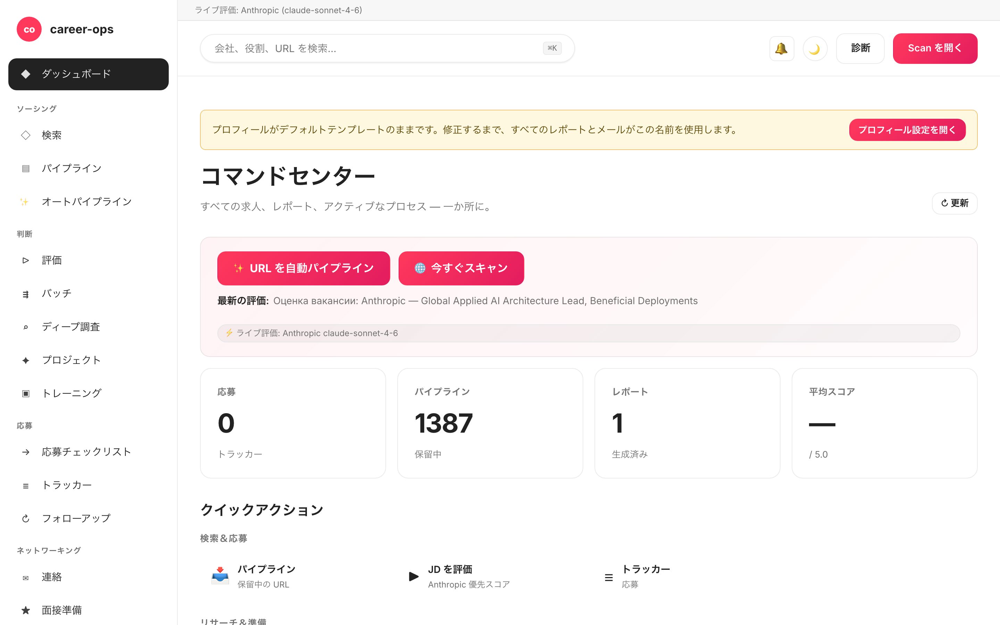

# career-ops-ui

> [career-ops](https://github.com/santifer/career-ops) — AI 駆動の求職パイプラインに、docs スタイルの洗練された Web インターフェースを与えるプロジェクトです。
> Claude Code、ターミナル、Markdown ファイルを行き来する代わりに、検索・評価・ディープリサーチ・応募・トラッキングを 1 つのブラウザタブから完結できます。

[English](README.md) | [Español](README.es.md) | [Português (Brasil)](README.pt-BR.md) | [한국어](README.ko-KR.md) | **日本語** | [Русский](README.ru.md) | [简体中文](README.zh-CN.md) | [繁體中文](README.zh-TW.md) | [Français](README.fr.md)

[](#tests)
[](#tests)
[](#tests)
[](#requirements)
[](LICENSE)
[](https://github.com/Fighter90/career-ops-ui/releases/tag/v1.69.2)

> **🆕 最新リリース — v1.69.2**
>
> **fix(test): `npm test` が実際の `config/profile.yml` / `data/scan-history.tsv` を上書きしなくなりました。** あるテスト（`critical-fixes.test.mjs`）がファイル冒頭で `prompts.mjs`（→ `paths.mjs`）を読み込んでいたため、テストが `CAREER_OPS_ROOT` を一時ディレクトリに設定する前に `PROJECT_ROOT` が**実際の**親に解決され、`PUT /api/profile` が毎回「Acceptance Test」フィクスチャをプロフィールに書き込んでいました。現在は環境変数を設定した後に動的 `import()` で読み込み、`tests/test-root-isolation.test.mjs` がスイート全体を保護します。本番コードの変更なし。
>
> _フルスイート **1086/1086** グリーン · i18n + ドキュメントを全 9 ロケールで同期。_

<!-- DO NOT REVERT: locale-specific dashboard screenshot (dashboard-ja.png). Each README uses its own ./images/dashboard-<locale>.png — never replace with dashboard-en.png. Generated by scripts/capture-dashboard-screenshots.mjs. -->


## career-ops について

[career-ops](https://career-ops.org) は、任意の AI コーディング CLI(Claude Code、Codex、OpenCode、Qwen CLI — 同じスラッシュコマンド・サーフェスで他の Claude 互換 CLI も動作します)上でスラッシュコマンドとして動作する、オープンソースの求職システムです。モデル非依存に設計されており、各求人を CV と照合して 6 次元 0.0–5.0 のルーブリックで評価し、求人に合わせて調整した PDF レジュメを生成し、すべての応募をローカルで追跡します。クラウドアカウントもテレメトリも自動送信も一切ありません。

**本リポジトリ (career-ops-ui)** は、その上に載せる洗練された Web インターフェースです。フォーム入力(Playwright MCP 経由)とスラッシュコマンドモードは引き続き CLI 側が担い、SPA は同じ `cv.md` / `data/applications.md` / `reports/` ファイル群に対して CRM ライクなブラウザ画面を提供します。両者は同じデータを共有します。

**スコア別のアクション閾値** ([career-ops.org/docs](https://career-ops.org/docs) より):

| スコア | 次のアクション |
|---|---|
| **≥ 4.5** | `/career-ops apply` — 高フィット、即応募 |
| **4.0 – 4.4** | 応募、または `/career-ops contacto` で温かい紹介を依頼 |
| **3.5 – 3.9** | `/career-ops deep` — まず調査 |
| **< 3.5** | 明確な理由がなければスキップ |

**正規ガイド**([career-ops.org/docs](https://career-ops.org/docs)):

- [What is career-ops](https://career-ops.org/docs/introduction/what-is-career-ops)
- [Scan job portals](https://career-ops.org/docs/introduction/guides/scan-job-portals)
- [Apply for a job](https://career-ops.org/docs/introduction/guides/apply-for-a-job)
- [Batch-evaluate offers](https://career-ops.org/docs/introduction/guides/batch-evaluate-offers)
- [Set up Playwright](https://career-ops.org/docs/introduction/guides/set-up-playwright)

## ワンコマンドで起動・初期化

> **重要 — career-ops-ui は [`santifer/career-ops`](https://github.com/santifer/career-ops) の*上に乗る*ダッシュボードです。** `career-ops/web-ui/` として career-ops プロジェクトの**内部**で動作し、親フォルダーの `cv.md`、`config/`、`data/` を `../` 経由で読み込みます。**単独では動作しません** — 親リポジトリ `career-ops` も必要です。単独でクローンして `init` を実行しないでください；以下の 2 つのオプションのいずれかを使用してください。

### オプション 1 — 1 つの curl（推奨：すべてをセットアップ）

```bash
curl -fsSL https://raw.githubusercontent.com/Fighter90/career-ops-ui/main/bin/setup.sh | bash
```

**両方**のリポジトリをクローンし、`career-ops/web-ui/` 構造を整え、依存関係をインストールし、doctor を実行したうえで http://127.0.0.1:4317 でサーバーを起動します — その後ダッシュボードを開きます。

### オプション 2 — 既存の career-ops プロジェクトに UI を追加

すでに career-ops を設定済みでダッシュボードだけが必要な場合は、UI を `web-ui` として**内部に**クローンします：

```bash
cd career-ops                                                   # ← 既存の career-ops プロジェクト
git clone https://github.com/Fighter90/career-ops-ui.git web-ui
cd web-ui
npm install
npx career-ops-ui init        # interactive: pick LLM provider + paste its key → parent career-ops/.env
```

`web-ui/` のネスト構造こそが、UI が `../cv.md`、`../config/`、`../data/` を解決できる理由です。`npx career-ops-ui <verb>` の代わりに `career-ops-ui <verb>` と入力したい場合は `npm link` を**一度**実行してください。

### CLI コマンド

```bash
career-ops-ui setup    # bootstrap: install deps → doctor → run (SKIP_START=1 to stop before run)
career-ops-ui init     # pick LLM provider + paste its key (interactive)
career-ops-ui doctor   # verify Node / project / keys / Playwright (exit 0 ⇔ all required green)
career-ops-ui run      # launch the server at http://127.0.0.1:4317
career-ops-ui open     # open + RAISE the dashboard tab in your browser
career-ops-ui help     # list every verb
```

`npm link` を実行していない場合は `npx ` を前置してください（例：`npx career-ops-ui run`）。`setup`/`run` の後、タブは自動的に開かれ**最前面に表示**されます；`NO_OPEN=1` を設定すると自動オープンを無効化できます（headless / CI）。

### LLM プロバイダーの選択

`init` はプロバイダーウィザードです — **Claude / Claude Code**(`ANTHROPIC_API_KEY`)、**Gemini / Gemini CLI**(`GEMINI_API_KEY`)、**Codex / OpenCode CLI**(`OPENAI_API_KEY`)、または **Auto**（Anthropic → Gemini フォールバック）から選択します。キーはエコーを抑制した状態で入力され、`#/config` の API キータブが使うのと同じ検証済みパスを通じて親の `career-ops/.env` に書き込まれます。CI 向けの非対話形式：

```bash
career-ops-ui init --provider claude --anthropic-key sk-ant-… --yes
career-ops-ui init --provider gemini --gemini-key …          --yes
career-ops-ui init --provider auto   --openai-key sk-…       --yes
```

または手動で設定：`echo "ANTHROPIC_API_KEY=sk-ant-…" >> career-ops/.env`。プロバイダーは `LLM_PROVIDER`（`auto` | `claude` | `gemini`）を設定します；再起動なしで **`#/config` → API キー** からいつでも変更できます。

### `init` のトラブルシューティング

`career-ops-ui init` が失敗するか、コマンドが見つからない場合（`git pull` 直後によく発生）：

```bash
cd career-ops/web-ui
npm install
npx career-ops-ui init        # npx runs the local bin even without `npm link`
```

確認事項：

- **`career-ops/web-ui/` 内から**実行していること — 単独の `career-ops-ui/` クローンからではないこと。
- **親フォルダー `career-ops/` が存在し**、`cv.md` と `config/` が含まれていること。career-ops-ui を単独でクローンした場合は移動（または再クローン）して `career-ops/web-ui/` に配置してください — またはオプション 1 の curl を実行すると構造を自動的に整えます。
- `career-ops-ui doctor`（または `npx career-ops-ui doctor`）が不足しているものを正確に表示します。

---

## なぜ必要か

[career-ops](https://github.com/santifer/career-ops) は強力な Claude Code 駆動の求職システムです。JD を貼り付ければ、0–5 のフィットスコア、ATS に最適化された PDF、トラッカーエントリが得られます。Claude Code 内では快適に動作しますが、データは `cv.md`、`data/applications.md`、`reports/*.md`、`data/pipeline.md`、`portals.yml`、`config/profile.yml` に散在しており、見失いやすく、俯瞰しづらいのが難点です。

`career-ops-ui` はその上に洗練された UI を被せます。

- **Auto-pipeline** — `#/auto` に URL を 1 つ貼ってワンクリック:検証 → 取得 → 評価 → レポート保存 → トラッカー追加。ライブのアクセシブルなステッパーと成果物ディープリンク付き。
- **閲覧:** トラッカー、レポート、パイプラインを CRM のように一覧できます。
- **トリガー:** Greenhouse / Ashby / Lever / Workable / SmartRecruiters / Workday **および** hh.ru / Habr Career のスキャンを起動し、ライブ SSE ログを観察できます。
- **評価:** Anthropic(優先)または Gemini で JD をライブ評価。API キーが未設定なら、Claude Code 用にコピペできるプロンプトを返します。
- **ディープリサーチ:** Anthropic SDK で企業をライブ調査。cv / profile / mode ファイルが自動でインライン化されます。
- **編集:** サイドバイサイドの Markdown プレビューと、サーバーサイドの XSS サニタイズ付きで `cv.md` を編集できます。
- **メンテナンス:** doctor、verify、normalize、dedup、merge をそれぞれワンクリックで実行できます。
- **マルチ CLI:** Claude Code、Codex、Cursor、Aider、Gemini CLI のいずれからも同一に駆動できます。`CLAUDE.md` / `AGENTS.md` / `GEMINI.md` のシムが、単一のソース・オブ・トゥルースを指します。

完全に加算的な構成です。`career-ops/` 内部には一切手を加えないため、カスタマイズはそのまま保持されます。

---

## クイックスタート

### 1. 先に career-ops をインストール

```bash
git clone https://github.com/santifer/career-ops.git
cd career-ops
```

[career-ops のオンボーディング](https://github.com/santifer/career-ops#first-run--onboarding) に従い、`cv.md`、`config/profile.yml`、`portals.yml` を揃えます。

### 2. career-ops-ui をその中に配置

```bash
git clone https://github.com/Fighter90/career-ops-ui.git web-ui
```

ツリーは次のようになります。

```
career-ops/
├─ cv.md
├─ portals.yml
├─ config/
├─ data/
├─ modes/
├─ reports/
├─ scan.mjs … doctor.mjs … (etc)
└─ web-ui/                 ← 本リポジトリ
   ├─ bin/start.sh
   ├─ package.json
   ├─ server/
   ├─ public/
   └─ tests/
```

### 3. 起動

```bash
bash web-ui/bin/start.sh
```

このスクリプトは次の処理を行います。

1. Node ≥ 18 を確認します。
2. `npm install` を実行します(初回のみ。依存は Express と js-yaml の 2 つだけ)。
3. Express サーバーを `127.0.0.1:4317` で起動します。
4. デフォルトブラウザで http://127.0.0.1:4317/ を開きます。

ポートやホストをカスタマイズする場合:

```bash
PORT=8080 bash web-ui/bin/start.sh
HOST=0.0.0.0 PORT=4317 bash web-ui/bin/start.sh   # LAN に公開
```

`career-ops/web-ui` 以外の場所にクローンした場合は、環境変数で career-ops の場所を指定します。

```bash
CAREER_OPS_ROOT=/path/to/career-ops bash bin/start.sh
```

---

## 初回起動 — クリーンな状態

`career-ops/data/pipeline.md` には、テストスイートが密閉的に実行できるよう 2 つの QA フィクスチャ URL (`example.com/qa-fixture-*`) が含まれています。新規クローンでは Pipeline が `2 件待機中` と表示されますが、これらは実際の求人ではありません。最初のスキャン前にクリーンアップしてください:

```bash
make clean-test-fixtures
npm start
```

http://127.0.0.1:4317 を開きます。Pipeline カウンタが `0 件待機中` と表示されるはずです。

---

## 必要要件

| | |
| --- | --- |
| **Node.js** | ≥ 18(ネイティブ `fetch` と `node:test` を使用) |
| **career-ops** | クローン済みでオンボーディング完了(上記参照) |
| **オプション** | 親プロジェクトの `.env` に `GEMINI_API_KEY`(無料 tier モデル `gemini-2.0-flash`)。ワンクリック JD 評価に使用します。未設定時は Claude 用のコピペ可能なプロンプトを返します。 |
| **オプション** | hh.ru が 403 を返す場合はロシアの IP / VPN から実行してください。Habr Career は IP に関係なく利用できます。 |
| **オプション** | Playwright(career-ops の推移的依存関係として既にインストール済み)、e2e テストスイート用。 |

---

## 機能一覧 — ページ別

| ページ            | 内容                                                                                                              |
| ---------------- | ----------------------------------------------------------------------------------------------------------------- |
| **Dashboard**    | 集計カウント(apps / pipeline / reports)、平均スコア、ステータス内訳、最新 5 件の応募と最新レポート。 |
| **Scan**         | **🌐 単一 Scan ボタン** — 有効なすべてのソースを 1 回のスイープで実行します(EN は Greenhouse / Ashby / Lever / Workable / SmartRecruiters / Workday、RU は hh.ru + Habr Career + Trudvsem + GetMatch + GeekJob)。ライブ SSE ログストリーミングに加え、location / Remote-Hybrid バッジ / relocation フラグ / 給与 / source フィルタと、動的な stack / level / keyword チップ付きのクリック可能な結果テーブルを備えます。Active-Companies カードには、追跡対象のすべてのボードと API ヘルスが表示されます。 |
| **Pipeline**     | `data/pipeline.md` への CRUD。サーバーサイドのプレビュープロキシ(SSRF セーフ、ホップごとのリダイレクト検証、8 KB のボディ上限)。URL から評価へ直接ジャンプできます。 |
| **Evaluate**     | JD を貼り付け → **Anthropic 優先**(両キーがあれば優先)、次に Gemini、最後に手動プロンプトのフォールバックの順で評価します。Anthropic 経路では cv / profile / `_shared.md` / `oferta.md` を自動的にインライン化します(REVIEW-A1)。JD を `jds/` に保存するオプションあり。 |
| **Deep research**| Evaluate と同じフォールバック連鎖。Anthropic がライブで稼働すると、約 10–30 KB のグラウンディングされた Markdown を返し、`interview-prep/<company>-<role>.md` に保存します。 |
| **Modes**        | 7 つの汎用モードページ(`/#/project`、`/#/training`、`/#/followup`、`/#/batch`、`/#/contacto`、`/#/interview-prep`、`/#/patterns`)が、同じ Anthropic / Gemini / 手動フォールバックを共有します。各ページにはインラインヒントを表示します(v1.22.0)。 |
| **Apply helper** | 応募チェックリストを生成します。実際の Playwright によるフォーム入力は、引き続き Claude Code 内の `/career-ops apply` に委ねます。 |
| **Tracker**      | `data/applications.md` 上のフィルタ可能なテーブル(status、score、自由テキスト)。`normalize-statuses.mjs` / `dedup-tracker.mjs` / `merge-tracker.mjs` をワンクリックで実行できます。パイプと改行のエスケープは GFM 準拠であり、`"Acme \| Co"` のような名前もロスレスにラウンドトリップします。 |
| **Reports**      | `reports/` 配下のすべてのレポートを、パース済みヘッダー(Score / Legitimacy / URL)付きで閲覧・参照できます。 |
| **CV**           | `cv.md` のライブ Markdown エディタ。サイドバイサイドプレビュー、ワンクリックの `cv-sync-check.mjs`、📁 CV アップロードを備えます。保存時にはサーバーサイドで XSS をストリップします(`<script>`、`javascript:`、`on*=` ハンドラ)。 |
| **Profile**      | `config/profile.yml` とアーキタイプの読み取り専用ビュー。UI フレンドリーなサマリーを表示します。 |
| **App settings** | 親 `.env` キー用の UI 内エディタ。`ANTHROPIC_API_KEY`、`GEMINI_API_KEY`、モデルのオーバーライド、ポートとホストを編集できます。シークレットは読み取り時にマスクされます。 |
| **Health**       | すべてのセットアップチェックを OK / OPTIONAL / FAIL バッジで表示し、`doctor.mjs` と `verify-pipeline.mjs` を実行するボタンを備えます。 |
| **Help**         | アプリ内 Markdown ユーザーガイド(`/#/help`)。サポート対象の 8 言語すべてにローカライズ済みです(en / es / pt-BR / ko-KR / ja / ru / zh-CN / zh-TW)。 |
| **Activity log** | すべての状態変更リクエスト(書き込み・実行・スキャン)の監査証跡。シークレットはマスク済みです。 |
| **通知** 🔔 *(v1.58.34 / v1.58.35)* | トップバーのベル + 赤い未読バッジ。クリック → 右ドロワーが最新 50 件のトースト(タブ単位/セッション単位)を表示 — 成功 / エラー / 情報-進行、それぞれにローカル時刻・メッセージ・必要に応じて `(METHOD /path · HTTP NNN)` 末尾を `<details>` で表示。ヘルプ **§18** が各カテゴリを説明。ドロワーは **ベルのクリック時にのみ** 開く(キーボード Enter / Space 含む)。× / Esc / ベル再クリックで閉じる。|

グローバルキーボードショートカット:

- `Ctrl+K` / `Cmd+K` — グローバル検索にフォーカスします。
- グローバル検索に URL を貼り付けると、自動的にパイプラインへ追加されます。
- `Esc` — 開いているモーダルを閉じます。

すべての視覚的合図には、色だけでなくテキストやアイコンなどの冗長な手がかりを付与しており、WCAG 1.4.1 を満たします(v1.22.0)。

---

## Scan

実際に求人を返す、ゼロトークンのポータルスキャン。UI 上の **1 つの 🌐 Scan ボタン** が、設定済みのすべてのソースを 1 回のスイープで実行します。

- **Greenhouse / Ashby / Lever / Workable / SmartRecruiters / Workday** — `portals.yml::tracked_companies` に登録された、認識可能な ATS パターンを持つすべての企業に対する公開 boards-api を叩きます。同梱リストは Stripe、GitLab、Vercel、Cloudflare、Datadog、Discord、Elastic、Grafana Labs、CockroachDB、Fastly、Twilio、Coinbase、Reddit、Robinhood、Affirm、Lyft、Linear、Supabase、PostHog、Ramp、Modal Labs、Railway、Browserbase、JetBrains をカバーします。自由に拡張・削減できます。
- **RSS 求人ボード** — RSS/Atom フィードを公開している求人ボード(LaraJobs、WeWorkRemotely、RemoteOK、golangprojects など)に対応。`portals.yml` に `provider: rss` とフィード URL を追加するだけです。コード変更は不要です。
- **hh.ru** — `hh.ru/search/vacancy` の HTML をスクレイプ。どの IP からでも、キーもプロキシも不要で動作します。（JSON API `api.hh.ru` はもう使いません：IP/User-Agent に関係なくすべてのプログラムクライアントに 403 を返すようになったためです。サイトは Habr Career と同様、ブラウザ風クライアントに完全な結果を返します。）
- **Habr Career** — `career.habr.com/vacancies` の HTML スクレイプ。任意の IP から動作し、認証は不要です。

### RSS アダプタ

`portals.yml` に `provider: rss` と `rss:`（または `feed_url:`）キーを持つエントリを追加することで、RSS ベースの求人ボードをスキャナに接続できます。

```yaml
tracked_companies:
  - name: LaraJobs
    provider: rss
    rss: https://larajobs.com/feed
    enabled: true
  - name: WeWorkRemotely
    provider: rss
    rss: https://weworkremotely.com/remote-jobs.rss
    enabled: true
```

アダプタは小さな正規表現ベースのパーサー（XML ライブラリ不要）で `<item>` ブロックを解析します。`title`、`link`（→ `url`）、`pubDate`（→ `date`）、`description`（→ `snippet`、HTML タグを除去）を抽出します。リモート勤務の判定はタイトルや説明文中の `/remote|anywhere/i` パターンで行い、会社名は `dc:creator`、タイトルの「会社名 — 職種」パターン、またはフィードのホスト名の順で取得します。ATS アダプタと同じ正規化 → フィルタリング → 重複排除 → パイプライン追記の流れが適用されます。

すべてのソースは同じパイプラインを通ります。normalize → filter(`title_filter.positive` / `title_filter.negative`)→ `data/scan-history.tsv` + `data/pipeline.md` + `data/applications.md` に対する dedup → `data/pipeline.md` への追記 → UI のフィルタ可能テーブル向けに完全な結果セットを `data/last-scan.json` に保存、という流れです。

`portals.yml` で設定します。

```yaml
title_filter:
  positive: [backend, engineer, senior, tech lead, golang, php]
  negative: [junior, intern, frontend, ios, android]
tracked_companies:
  - { name: Stripe, enabled: true, careers_url: https://job-boards.greenhouse.io/stripe }
  - { name: Linear, enabled: true, careers_url: https://jobs.ashbyhq.com/linear }
  # ...
russian_portals:
  sources: ["hh", "habr"]   # 片方または両方
  area: 113                  # 1=モスクワ, 2=SPb, 113=ロシア全域, 1001=リモート
  per_page: 50
  only_remote: false
  queries: ["Senior PHP", "Senior Go", "Tech Lead"]
```

すべてのソースは単一の SSE エンドポイント `/api/stream/scan?source=ats|regional|both` を経由します。**🌐 Scan** UI ボタンは `source=both` を呼び出すため、すべてのアダプタ(Greenhouse / Ashby / Lever / Workable / SmartRecruiters / Workday + hh.ru + Habr Career + Trudvsem + GetMatch + GeekJob)が 1 本の接続で並行実行されます。クライアントの切断時には `AbortSignal` を尊重し、孤児となる fetch を残しません。

---

## アーキテクチャ

```
career-ops-ui/
├─ CLAUDE.md                 # プロジェクトレベルのエージェント指示(正規)
├─ AGENTS.md                 # Codex / Aider / 汎用 CLI シム → CLAUDE.md
├─ GEMINI.md                 # Gemini CLI シム → CLAUDE.md
├─ .aiignore                 # AI ツール用の除外リスト
├─ .claude/                  # Claude Code エージェント設定
│  ├─ agents/                # 3 つのプロジェクト固有サブエージェント (route, view, test isolation)
│  └─ commands/               # スラッシュコマンドスタブ
├─ bin/start.sh              # ワンショットランチャー(Node チェック → npm install → サーバー起動 → ブラウザを開く)
├─ package.json              # ランタイム依存 2 つ: express, js-yaml
├─ server/
│  ├─ index.mjs              # ~130 LOC オーケストレータ: middleware + 12 個の register<Topic>Routes(app) コール + SPA catch-all
│  └─ lib/
│     ├─ paths.mjs           # career-ops ファイルへの絶対パス(CAREER_OPS_ROOT 対応)
│     ├─ parsers.mjs         # markdown / pipeline / report パーサー(GFM 準拠のパイプエスケープ)
│     ├─ runner.mjs          # runNodeScript() + streamNodeScript()、SIGTERM→SIGKILL エスカレーション + 30 分上限
│     ├─ security.mjs        # isValidJobUrl, stripDangerousMarkdown, sanitizeJobDescription, sanitizePathName, isPubliclyExposed
│     ├─ safe-fetch.mjs      # DNS ピン留め HTTP クライアント(DNS リバインド対策、v1.21.0)
│     ├─ file-lock.mjs       # パスごとのミューテックス(競合状態の解消、v1.21.0)
│     ├─ rate-limit.mjs      # LLM エンドポイント用のスライディングウィンドウ・レート制限(v1.21.0)
│     ├─ prompts.mjs         # bundleProjectContext, buildEvaluationPrompt, buildDeepPrompt, buildModePrompt
│     ├─ store.mjs           # safeReadApps/Pipeline/Reports, checkProfileCustomized, ensureRussianPortalsDefaults
│     ├─ anthropic.mjs       # 最小限の Anthropic SDK アダプタ(runAnthropic, hasAnthropicKey, hasGeminiKey)
│     ├─ env-config.mjs      # シークレットマスクとバリデーション付き .env ラウンドトリップ
│     ├─ activity-log.mjs    # JSONL 監査証跡 middleware(シークレット編集済み)
│     ├─ dotenv.mjs          # 軽量 dotenv ローダ
│     ├─ en-scanner.mjs      # インプロセス Greenhouse/Ashby/Lever オーケストレータ(AbortSignal 対応)
│     ├─ ru-scanner.mjs      # インプロセス hh.ru + Habr オーケストレータ(AbortSignal 対応)
│     ├─ sources/
│     │  ├─ greenhouse.mjs   # boards-api.greenhouse.io クライアント
│     │  ├─ ashby.mjs        # api.ashbyhq.com クライアント
│     │  ├─ lever.mjs        # api.lever.co クライアント
│     │  ├─ hh.mjs           # api.hh.ru クライアント(UA 対応)
│     │  └─ habr.mjs         # career.habr.com HTML パーサー(cheerio 不使用、regex のみ)
│     └─ routes/             # 12 ルートモジュール — トピックごとに 1 つ (P-2)
│        ├─ activity.mjs     # /api/activity
│        ├─ config.mjs       # /api/config(親 .env ラウンドトリップ)
│        ├─ content.mjs      # /api/cv, /api/profile, /api/portals, /api/modes
│        ├─ health.mjs       # /api/health, /api/dashboard
│        ├─ help.mjs         # /api/help/:lang
│        ├─ jds.mjs          # /api/jds CRUD
│        ├─ llm.mjs          # /api/evaluate, /api/deep, /api/mode/:slug, /api/apply-helper, /api/interview-prep*
│        ├─ pipeline.mjs     # /api/pipeline + SSRF セーフなプレビュープロキシ
│        ├─ reports.mjs      # /api/reports
│        ├─ runners.mjs      # /api/run/* + /api/stream/{scan,liveness,pdf} + /api/output/pdfs
│        ├─ scan.mjs         # /api/stream/scan-{ru,en} + /api/scan-results
│        └─ tracker.mjs      # /api/tracker
├─ public/                   # 静的 SPA — ビルドステップなし
│  ├─ index.html
│  ├─ css/app.css            # デザイントークン(docs スタイルパレット)
│  └─ js/
│     ├─ api.js              # fetch ラッパー + 接続バナー状態 + UI ヘルパー + 安全な Markdown レンダラ
│     ├─ router.js           # 404 フォールバックと alias サポート付きの hash ベースルーター
│     ├─ app.js              # boot + グローバルキーボードハンドラ + モバイルサイドバードロワー
│     ├─ lib/{i18n,skills}.js
│     └─ views/              # ページごとに 1 ファイル(dashboard, scan, pipeline, evaluate, deep, apply, tracker, reports, cv, settings, health, config, help, activity, mode-page)
├─ docs/                     # パブリックリファレンス: architecture, API, data-flows, SDD, conventions, reviews
│  ├─ PROJECT.md             # what / why / for-whom
│  ├─ ROADMAP.md             # 現在のマイルストーン + 完了履歴
│  ├─ PRODUCTION-READINESS.md # 率直なデプロイメントゲート評価
│  ├─ sdd/{SDD-GUIDE,CONVENTIONS}.md
│  ├─ architecture/{OVERVIEW,SERVER,FRONTEND,API,DATA-FLOWS}.md
│  └─ reviews/REVIEW-*.md
└─ tests/                    # 1000 unit + 70 Playwright + e2e:full + e2e:smoke
   ├─ parsers.test.mjs       # markdown / pipeline / report パーサー(純粋関数)
   ├─ api.test.mjs           # 全エンドポイント、ephemeral server、ネットワークなし
   ├─ {ru,en}-scanner.test.mjs   # mocked fetch
   ├─ pipeline-preview.test.mjs   # ホップごとのリダイレクト検証(REVIEW-B1)
   ├─ ssrf-redirect-rebind.test.mjs # DNS リバインドリダイレクト対策(v1.21.0)
   ├─ concurrent-tracker-write.test.mjs # 競合書き込みのリグレッション(v1.21.0)
   ├─ rate-limit.test.mjs    # スライディングウィンドウのバースト挙動(v1.21.0)
   ├─ path-traversal.test.mjs # `..` / null バイト / 先頭ドット拒否(v1.21.0)
   ├─ anthropic.test.mjs     # SDK アダプタ + log-guard test(REVIEW-B4)
   ├─ url-validation.test.mjs    # SSRF reject sweep(FIX-M3 + M6 + M7)
   ├─ cv-xss.test.mjs        # stripDangerousMarkdown ラウンドトリップ(エンティティ対応)
   ├─ jd-sanitize.test.mjs   # sanitizeJobDescription
   ├─ help.test.mjs / help-ui.test.mjs    # 全 8 ロケールの i18n parity
   ├─ playwright-smoke.mjs   # 12 ブラウザフロー(CV 保存、tracker、pipeline、evaluate、config など)
   └─ e2e{,-comprehensive}.mjs   # Playwright による完全な walkthrough
```

### なぜビルドステップがないのか

バニラ HTML / CSS / JS は、表面積を極小に保ちます。2 つの依存を入れる `npm install` 1 回で動作します。Webpack も Vite も、悪夢のような `node_modules` も不要です。UI 全体は minify 後 30 KB 未満です。開発中にホットリロードが欲しい場合は、Node 組み込みの `--watch` を使う `npm run dev` を利用してください。

### Spec-Driven Development

非自明な変更は GSD パイプライン(`superpowers@claude-plugins-official` の `gsd-*` スキル群)を経由します。

```
discuss → spec → plan → execute → verify → review
```

公開リファレンス: [`docs/sdd/SDD-GUIDE.md`](docs/sdd/SDD-GUIDE.md)。プランニング成果物はすべて `.planning/`(gitignore 済み)に格納します。`docs/` ツリーは長期的に維持される公開契約です。

---

## API リファレンス

すべてのエンドポイントは `/api/*` 配下です。特記なき場合、JSON in / JSON out。

### Health とダッシュボード

| Method | Path                     | Response                                                                    |
| ------ | ------------------------ | --------------------------------------------------------------------------- |
| GET    | `/api/health`            | `{ ok, warnings, version, parentVersion, checks: [{name, ok, required, value?}] }` |
| GET    | `/api/dashboard`         | `{ counts, avgScore, byStatus, recent, pipeline, lastReport }`              |
| GET    | `/api/status/providers`  | `{ activeProvider, activeModel, keysConfigured }` — オンボーディングバナー + ⚡ コストヒント用の LLM 準備状況 (v1.55.3) |
| GET    | `/api/activity?limit&type` | `data/activity.jsonl` 監査証跡の tail                                       |
| GET    | `/api/help/:lang`        | ローカライズ済みアプリ内ユーザーガイド(フォールバック: `en.md`)            |

### アプリ設定(親 .env ラウンドトリップ)

| Method | Path             | 目的                                                                   |
| ------ | ---------------- | ---------------------------------------------------------------------- |
| GET    | `/api/config`    | シークレットがマスクされた既知の env キー                              |
| POST   | `/api/config`    | バリデート後に親 `.env` を書き込み、`process.env` にインプレース適用    |

### データファイル

| Method | Path                                | 目的                                                                   |
| ------ | ----------------------------------- | ---------------------------------------------------------------------- |
| GET    | `/api/tracker`                      | `{ rows: [parsed applications.md] }`                                   |
| POST   | `/api/tracker`                      | body `{ company, role, score?, status?, url?, notes?, date? }` — dedup 対応(company + role を大文字小文字非区別) |
| GET    | `/api/pipeline`                     | `{ urls: [...] }`                                                      |
| POST   | `/api/pipeline`                     | body `{ url }` → dedup と `isValidJobUrl` を経て `data/pipeline.md` に追加 |
| GET    | `/api/pipeline/preview?url=…`       | サーバーサイド fetch プロキシ(ホップごとの SSRF チェック、リダイレクト ≤3、8 KB 上限) |
| DELETE | `/api/pipeline?url=…`               | URL を削除                                                             |
| GET    | `/api/reports`                      | `reports/*.md` のパース済みリスト                                       |
| GET    | `/api/reports/:slug`                | 完全な Markdown + パース済みヘッダー                                    |
| GET    | `/api/jds`                          | 保存済み JD ファイルのリスト                                            |
| GET    | `/api/jds/:name`                    | text/plain — 生 JD                                                     |
| POST   | `/api/jds`                          | body `{ text, slug? }` → `jds/` に保存                                 |
| DELETE | `/api/jds/:name`                    | unlink(`.txt` サフィックス必須)                                       |
| GET    | `/api/cv`                           | `{ markdown }`                                                         |
| PUT    | `/api/cv`                           | body `{ markdown }` → `cv.md` を書き込み(XSS ストリップ済み、≤1 MB)  |
| GET    | `/api/profile`                      | `{ profile: yaml-parsed, raw: text }`                                  |
| GET    | `/api/portals`                      | `{ portals: yaml-parsed, raw: text }`                                  |
| GET    | `/api/modes`                        | モードファイルのリスト                                                  |
| GET    | `/api/modes/:name`                  | text/plain — 生モードプロンプト                                         |
| GET    | `/api/output/pdfs`                  | 生成済み PDF のリスト                                                   |
| GET    | `/api/output/pdfs/:name`            | ダウンロード(`Content-Disposition: attachment`)                       |
| GET    | `/api/interview-prep`               | 保存済み deep-research ファイルのリスト                                 |
| GET    | `/api/interview-prep/:name`         | `{ name, markdown }`                                                   |
| DELETE | `/api/interview-prep/:name`         | unlink(`.md` サフィックス必須)                                        |

### スクリプトランナー(バッファリング、ワンショット)

| Method | Path                    | ラップ対象                  |
| ------ | ----------------------- | --------------------------- |
| POST   | `/api/run/doctor`       | `node doctor.mjs`           |
| POST   | `/api/run/verify`       | `node verify-pipeline.mjs`  |
| POST   | `/api/run/normalize`    | `node normalize-statuses.mjs` |
| POST   | `/api/run/dedup`        | `node dedup-tracker.mjs`    |
| POST   | `/api/run/merge`        | `node merge-tracker.mjs`    |
| POST   | `/api/run/sync-check`   | `node cv-sync-check.mjs`    |

バッファリング実行はすべて 60 秒で上限とし、5 秒の猶予の後に SIGTERM → SIGKILL へエスカレーションします。

### ストリーム (SSE)

| Method | Path                          | ストリームの内容                   |
| ------ | ----------------------------- | ---------------------------------- |
| GET    | `/api/stream/scan`            | レガシー `node scan.mjs`(サブプロセス) |
| GET    | `/api/stream/scan?source=ats\|regional\|both` | 統合インプロセス scanner SSE — クエリ: `dryRun=1`、`company=…`(ATS のみ)。 |
| GET    | `/api/stream/liveness`        | `node check-liveness.mjs`          |
| GET    | `/api/stream/pdf`             | `node generate-pdf.mjs`            |

SSE イベント種別:

```
event: start    data: { script, args?, writeFiles? }
event: log      data: { stream: "stdout"|"stderr", line: string }
event: done     data: { code, counts?, errors? }
event: error    data: { message }
```

### LLM エンドポイント(Anthropic 優先 → Gemini → 手動フォールバック)

| Method | Path                                | 目的                                                                             |
| ------ | ----------------------------------- | -------------------------------------------------------------------------------- |
| POST   | `/api/evaluate`                     | body `{ jd, save? }` → JD 評価(`oferta.md` 準拠の A–G セクション)              |
| POST   | `/api/evaluate/test-gemini`         | `GEMINI_API_KEY` の smoke チェック                                              |
| POST   | `/api/evaluate/test-anthropic`      | `ANTHROPIC_API_KEY` の smoke チェック                                           |
| POST   | `/api/deep`                         | body `{ company, role?, run? }` → deep-research プロンプトまたはライブのグラウンディング済み Markdown |
| POST   | `/api/mode/:slug`                   | 汎用モードランナー。allowlist: `batch`, `contacto`, `followup`, `interview-prep`, `patterns`, `project`, `training` |
| POST   | `/api/apply-helper`                 | body `{ url, jd? }` → 応募チェックリスト                                         |
| GET    | `/api/scan-results`                 | `{ en: {when, fresh[], filtered[], errors[]}, ru: { ... } }` — 最新スキャン     |
| GET    | `/api/scan/regional/config`         | 有効な regional-scanner 設定(queries、negatives、sources)。 |

`/api/deep` または `/api/mode/:slug` に `run: true` が指定された場合、サーバーは(両キーが存在するときに)Anthropic を優先し、`cv.md` + `config/profile.yml` + `modes/_shared.md` + 該当モードテンプレートを `<project_context>` ブロックにインライン化したうえで、モデルのグラウンディング済み Markdown を直接返します。組み立て後のプロンプトのソフトキャップは 200 KB です。超過時は 413 を返します。

LLM エンドポイントはレート制限の対象です(`server/lib/rate-limit.mjs`、v1.21.0)。ループバック上では実質的に無効化されます。`HOST=0.0.0.0` 時には IP ごとに毎分 10 リクエストです。`LLM_RATE_LIMIT="N/Ws"` で設定可能で、上限を超えると `Retry-After` ヘッダ付きの 429 を返します。

---

## テスト

```bash
npm test                       # 1000 unit/integration テスト
npm run test:e2e               # 20 smoke e2e(独自サーバーを起動)
npm run test:e2e:full          # 23 comprehensive e2e
npm run test:e2e:browser       # 70 Playwright browser-smoke
npm run test:coverage          # `npm test` 相当 + V8 coverage
```

| スイート                       | テスト数 | 内容                                                                                                       |
| --------------------------- | ----- | ---------------------------------------------------------------------------------------------------------- |
| `node --test tests/*.test.mjs`(unit + integration) | **1000** | 全エンドポイント、ephemeral server、ネットワーク非依存。parser、scanner(モック)、runner、anthropic、security headers、XSS、JD サニタイズ、URL バリデーション、i18n parity、レート制限、ファイルロック、safe-fetch、path-traversal、DNS リバインドリダイレクトを含みます。 |
| `tests/e2e.mjs`(smoke)     | 20    | Playwright ヘッドレス: 各 route のレンダリングと基本フロー。                                                |
| `tests/e2e-comprehensive.mjs` | 23    | Playwright による完全な walkthrough: 11 routes + 12 機能フロー。                                          |
| `tests/playwright-smoke.mjs`(`npm run test:e2e:browser`) | **32** | ブラウザ駆動 smoke: dashboard レンダリング、ナビゲーション、言語切替、404、health、tracker ラウンドトリップ (BF-1)、pipeline 追加と無効 URL sweep、reports 空、evaluate 手動フォールバック、config キーマスク、CV PUT XSS ストリップ、pipeline preview 400、レート制限、競合書き込み、エンティティ対応 XSS。 |
| **合計**                   | **500+** | **0 失敗、0 フレーク**                                                                                    |

カバレッジ: `--experimental-test-coverage` 経由で行カバレッジ約 93% / ブランチカバレッジ約 83%。

パーサーは I/O を持たない純粋関数として、`applications.md`、`pipeline.md`、`reports/*.md` の実データ断片に対してテストします。API テストは ephemeral port で Express アプリを起動し、すべてのエンドポイントを end-to-end でエクササイズします。スキャナーテストは `fetch` をモックするため、hh.ru が IP をブロックしてもパスします。Playwright のブラウザ smoke はインプロセスサーバーに対して実行し、Playwright は親プロジェクトの `node_modules` 経由で解決されます。`web-ui/` に新たな依存を追加する必要はありません。

CI は `main` への各プッシュで、Node 18 / 20 / 22 に対して unit + e2e + Playwright マトリクスを実行します。

---

## 設定

環境変数(サーバー起動時に読み取り。特記なき場合はすべてオプション):

| 変数                 | デフォルト          | 目的                                                                              |
| -------------------- | ------------------ | ---------------------------------------------------------------------------------- |
| `PORT`               | `4317`             | Express のバインドポート                                                          |
| `HOST`               | `127.0.0.1`        | Express のバインドホスト。非ループバック時に CSP を付与します。認証ゲートは v2.0.0 で計画中です。 |
| `CAREER_OPS_ROOT`    | スクリプトからの `..`   | `cv.md`、`data/`、`portals.yml`、`modes/` などの所在地                          |
| `ANTHROPIC_API_KEY`  | 未設定              | `/api/evaluate`、`/api/deep`、`/api/mode/:slug` のライブモードを有効化(両キー設定時に優先)。 |
| `ANTHROPIC_MODEL`    | `claude-sonnet-4-6` | Anthropic モデルの上書き                                                          |
| `GEMINI_API_KEY`     | 未設定              | `gemini-eval.mjs` に転送し、`/api/evaluate` のフォールバックとして使用             |
| `GEMINI_MODEL`       | `gemini-2.0-flash` | Gemini モデルの上書き                                                              |
| `OPENAI_API_KEY`     | unset              | ヘッドレス・ライブ評価（`auto` 順で 3 番目）+ 親 Codex/OpenAI CLI フロー            |
| `OPENAI_MODEL`       | `gpt-5-codex`      | OpenAI モデルの上書き                                                              |
| `QWEN_API_KEY`       | unset              | DashScope（OpenAI 互換）経由のヘッドレス・ライブ評価（`auto` 順で 4 番目）          |
| `QWEN_MODEL`         | `qwen-max`         | Qwen モデルの上書き                                                                |
| `OPENROUTER_API_KEY` | unset              | OpenRouter 経由のヘッドレス・ライブ評価 — 1 キーで 300+ モデル（`auto` で 5 番目/最後）|
| `OPENROUTER_MODEL`   | `openrouter/auto`  | `vendor/model` id。カタログは `GET /api/openrouter/models` からライブ取得           |
| `LLM_RATE_LIMIT`     | `10/60s`           | LLM エンドポイントのレート制限(IP ごと、形式 `N/Ws`)                            |
| `(server uses default UA)`      | 未設定              | hh.ru User-Agent の上書き(RU 以外 IP からの 403 削減に有効)                    |

本 UI が認識する `portals.yml` 拡張(親プロジェクトの既存ファイルに追記):

```yaml
russian_portals:
  sources: ["hh", "habr"]
  area: 113          # hh.ru area id
  per_page: 50
  only_remote: false
  queries: ["Senior PHP", "Тимлид Go", ...]
```

任意の company エントリに、明示的な `api:` URL を追記することもできます。検証済み 24 社向けの貼り付け用ブロックは [`docs/portals-examples.md`](docs/portals-examples.md)(本リポジトリ内)を参照してください。

---

## セキュリティノート

- サーバーはデフォルトで `127.0.0.1` にバインドします。`HOST=0.0.0.0` を明示しない限り、インターネットに公開されることはありません。
- **パスサニタイズ (v1.21.0):** すべての `:name` / `:slug` ルートパラメータは `server/lib/security.mjs` の `sanitizePathName()` を経由します。`[\w-.]` 以外の文字を除去し、先頭のドット連続を破棄し、内部のドット連続を縮約し、200 文字で打ち切り、空文字なら 400 を返します。これまで重複していた 10 か所の正規表現を置き換え、従来は通過していた `..pdf` / `....md` を確実に拒否します。
- **DNS リバインド対策 (v1.21.0):** `/api/pipeline/preview` と `/api/auto-pipeline` は `server/lib/safe-fetch.mjs::safeGet` を経由します。DNS ルックアップを 1 回に固定し、TCP コネクションをピン留めし、SNI / Host を元のホスト名に向けたまま接続します。2 回目のルックアップは行わず、TOCTOU ウィンドウを排除します。
- **競合書き込みミューテックス (v1.21.0):** `tracker.mjs`、`pipeline.mjs`(POST と DELETE)、`auto-pipeline.mjs` のトラッカー処理は、read-modify-write を `server/lib/file-lock.mjs` の `withFileLock(path, fn)` でラップします。並行する POST が行を取りこぼすことはありません。
- **LLM レート制限 (v1.21.0):** `/api/evaluate`、`/api/deep`、`/api/mode/:slug`、`/api/auto-pipeline` には `server/lib/rate-limit.mjs` の `llmRateLimit` が付与されます。**ループバック上では no-op**。`HOST=0.0.0.0` 時は IP ごとに毎分 10 リクエスト。`LLM_RATE_LIMIT="N/Ws"` で設定可能で、超過時は `Retry-After` 付きの 429 を返します。
- **CV XSS ストリップの強化 (v1.22.0):** `stripDangerousMarkdown` はエンティティ対応となりました。`&lt;`、`&gt;`、`&#NN;`、`&#xHH;` などの HTML エンティティを先に正規化してから regex でストリップするため、`&lt;script&gt;` や `java&#115;cript:` のようなペイロードでもバイパスを許しません。
- サブプロセスの起動は引数配列を伴う `spawn` を使用します。**シェル補間は一切行いません**。`bash` ランナーは `~/.bashrc` を無視するため `--noprofile --norc` を付与します。
- ストリーミングエンドポイントはクライアント切断時に子プロセスを kill します(孤児スキャナーは残しません)。
- 書き込みエンドポイントが触れるのは既知の career-ops パスに限定されます。`data/`、`jds/`、`cv.md`、`config/`、`portals.yml`、`output/`、`reports/`、`interview-prep/`、`modes/_profile.md` のみで、それ以外には決して触れません。
- 接続バナーは切断中に指数バックオフ(3 秒 → 6 秒 → 12 秒 → 24 秒 → 60 秒)で `/api/health` を ping し、復旧時には自動でクリアされます(v1.22.0 M-6)。

---

## 制限事項

完全に LLM 駆動のモード(`oferta`、`deep`、`contacto`、`apply`、`batch`、`patterns`、`followup`)は、実際に動作させるには LLM を必要とします。Web UI は 3 つの選択肢を提供します。

1. **Anthropic(優先)** — 親プロジェクトの `.env` に `ANTHROPIC_API_KEY` を設定します。`runAnthropic` を経由し、`cv.md` / `config/profile.yml` / `modes/_shared.md` / モードテンプレートを自動的にインライン化します(REVIEW-A1)。v1.8.0 以降、`claude-sonnet-4-6` を用いたライブ動作を確認しており、deep-research コールで約 26 KB のグラウンディング済み Markdown を返します。
2. **`gemini-eval.mjs` をフォールバックとして使用** — `GEMINI_API_KEY` のみが設定されている場合に、そのまま動作します。
3. **コピペ用プロンプト** — どのキーも未設定の場合、UI は Claude Code / ChatGPT / Gemini Web 用にフォーマットされた、そのまま使えるプロンプトを生成します。

Claude Code 内の既存の `/career-ops apply` Playwright フォーム入力フローは、応募フォームを真に自動入力できる唯一の手段であり続けます。UI 側の *Apply helper* は、その代わりにチェックリストを生成します。

production-readiness アセスメント(デプロイメントゲート、リスク台帳、繰延項目)については [`docs/PRODUCTION-READINESS.md`](docs/PRODUCTION-READINESS.md) を参照してください。TL;DR: シングルテナントのループバック用途では準備完了。LAN への公開は v2.0 P-12 の認証ゲートを待っています。

---

## ローカライズ (Localization)

UI は **8 言語** を提供します — `en`, `es`, `pt-BR`, `ko`, `ja`, `ru`, `zh-CN`, `zh-TW`。**v1.60.0 (I18N-SPLIT)** 以降、翻訳は [`public/js/lib/locales/`](public/js/lib/locales/) 配下の **言語ごとに 1 ファイル**（`i18n-dict.<lang>.js`、フラットな `キー → 文字列` テーブル）と共通の `i18n-dict.aliases.js` にあります。[`i18n-dict.js`](public/js/lib/i18n-dict.js) がそれらを `window.__I18N_DICT` に組み立て、[`i18n.js`](public/js/lib/i18n.js) が `t('キー', 'fallback')` を解決します。ビルドも fetch もなし — 翻訳者は 1 つの言語ファイルだけを編集します。

**文字列の追加・変更:** 同じキーを 8 つの言語ファイルすべてに追加し（パリティはテストで強制）、`data-i18n="scan.newButton"` または `t('scan.newButton')` で使い、`npm test` を実行します。

```js
// public/js/lib/locales/i18n-dict.en.js   →   'scan.newButton': 'Run scan',
// public/js/lib/locales/i18n-dict.es.js   →   'scan.newButton': 'Ejecutar búsqueda',
```

📖 **完全ガイド:** [`docs/LOCALIZATION.md`](docs/LOCALIZATION.md) — 言語別レイアウト、`@alias` の仕組み、新しい言語の追加手順、すべての i18n CI ゲート。

---

## 貢献

Issue と PR を歓迎します。ハウスルール:

- プッシュ前に `npm test` を実行してください。**1000 checks green** がバーラインです(UI に手を入れる場合は加えて 70 Playwright)。
- 非自明な変更は GSD パイプラインを経由します。[`docs/sdd/SDD-GUIDE.md`](docs/sdd/SDD-GUIDE.md) を参照してください。
- 本リポジトリから親 `career-ops/` プロジェクト内のファイルを変更してはなりません。本プロジェクトの本質は、非侵襲的なオーバーレイであることです。ハードルールは [`CLAUDE.md`](CLAUDE.md) にあります。
- Conventional commits: `feat`、`fix`、`refactor`、`docs`、`test`、`chore`、`perf`、`ci`。オプショナルスコープ: `feat(scan):`。Breaking change は `feat!:`。
- テストは CI 隔離である必要があります。フィクスチャは `mkdtempSync` または `CAREER_OPS_ROOT=$(mktemp -d)` でブートストラップしてください。

Claude 以外の CLI(Codex、Aider、Cursor、Gemini)からリポジトリを駆動する場合は、[`AGENTS.md`](AGENTS.md) または [`GEMINI.md`](GEMINI.md) を参照してください。どちらも正規の `CLAUDE.md` にシムされています。

---

---

## 🌍 Getting Started — インストール後の最初のステップ

ワンコマンドインストールを終えると、2 つの空の git クローンが手元に残ります。スターターの `cv.md`、`config/profile.yml`、`portals.yml`、`data/applications.md`、`data/pipeline.md` には **EDIT ME** マーカーが埋め込まれています。Health ページは初回起動の時点で全項目がグリーンになっているはずです。プレースホルダーを実際のデータに置き換えていきましょう。

### 1. CV を作成 (`cv.md`)

3 つの方法があります。

- **方法 A — 既存の履歴書を貼り付ける:** `career-ops/cv.md` を開き、EDIT-ME プレースホルダーを、整理された Markdown による実際の履歴書で置き換えます(セクション: Summary、Experience、Projects、Education、Skills)。シンプルなほど良好です — `career-ops` はプレーンテキストとして読みます。
- **方法 B — UI からアップロード:** サイドバーの **CV** をクリック → **📁 CV をアップロード** → `.md` / `.txt` ファイルを選択 → プレビューを確認 → **💾 保存** をクリック。
- **方法 C — Claude Code に LinkedIn URL を渡す:** `career-ops/` で Claude Code を開き、`/career-ops` を実行して LinkedIn URL を貼り付け、*「ここから CV を抽出して cv.md に書き出してください」* と依頼します。

各メトリックは具体的に記述してください(例: *「p99 レイテンシを 38% 削減」*、*「パフォーマンスを改善」* では不可)。評価パイプラインは、このファイルから直接メトリックを読み取ります。

### 2. プロフィールを編集 (`config/profile.yml`)

```bash
$EDITOR career-ops/config/profile.yml
```

氏名、メール、所在地、LinkedIn、対象ロール、アーキタイプ、給与レンジの各プレースホルダーを置き換えます。最も重要なフィールドは **archetypes** です。すべての JD がここを軸にあなたとマッチングされます。

### 3. スキャナーをチューニング (`portals.yml`)

```bash
$EDITOR career-ops/portals.yml
```

`title_filter.positive`(例: `"PHP"`、`"Go"`、`"Backend"`、`"Senior"`)と `title_filter.negative`(例: `"Junior"`、`"Java"`、`"iOS"`)を、自分のスタックとシニアリティに合わせて設定します。同梱の `tracked_companies` には、検証済みの Greenhouse / Ashby ボードが 3 つ(GitLab、Vercel、Linear)含まれています。さらに 24 個以上の貼り付け用ブロックは [`docs/portals-examples.md`](docs/portals-examples.md) を参照してください。

hh.ru / Habr Career をスキャンしたい場合は、セットアップスクリプトが作成した `russian_portals:` ブロックを編集し、検索クエリ(例: `"Senior PHP"`、`"Тимлид Go"`)を追加します。

### 4. (オプション)LLM API キー

両方のキーが設定されている場合、UI は Anthropic を Gemini より優先します。片方だけでも、どちらもなしでも動作します。キーがなければ **Evaluate** は Claude Code 用のコピペプロンプトを返します。

```bash
# Anthropic(優先)
echo "ANTHROPIC_API_KEY=sk-ant-..." >> career-ops/.env
# Gemini(フォールバック)
echo "GEMINI_API_KEY=AIza..." >> career-ops/.env
```

UI 側の **App settings** ページ(`/#/config`)からも設定できます。同じファイルに書き込まれ、読み取り時にマスクされ、`process.env` に即座に反映されます。

### 5. 検証して作業開始

Health ページをリロードして、必須チェックがすべてグリーンになっていることを確認します。続けて:

1. **🌐 Scan** をクリック → 約 5 秒待つ → Greenhouse / Ashby / Lever / Workable / SmartRecruiters / Workday +
   hh.ru / Habr Career がスキャンされ、下部のテーブルに求人が表示されます。
2. 任意のタイトルをクリック → 元の求人ページが新しいタブで開きます。
3. 有望なものが見つかるまで、stack チップ(PHP / Go / Backend / Senior)でフィルタを絞り込みます。
4. URL をコピー → **Pipeline** に貼り付け → **Evaluate** をクリックして 0–5 でライブスコアリング(Anthropic / Gemini)するか、手動プロンプトを取得します。
5. レポートは `reports/`、トラッカーは `data/applications.md`、ライブの deep-research は `interview-prep/` に配置されます。すべて UI 上から確認できます。

> 本ガイドの翻訳は、各言語固有の README に存在します:
> [Español](README.es.md) · [Português (Brasil)](README.pt-BR.md) ·
> [한국어](README.ko-KR.md) · [日本語](README.ja.md) ·
> [Русский](README.ru.md) · [简体中文](README.zh-CN.md) ·
> [繁體中文](README.zh-TW.md)

---

## ライセンス

MIT ライセンス。[LICENSE](LICENSE) を参照してください。

[santifer](https://santifer.io) による [career-ops](https://github.com/santifer/career-ops) の上に構築しています。優れたパイプラインをありがとうございます。

## コントリビューター

career-ops-ui の構築に協力してくださっているすべての方に感謝します。本プロジェクトは [Fighter90](https://github.com/Fighter90) がメンテナンスし、コミュニティからの貢献によって改善されています。完全な一覧は [コントリビューターグラフ](https://github.com/Fighter90/career-ops-ui/graphs/contributors) をご覧ください。

[](https://github.com/Fighter90/career-ops-ui/graphs/contributors)
