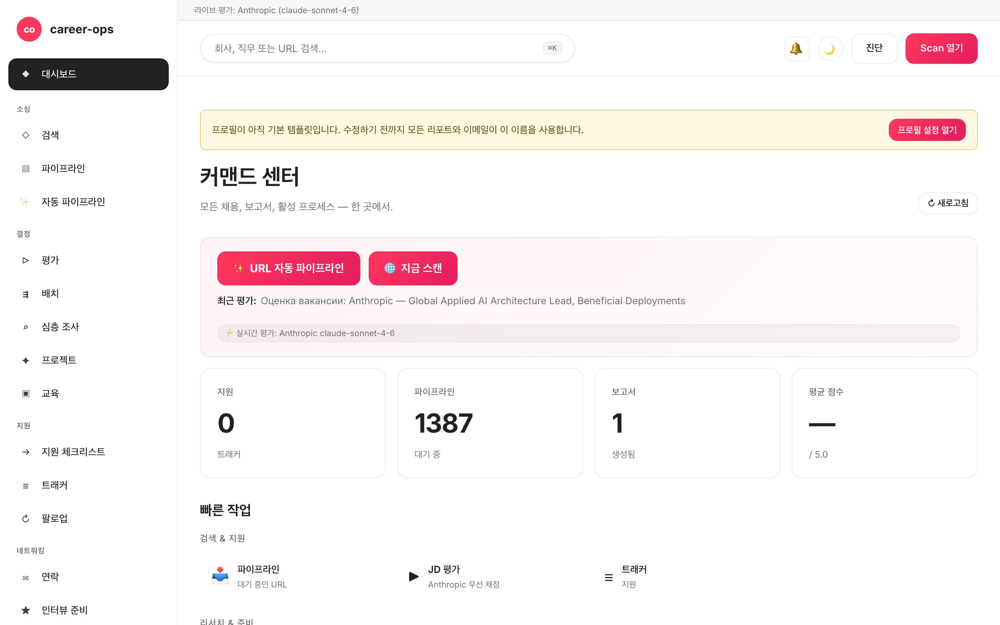

# career-ops-ui

> [career-ops](https://github.com/santifer/career-ops) AI 구직 파이프라인을 위한 깔끔한 docs-style 웹 인터페이스입니다.
> Claude Code, 터미널, 마크다운 파일 사이를 오갈 필요 없이 — 단일 브라우저 탭에서 모든 채용 공고를 검색하고, 평가하고, 심층 조사하고, 지원하고, 추적할 수 있습니다.

[English](README.md) | [Español](README.es.md) | [Português (Brasil)](README.pt-BR.md) | **한국어** | [日本語](README.ja.md) | [Русский](README.ru.md) | [简体中文](README.zh-CN.md) | [繁體中文](README.zh-TW.md) | [Français](README.fr.md)

[](#tests)
[](#tests)
[](#tests)
[](#requirements)
[](LICENSE)
[](https://github.com/Fighter90/career-ops-ui/releases/tag/v1.69.2)

> **🆕 최신 릴리스 — v1.69.2**
>
> **fix(test): `npm test`가 실제 `config/profile.yml` / `data/scan-history.tsv`를 더 이상 덮어쓰지 않습니다.** 한 테스트(`critical-fixes.test.mjs`)가 파일 상단에서 `prompts.mjs`(→ `paths.mjs`)를 가져왔기 때문에, 테스트가 `CAREER_OPS_ROOT`를 임시 디렉터리로 설정하기 전에 `PROJECT_ROOT`가 **실제** 부모로 해석되어 `PUT /api/profile`가 매 실행마다 "Acceptance Test" 픽스처를 프로필에 기록했습니다. 이제 환경 변수를 설정한 뒤 동적 `import()`로 로드하며, `tests/test-root-isolation.test.mjs`가 전체 스위트를 보호합니다. 프로덕션 코드 변경 없음.
>
> _전체 스위트 **1086/1086** 통과 · i18n + 문서를 9개 로케일에 동기화._

<!-- DO NOT REVERT: locale-specific dashboard screenshot (dashboard-ko-KR.png). Each README uses its own ./images/dashboard-<locale>.png — never replace with dashboard-en.png. Generated by scripts/capture-dashboard-screenshots.mjs. -->


## career-ops 소개

[career-ops](https://career-ops.org)는 모든 AI 코딩 CLI(Claude Code, Codex, OpenCode, Qwen CLI — 다른 Claude 호환 CLI도 동일한 슬래시 커맨드 인터페이스에서 작동합니다) 안에서 슬래시 명령으로 동작하는 오픈소스 구직 시스템입니다. 모델 무관(model-agnostic)으로 설계되어 있으며, 6차원 0.0–5.0 루브릭으로 각 채용 공고를 사용자의 CV와 대조하여 평가하고, 맞춤형 PDF 이력서를 생성하며, 모든 지원 이력을 로컬에 기록합니다. 클라우드 계정도, 텔레메트리도, 자동 제출 기능도 사용하지 않습니다.

**이 저장소(career-ops-ui)** 는 그 위에 얹은 완성도 높은 웹 인터페이스입니다. 폼 자동 입력(Playwright MCP 경유)과 슬래시 명령 모드는 여전히 CLI가 담당하며, SPA는 동일한 `cv.md` / `data/applications.md` / `reports/` 파일 위에 CRM 형태의 브라우저 화면을 제공합니다. 두 도구는 같은 데이터를 공유합니다.

**점수별 액션 임계값** ([career-ops.org/docs](https://career-ops.org/docs) 기준):

| Score | 다음 단계 |
|---|---|
| **≥ 4.5** | `/career-ops apply` — 적합도가 높음, 즉시 지원 |
| **4.0 – 4.4** | 지원하거나 `/career-ops contacto`로 warm intro 시도 |
| **3.5 – 3.9** | `/career-ops deep` — 먼저 리서치 진행 |
| **< 3.5** | 특별한 이유가 없는 한 건너뜀 |

**캐노니컬 가이드** ([career-ops.org/docs](https://career-ops.org/docs)):

- [What is career-ops](https://career-ops.org/docs/introduction/what-is-career-ops)
- [Scan job portals](https://career-ops.org/docs/introduction/guides/scan-job-portals)
- [Apply for a job](https://career-ops.org/docs/introduction/guides/apply-for-a-job)
- [Batch-evaluate offers](https://career-ops.org/docs/introduction/guides/batch-evaluate-offers)
- [Set up Playwright](https://career-ops.org/docs/introduction/guides/set-up-playwright)

## 한 줄 명령으로 실행 및 초기화

> **중요 — career-ops-ui는 [`santifer/career-ops`](https://github.com/santifer/career-ops) *위에* 올라가는 대시보드입니다.** `career-ops/web-ui/`로서 career-ops 프로젝트 **내부**에서 실행되며, `../`를 통해 부모 폴더의 `cv.md`, `config/`, `data/`를 읽습니다. **단독으로 작동하지 않습니다** — 부모 `career-ops` 저장소도 필요합니다. 단독으로 클론하여 `init`을 실행하지 마세요; 아래의 두 옵션 중 하나를 사용하세요.

### 옵션 1 — 단일 curl (권장: 모두 설정)

```bash
curl -fsSL https://raw.githubusercontent.com/Fighter90/career-ops-ui/main/bin/setup.sh | bash
```

**두** 저장소를 클론하고, `career-ops/web-ui/` 구조를 구성하고, 의존성을 설치하고, doctor를 실행한 뒤, http://127.0.0.1:4317 에서 서버를 시작합니다 — 그런 다음 대시보드를 엽니다.

### 옵션 2 — 기존 career-ops 프로젝트에 UI 추가

이미 career-ops를 설정했고 대시보드만 필요한 경우, UI를 `web-ui`로 **내부에** 클론합니다:

```bash
cd career-ops                                                   # ← 기존 career-ops 프로젝트
git clone https://github.com/Fighter90/career-ops-ui.git web-ui
cd web-ui
npm install
npx career-ops-ui init        # interactive: pick LLM provider + paste its key → parent career-ops/.env
```

`web-ui/`가 중첩된 구조인 것이 바로 UI가 `../cv.md`, `../config/`, `../data/`를 해석할 수 있는 이유입니다. `npx career-ops-ui <verb>` 대신 `career-ops-ui <verb>`를 입력하고 싶다면 `npm link`를 **한 번** 실행하세요.

### CLI 명령어

```bash
career-ops-ui setup    # bootstrap: install deps → doctor → run (SKIP_START=1 to stop before run)
career-ops-ui init     # pick LLM provider + paste its key (interactive)
career-ops-ui doctor   # verify Node / project / keys / Playwright (exit 0 ⇔ all required green)
career-ops-ui run      # launch the server at http://127.0.0.1:4317
career-ops-ui open     # open + RAISE the dashboard tab in your browser
career-ops-ui help     # list every verb
```

`npm link`를 실행하지 않았다면 `npx `를 앞에 붙이세요(예: `npx career-ops-ui run`). `setup`/`run` 이후 탭은 자동으로 열리고 **맨 앞으로 가져와집니다**; `NO_OPEN=1`을 설정하면 자동 열기를 비활성화합니다(headless / CI).

### LLM 프로바이더 선택

`init`은 프로바이더 마법사입니다 — **Claude / Claude Code** (`ANTHROPIC_API_KEY`), **Gemini / Gemini CLI** (`GEMINI_API_KEY`), **Codex / OpenCode CLI** (`OPENAI_API_KEY`), 또는 **Auto**(Anthropic → Gemini 폴백) 중에서 선택합니다. 키는 에코를 끈 상태로 입력되며 `#/config` API 키 탭이 사용하는 것과 동일한 검증된 경로를 통해 상위 `career-ops/.env`에 기록됩니다. CI용 비대화형 형식:

```bash
career-ops-ui init --provider claude --anthropic-key sk-ant-… --yes
career-ops-ui init --provider gemini --gemini-key …          --yes
career-ops-ui init --provider auto   --openai-key sk-…       --yes
```

또는 직접 설정: `echo "ANTHROPIC_API_KEY=sk-ant-…" >> career-ops/.env`. 프로바이더는 `LLM_PROVIDER`(`auto` | `claude` | `gemini`)를 설정합니다; 재시작 없이 **`#/config` → API 키**에서 언제든 변경할 수 있습니다.

### `init` 문제 해결

`career-ops-ui init`이 실패하거나 명령을 찾을 수 없는 경우(`git pull` 직후에 흔히 발생):

```bash
cd career-ops/web-ui
npm install
npx career-ops-ui init        # npx runs the local bin even without `npm link`
```

확인 사항:

- **`career-ops/web-ui/` 내부에서** 실행하고 있는지 — 단독 `career-ops-ui/` 클론에서가 아닌지.
- **부모 `career-ops/` 폴더가 존재하고** `cv.md`와 `config/`가 포함되어 있는지. career-ops-ui를 단독으로 클론했다면, `career-ops/web-ui/`에 위치하도록 이동(또는 재클론)하세요 — 또는 옵션 1의 curl을 실행하면 구조를 자동으로 구성해 줍니다.
- `career-ops-ui doctor` (또는 `npx career-ops-ui doctor`)가 정확히 무엇이 부족한지 출력합니다.

---

## 왜 필요한가?

[career-ops](https://github.com/santifer/career-ops)는 강력한 Claude Code 기반 구직 시스템입니다. JD를 붙여 넣으면 0–5의 적합도 점수, ATS 최적화 PDF, 트래커 항목이 곧바로 생성됩니다. Claude Code 안에서는 훌륭하게 동작하지만, 실제 데이터는 `cv.md`, `data/applications.md`, `reports/*.md`, `data/pipeline.md`, `portals.yml`, `config/profile.yml` 등 여러 파일에 흩어져 있어 잃어버리기 쉽고 한눈에 훑어보기도 어렵습니다.

`career-ops-ui`는 그 위에 다듬어진 UI 한 겹을 더합니다.

- **Auto-pipeline** — `#/auto`에 URL 하나 붙여넣고 한 번 클릭: 검증 → 가져오기 → 평가 → 리포트 저장 → 트래커 추가, 실시간 접근성 스테퍼와 산출물 딥링크 제공.
- **탐색** — 트래커, 보고서, 파이프라인을 CRM처럼 살펴봅니다.
- **트리거** — 스캔(Greenhouse / Ashby / Lever / Workable / SmartRecruiters / Workday **및** hh.ru / Habr Career / Trudvsem / GetMatch / GeekJob)을 실행하고 실시간 SSE 로그를 확인합니다.
- **평가** — Anthropic(우선) 또는 Gemini로 JD를 라이브 평가하거나, API 키가 없을 경우 Claude Code용 복붙 프롬프트를 받습니다.
- **딥 리서치** — Anthropic SDK를 통한 라이브 회사 리서치를 수행하며, cv / profile / mode 파일을 자동으로 인라인 처리합니다.
- **편집** — `cv.md`를 사이드 바이 사이드 마크다운 프리뷰와 서버 사이드 XSS 새니타이즈로 편집합니다.
- **유지보수** — doctor, verify, normalize, dedup, merge를 모두 원클릭으로 실행합니다.
- **멀티 CLI** — Claude Code, Codex, Cursor, Aider, Gemini CLI에서 동일하게 동작합니다. `CLAUDE.md` / `AGENTS.md` / `GEMINI.md` 심(shim)이 단일 진실 공급원(single source of truth)을 가리킵니다.

순수한 추가물입니다. `career-ops/` 내부는 어떤 것도 변경되지 않으며, 사용자가 적용한 커스터마이징은 그대로 유지됩니다.

---

## 빠른 시작

### 1. career-ops 먼저 설치

```bash
git clone https://github.com/santifer/career-ops.git
cd career-ops
```

[career-ops 온보딩](https://github.com/santifer/career-ops#first-run--onboarding) 절차를 따라 `cv.md`, `config/profile.yml`, `portals.yml`이 존재하도록 준비합니다.

### 2. 그 안에 career-ops-ui 배치

```bash
git clone https://github.com/Fighter90/career-ops-ui.git web-ui
```

디렉터리 구조는 다음과 같이 됩니다.

```
career-ops/
├─ cv.md
├─ portals.yml
├─ config/
├─ data/
├─ modes/
├─ reports/
├─ scan.mjs … doctor.mjs … (등)
└─ web-ui/                 ← 이 저장소
   ├─ bin/start.sh
   ├─ package.json
   ├─ server/
   ├─ public/
   └─ tests/
```

### 3. 실행

```bash
bash web-ui/bin/start.sh
```

스크립트가 수행하는 작업은 다음과 같습니다.

1. Node ≥ 18 확인.
2. `npm install` (최초 실행 시에만, 의존성 두 개 — Express + js-yaml).
3. `127.0.0.1:4317`에서 Express 서버 기동.
4. 기본 브라우저에서 http://127.0.0.1:4317/ 열기.

포트 / 호스트 커스터마이징:

```bash
PORT=8080 bash web-ui/bin/start.sh
HOST=0.0.0.0 PORT=4317 bash web-ui/bin/start.sh   # LAN에 노출
```

저장소를 `career-ops/web-ui` 외 다른 위치에 클론했다면 환경 변수로 career-ops 위치를 알려 줍니다.

```bash
CAREER_OPS_ROOT=/path/to/career-ops bash bin/start.sh
```

---

## 최초 실행 — 깨끗한 상태

`career-ops/data/pipeline.md` 에는 테스트 스위트가 헐멋하게 실행되도록 두 개의 QA 픽스처 URL (`example.com/qa-fixture-*`) 이 포함되어 있습니다. 새 클론에서는 Pipeline 이 `2 대기 중` 으로 표시됩니다 — 실제 채용 공고가 아닙니다. 첫 스캔 전에 정리하세요:

```bash
make clean-test-fixtures
npm start
```

http://127.0.0.1:4317 를 엽니다. Pipeline 카운터가 `0 대기 중` 으로 표시되어야 합니다.

---

## 요구사항

| | |
| --- | --- |
| **Node.js** | ≥ 18 (네이티브 `fetch`, `node:test` 사용) |
| **career-ops** | 클론 및 온보딩 완료 — 위 절차 참조 |
| **선택사항** | 원클릭 JD 평가용 `GEMINI_API_KEY`를 부모 프로젝트의 `.env`에 설정 (무료 티어 모델 `gemini-2.0-flash`). 설정하지 않으면 UI가 Claude용 복붙 프롬프트를 반환합니다. |
| **선택사항** | hh.ru가 403을 반환하는 경우 러시아 IP / VPN에서 실행합니다. Habr Career는 IP와 무관하게 동작합니다. |
| **선택사항** | e2e 테스트 스위트용 Playwright (이미 career-ops의 transitive dep입니다). |

---

## 페이지별 기능

| 페이지            | 기능                                                                                                              |
| ---------------- | ----------------------------------------------------------------------------------------------------------------- |
| **Dashboard**    | 집계 카운트(apps / pipeline / reports), 평균 점수, 상태 분포, 최근 5개 apps + 최신 보고서.                                  |
| **Scan**         | **🌐 단일 Scan 버튼** — 활성화된 모든 소스를 한 번에 실행합니다(EN은 Greenhouse / Ashby / Lever / Workable / SmartRecruiters / Workday, RU는 hh.ru + Habr Career + Trudvsem + GetMatch + GeekJob). 실시간 SSE 로그 스트리밍과 클릭 가능한 결과 테이블, location / Remote-Hybrid 배지 / relocation 플래그 / 급여 / source 필터, 동적 stack / level / keyword 칩을 제공합니다. Active-Companies 카드는 추적 중인 모든 board와 API health를 나열합니다. |
| **Pipeline**     | `data/pipeline.md`에 대한 CRUD. 서버 사이드 프리뷰 프록시(SSRF 안전, per-hop redirect 검증, 8 KB body cap). URL에서 바로 평가로 이동할 수 있습니다. |
| **Evaluate**     | JD 붙여넣기 → **Anthropic 우선**(두 키가 모두 있을 때 선호), 그다음 Gemini, 마지막으로 수동 프롬프트 폴백. Anthropic 경로는 cv / profile / `_shared.md` / `oferta.md`를 자동으로 인라인합니다(REVIEW-A1). JD를 `jds/`에 저장하는 옵션도 있습니다. |
| **Deep research**| Evaluate와 동일한 폴백 체인. 라이브 Anthropic은 약 10~30 KB의 grounded markdown을 `interview-prep/<company>-<role>.md`에 저장합니다. |
| **Modes**        | 7개의 범용 mode 페이지(`/#/project`, `/#/training`, `/#/followup`, `/#/batch`, `/#/contacto`, `/#/interview-prep`, `/#/patterns`)가 동일한 Anthropic / Gemini / manual 폴백을 사용합니다. |
| **Apply helper** | 제출 체크리스트를 생성합니다. 실제 Playwright 폼 자동 입력은 Claude Code의 `/career-ops apply`에 그대로 유지됩니다. |
| **Tracker**      | `data/applications.md` 위의 필터 가능 테이블(status, score, free-text). 원클릭 `normalize-statuses.mjs` / `dedup-tracker.mjs` / `merge-tracker.mjs`. 파이프 + 줄바꿈 이스케이프가 GFM을 준수하므로 `"Acme \| Co"` 같은 이름도 무손실로 라운드트립됩니다. |
| **Reports**      | `reports/`의 모든 보고서를 파싱된 헤더(Score / Legitimacy / URL)와 함께 열람할 수 있습니다.                       |
| **CV**           | `cv.md` 라이브 마크다운 에디터, 사이드 바이 사이드 프리뷰, 원클릭 `cv-sync-check.mjs`, 📁 Upload CV 지원. 저장 시 서버 사이드 XSS 스트립(`<script>`, `javascript:`, `on*=` 핸들러)이 적용됩니다. |
| **Profile**      | `config/profile.yml` + archetypes의 읽기 전용 뷰 — UI 친화적인 요약 화면입니다.                                         |
| **App settings** | 부모 `.env` 키를 UI 내부에서 편집합니다: `ANTHROPIC_API_KEY`, `GEMINI_API_KEY`, 모델 오버라이드, port / host. 시크릿은 읽을 때 마스킹됩니다. |
| **Health**       | 모든 setup 체크를 OK / OPTIONAL / FAIL 배지로 보여 주며, `doctor.mjs`와 `verify-pipeline.mjs` 실행 버튼을 제공합니다.           |
| **Help**         | 인앱 마크다운 사용자 가이드(`/#/help`). 지원되는 8개 언어(en / es / pt-BR / ko-KR / ja / ru / zh-CN / zh-TW)로 현지화되어 있습니다. |
| **Activity log** | 상태를 변경하는 모든 요청(writes, runs, scans)에 대한 감사 추적. 시크릿은 redact 처리됩니다. |
| **알림** 🔔 *(v1.58.34 / v1.58.35)* | 상단바 벨 + 빨간 안 읽음 배지. 클릭 → 우측 드로어가 최근 50 개의 토스트(탭별/세션별) 표시 — 성공 / 오류 / 정보-진행, 각 항목에 현지화된 시각·메시지·필요 시 `(METHOD /path · HTTP NNN)` 후미가 `<details>` 안에 포함. 도움말 **§18** 가 모든 카테고리 설명. 드로어는 **벨 클릭에서만** 열림(키보드 Enter / Space 포함); ×, Esc, 또는 벨 재클릭으로 닫힘. |

전역 키보드 단축키:

- `Ctrl+K` / `Cmd+K` — 전역 검색에 포커스.
- 전역 검색에 URL을 붙여 넣으면 자동으로 파이프라인에 추가됩니다.
- `Esc` — 열려 있는 모달을 닫습니다.

---

## Scan

실제로 채용 공고를 반환하는 제로 토큰 포털 스캔입니다. UI의 **🌐 Scan 버튼 하나**가 설정된 모든 소스를 단일 스윕으로 실행합니다.

- **Greenhouse / Ashby / Lever / Workable / SmartRecruiters / Workday** — `portals.yml::tracked_companies`에 등록되어 있고 인식 가능한 ATS 패턴을 가진 모든 회사의 공개 boards-api를 호출합니다. 번들 목록에는 Stripe, GitLab, Vercel, Cloudflare, Datadog, Discord, Elastic, Grafana Labs, CockroachDB, Fastly, Twilio, Coinbase, Reddit, Robinhood, Affirm, Lyft, Linear, Supabase, PostHog, Ramp, Modal Labs, Railway, Browserbase, JetBrains가 포함되어 있으며 자유롭게 확장하거나 축소할 수 있습니다.
- **RSS 채용 게시판** — RSS/Atom 피드를 제공하는 모든 채용 게시판(LaraJobs, WeWorkRemotely, RemoteOK, golangprojects 등)을 지원합니다. `portals.yml`에 `provider: rss`와 피드 URL만 추가하면 됩니다. 코드 변경 불필요.
- **hh.ru** — `hh.ru/search/vacancy` HTML 스크랩. 어떤 IP에서도 키·프록시 없이 작동합니다. (JSON API `api.hh.ru`는 더 이상 사용하지 않습니다: 이제 IP/User-Agent와 무관하게 모든 프로그램 클라이언트에 403을 반환합니다. 사이트는 Habr Career처럼 브라우저류 클라이언트에 전체 결과를 제공합니다.)
- **Habr Career** — `career.habr.com/vacancies`의 HTML 스크레이프. 모든 IP에서 동작하며 인증이 필요하지 않습니다.

### RSS 어댑터

`portals.yml`에 `provider: rss`와 `rss:` (또는 `feed_url:`) 키를 가진 항목을 추가하여 RSS 기반 채용 게시판을 스캐너에 연결합니다.

```yaml
tracked_companies:
  - name: LaraJobs
    provider: rss
    rss: https://larajobs.com/feed
    enabled: true
  - name: WeWorkRemotely
    provider: rss
    rss: https://weworkremotely.com/remote-jobs.rss
    enabled: true
```

어댑터는 소형 정규식 파서(XML 라이브러리 불필요)로 `<item>` 블록을 분석합니다. `title`, `link` (→ `url`), `pubDate` (→ `date`), `description` (→ `snippet`, HTML 태그 제거)을 추출합니다. 원격 근무 여부는 제목이나 설명의 `/remote|anywhere/i` 패턴으로 판별하고, 회사명은 `dc:creator`, 제목의 «회사 — 직책» 패턴, 또는 피드 호스트명 순으로 추출합니다. ATS 어댑터와 동일한 정규화 → 필터링 → 중복 제거 → 파이프라인 추가 흐름이 적용됩니다.

모든 소스는 동일한 파이프라인을 통과합니다: 정규화 → 필터(`title_filter.positive` / `title_filter.negative`) → `data/scan-history.tsv` + `data/pipeline.md` + `data/applications.md` 대조 dedup → `data/pipeline.md`에 append → 전체 결과셋을 UI 필터 테이블용 `data/last-scan.json`에 저장.

`portals.yml`을 통해 설정합니다.

```yaml
title_filter:
  positive: [backend, engineer, senior, tech lead, golang, php]
  negative: [junior, intern, frontend, ios, android]
tracked_companies:
  - { name: Stripe, enabled: true, careers_url: https://job-boards.greenhouse.io/stripe }
  - { name: Linear, enabled: true, careers_url: https://jobs.ashbyhq.com/linear }
  # ...
russian_portals:
  sources: ["hh", "habr"]   # 하나 또는 둘 다
  area: 113                  # 1=Moscow, 2=SPb, 113=Russia, 1001=remote
  per_page: 50
  only_remote: false
  queries: ["Senior PHP", "Senior Go", "Tech Lead"]
```

모든 소스는 단일 SSE 엔드포인트(`/api/stream/scan?source=ats|regional|both`)를 거쳐 흐릅니다. **🌐 Scan** UI 버튼은 `source=both`를 호출하여 모든 어댑터(Greenhouse / Ashby / Lever / Workable / SmartRecruiters / Workday + hh.ru + Habr Career + Trudvsem + GetMatch + GeekJob)를 단일 연결로 실행합니다. 클라이언트가 연결을 끊으면 `AbortSignal`을 honor하므로 orphan fetch가 발생하지 않습니다.

---

## 아키텍처

```
career-ops-ui/
├─ CLAUDE.md                 # 프로젝트 레벨 에이전트 지침 (캐노니컬)
├─ AGENTS.md                 # Codex / Aider / 범용 CLI 심 → CLAUDE.md
├─ GEMINI.md                 # Gemini CLI 심 → CLAUDE.md
├─ .aiignore                 # AI 도구용 제외 목록
├─ .claude/                  # Claude Code 에이전트 설정
│  ├─ agents/                # 3개의 프로젝트별 서브에이전트 (route, view, test isolation)
│  └─ commands/               # 슬래시 명령 stub
├─ bin/start.sh              # 원샷 런처 (Node 체크 → npm install → 서버 → 브라우저 열기)
├─ package.json              # 2개의 런타임 의존성: express, js-yaml
├─ server/
│  ├─ index.mjs              # ~130 LOC 오케스트레이터: 미들웨어 + 12개 register<Topic>Routes(app) 호출 + SPA catch-all
│  └─ lib/
│     ├─ paths.mjs           # career-ops 파일의 절대 경로 (CAREER_OPS_ROOT 인식)
│     ├─ parsers.mjs         # markdown / pipeline / report 파서 (GFM 호환 파이프 이스케이프)
│     ├─ runner.mjs          # runNodeScript() + streamNodeScript()와 SIGTERM→SIGKILL 에스컬레이션 + 30분 캡
│     ├─ security.mjs        # isValidJobUrl, stripDangerousMarkdown, sanitizeJobDescription, sanitizePathName, isPubliclyExposed
│     ├─ safe-fetch.mjs      # DNS 핀닝 SSRF-safe fetch (v1.21.0)
│     ├─ file-lock.mjs       # 파일 단위 뮤텍스 (v1.21.0)
│     ├─ rate-limit.mjs      # LLM 엔드포인트 요청 빈도 제한 (v1.21.0)
│     ├─ prompts.mjs         # bundleProjectContext, buildEvaluationPrompt, buildDeepPrompt, buildModePrompt
│     ├─ store.mjs           # safeReadApps/Pipeline/Reports, checkProfileCustomized, ensureRussianPortalsDefaults
│     ├─ anthropic.mjs       # 최소 Anthropic SDK 어댑터 (runAnthropic, hasAnthropicKey, hasGeminiKey)
│     ├─ env-config.mjs      # 시크릿 마스킹 + 검증과 함께 .env 라운드트립
│     ├─ activity-log.mjs    # JSONL 감사 추적 미들웨어 (시크릿 redact)
│     ├─ dotenv.mjs          # 작은 dotenv 로더
│     ├─ en-scanner.mjs      # 인프로세스 Greenhouse/Ashby/Lever 오케스트레이터 (AbortSignal 인식)
│     ├─ ru-scanner.mjs      # 인프로세스 hh.ru + Habr 오케스트레이터 (AbortSignal 인식)
│     ├─ sources/
│     │  ├─ greenhouse.mjs   # boards-api.greenhouse.io 클라이언트
│     │  ├─ ashby.mjs        # api.ashbyhq.com 클라이언트
│     │  ├─ lever.mjs        # api.lever.co 클라이언트
│     │  ├─ hh.mjs           # api.hh.ru 클라이언트 (UA 인식)
│     │  └─ habr.mjs         # career.habr.com HTML 파서 (cheerio 없음, 정규식만)
│     └─ routes/             # 12개 라우트 모듈 — 토픽당 하나 (P-2)
│        ├─ activity.mjs     # /api/activity
│        ├─ config.mjs       # /api/config (부모 .env 라운드트립)
│        ├─ content.mjs      # /api/cv, /api/profile, /api/portals, /api/modes
│        ├─ health.mjs       # /api/health, /api/dashboard
│        ├─ help.mjs         # /api/help/:lang
│        ├─ jds.mjs          # /api/jds CRUD
│        ├─ llm.mjs          # /api/evaluate, /api/deep, /api/mode/:slug, /api/apply-helper, /api/interview-prep*
│        ├─ pipeline.mjs     # /api/pipeline + SSRF-safe 프리뷰 프록시
│        ├─ reports.mjs      # /api/reports
│        ├─ runners.mjs      # /api/run/* + /api/stream/{scan,liveness,pdf} + /api/output/pdfs
│        ├─ scan.mjs         # /api/stream/scan-{ru,en} + /api/scan-results
│        └─ tracker.mjs      # /api/tracker
├─ public/                   # 정적 SPA — 빌드 스텝 없음
│  ├─ index.html
│  ├─ css/app.css            # 디자인 토큰 (docs-style 팔레트)
│  └─ js/
│     ├─ api.js              # fetch 래퍼 + connection-banner 상태 + UI 헬퍼 + 안전한 markdown 렌더러
│     ├─ router.js           # 404 폴백 + alias 지원이 있는 hash 기반 라우터
│     ├─ app.js              # 부트 + 전역 키보드 핸들러 + 모바일 사이드바 drawer
│     ├─ lib/{i18n,skills}.js
│     └─ views/              # 페이지당 한 파일 (dashboard, scan, pipeline, evaluate, deep, apply, tracker, reports, cv, settings, health, config, help, activity, mode-page)
├─ docs/                     # 공개 레퍼런스: 아키텍처, API, 데이터 플로우, SDD, 컨벤션, 리뷰
│  ├─ PROJECT.md             # 무엇 / 왜 / 누구를 위해
│  ├─ ROADMAP.md             # 현재 milestone + 완료된 이력
│  ├─ PRODUCTION-READINESS.md # 솔직한 배포 게이트 평가
│  ├─ sdd/{SDD-GUIDE,CONVENTIONS}.md
│  ├─ architecture/{OVERVIEW,SERVER,FRONTEND,API,DATA-FLOWS}.md
│  └─ reviews/REVIEW-*.md
└─ tests/                    # 1000 unit + 70 Playwright + 23 e2e:full + 20 e2e:smoke
   ├─ parsers.test.mjs       # markdown / pipeline / report 파서 (순수 함수)
   ├─ api.test.mjs           # 모든 엔드포인트, 임시 서버, 네트워크 없음
   ├─ {ru,en}-scanner.test.mjs   # mocked fetch
   ├─ pipeline-preview.test.mjs   # per-hop redirect 검증 (REVIEW-B1)
   ├─ ssrf-redirect-rebind.test.mjs # DNS-rebind 방어 (v1.21.0)
   ├─ concurrent-tracker-write.test.mjs # 파일 락 경쟁 상태 (v1.21.0)
   ├─ rate-limit.test.mjs    # LLM rate limit (v1.21.0)
   ├─ path-traversal.test.mjs # sanitizePathName 스윕 (v1.21.0)
   ├─ anthropic.test.mjs     # SDK 어댑터 + log-guard 테스트 (REVIEW-B4)
   ├─ url-validation.test.mjs    # SSRF 거부 스윕 (FIX-M3 + M6 + M7)
   ├─ cv-xss.test.mjs        # stripDangerousMarkdown 라운드트립 (entity-aware, v1.22.0)
   ├─ jd-sanitize.test.mjs   # sanitizeJobDescription
   ├─ help.test.mjs / help-ui.test.mjs    # 8개 로케일 i18n 패리티
   ├─ playwright-smoke.mjs   # 12개 브라우저 플로우
   └─ e2e{,-comprehensive}.mjs   # 전체 Playwright 워크스루
```

### 빌드 스텝이 없는 이유

Vanilla HTML/CSS/JS는 표면적을 최소로 유지합니다. 의존성 두 개를 `npm install` 한 번이면 곧바로 실행됩니다. Webpack도, Vite도, 끝없는 `node_modules`도 없습니다. 전체 UI는 minified 기준 30 KB 미만입니다. 개발 중 hot-reload가 필요하면 `npm run dev`가 Node 내장 `--watch`를 사용합니다.

### 스펙 주도 개발 (Spec-Driven Development)

비자명한(non-trivial) 변경은 GSD 파이프라인(`superpowers@claude-plugins-official`의 `gsd-*` 스킬)을 거칩니다.

```
discuss → spec → plan → execute → verify → review
```

공개 레퍼런스는 [`docs/sdd/SDD-GUIDE.md`](docs/sdd/SDD-GUIDE.md)에 있습니다. 모든 계획 산출물은 `.planning/` 아래(gitignored)에 위치하며, `docs/` 트리는 장기 공개 계약(public contract)입니다.

---

## API 레퍼런스

모든 엔드포인트는 `/api/*` 아래에 있습니다. 별도 표기가 없으면 JSON in / JSON out입니다.

### Health & dashboard

| Method | Path                     | 응답                                                                    |
| ------ | ------------------------ | --------------------------------------------------------------------------- |
| GET    | `/api/health`            | `{ ok, warnings, version, parentVersion, checks: [{name, ok, required, value?}] }` |
| GET    | `/api/dashboard`         | `{ counts, avgScore, byStatus, recent, pipeline, lastReport }`              |
| GET    | `/api/status/providers`  | `{ activeProvider, activeModel, keysConfigured }` — 온보딩 배너 + ⚡ 비용 힌트용 LLM 준비 상태 (v1.55.3) |
| GET    | `/api/activity?limit&type` | `data/activity.jsonl` 감사 추적의 tail                                 |
| GET    | `/api/help/:lang`        | 현지화된 인앱 사용자 가이드 (폴백: `en.md`)                             |

### App settings (부모 .env 라운드트립)

| Method | Path             | 목적                                                                |
| ------ | ---------------- | ---------------------------------------------------------------------- |
| GET    | `/api/config`    | 시크릿이 마스킹된 알려진 env 키                                     |
| POST   | `/api/config`    | 검증 + 부모 `.env`에 쓰기; `process.env`에 즉시 적용      |

### 데이터 파일

| Method | Path                                | 목적                                                                |
| ------ | ----------------------------------- | ---------------------------------------------------------------------- |
| GET    | `/api/tracker`                      | `{ rows: [parsed applications.md] }`                                   |
| POST   | `/api/tracker`                      | body `{ company, role, score?, status?, url?, notes?, date? }` — dedup 인식 (company + role 대소문자 무관) |
| GET    | `/api/pipeline`                     | `{ urls: [...] }`                                                      |
| POST   | `/api/pipeline`                     | body `{ url }` → dedup + `isValidJobUrl`로 `data/pipeline.md`에 추가 |
| GET    | `/api/pipeline/preview?url=…`       | 서버 사이드 fetch 프록시 (per-hop SSRF 체크, ≤3 redirect, 8 KB 캡) |
| DELETE | `/api/pipeline?url=…`               | URL 제거                                                          |
| GET    | `/api/reports`                      | `reports/*.md`의 파싱된 목록                                          |
| GET    | `/api/reports/:slug`                | 전체 markdown + 파싱된 헤더                                          |
| GET    | `/api/jds`                          | 저장된 JD 파일 목록                                                 |
| GET    | `/api/jds/:name`                    | text/plain — raw JD                                                    |
| POST   | `/api/jds`                          | body `{ text, slug? }` → `jds/`에 저장                               |
| DELETE | `/api/jds/:name`                    | unlink (`.txt` suffix 필수)                                        |
| GET    | `/api/cv`                           | `{ markdown }`                                                         |
| PUT    | `/api/cv`                           | body `{ markdown }` → `cv.md` 쓰기 (entity-aware XSS 스트립, ≤1 MB)             |
| GET    | `/api/profile`                      | `{ profile: yaml-parsed, raw: text }`                                  |
| GET    | `/api/portals`                      | `{ portals: yaml-parsed, raw: text }`                                  |
| GET    | `/api/modes`                        | mode 파일 목록                                                     |
| GET    | `/api/modes/:name`                  | text/plain — raw mode 프롬프트                                           |
| GET    | `/api/output/pdfs`                  | 생성된 PDF 목록                                                 |
| GET    | `/api/output/pdfs/:name`            | 다운로드 (`Content-Disposition: attachment`)                          |
| GET    | `/api/interview-prep`               | 저장된 deep-research 파일 목록                                      |
| GET    | `/api/interview-prep/:name`         | `{ name, markdown }`                                                   |
| DELETE | `/api/interview-prep/:name`         | unlink (`.md` suffix 필수)                                         |

### 스크립트 러너 (버퍼, 원샷)

| Method | Path                    | 래핑하는 명령                       |
| ------ | ----------------------- | --------------------------- |
| POST   | `/api/run/doctor`       | `node doctor.mjs`           |
| POST   | `/api/run/verify`       | `node verify-pipeline.mjs`  |
| POST   | `/api/run/normalize`    | `node normalize-statuses.mjs` |
| POST   | `/api/run/dedup`        | `node dedup-tracker.mjs`    |
| POST   | `/api/run/merge`        | `node merge-tracker.mjs`    |
| POST   | `/api/run/sync-check`   | `node cv-sync-check.mjs`    |

모든 버퍼 실행은 60초로 제한되며, 5초 grace 후 SIGTERM → SIGKILL 에스컬레이션이 이뤄집니다.

### 스트림 (SSE)

| Method | Path                          | 스트리밍                            |
| ------ | ----------------------------- | ---------------------------------- |
| GET    | `/api/stream/scan`            | legacy `node scan.mjs` (서브프로세스)|
| GET    | `/api/stream/scan?source=ats\|regional\|both` | 통합 인프로세스 스캐너 SSE — query: `dryRun=1`, `company=…` (ATS 한정). |
| GET    | `/api/stream/liveness`        | `node check-liveness.mjs`          |
| GET    | `/api/stream/pdf`             | `node generate-pdf.mjs`            |

SSE 이벤트 타입:

```
event: start    data: { script, args?, writeFiles? }
event: log      data: { stream: "stdout"|"stderr", line: string }
event: done     data: { code, counts?, errors? }
event: error    data: { message }
```

### LLM 엔드포인트 (Anthropic 우선 → Gemini → 수동 폴백)

| Method | Path                                | 목적                                                                          |
| ------ | ----------------------------------- | -------------------------------------------------------------------------------- |
| POST   | `/api/evaluate`                     | body `{ jd, save? }` → JD 평가 (`oferta.md` 기준 A–G 섹션)              |
| POST   | `/api/evaluate/test-gemini`         | `GEMINI_API_KEY` 스모크 체크                                                     |
| POST   | `/api/evaluate/test-anthropic`      | `ANTHROPIC_API_KEY` 스모크 체크                                                  |
| POST   | `/api/deep`                         | body `{ company, role?, run? }` → deep-research 프롬프트 또는 라이브 grounded markdown |
| POST   | `/api/mode/:slug`                   | 범용 mode 러너; allowlist: `batch`, `contacto`, `followup`, `interview-prep`, `patterns`, `project`, `training` |
| POST   | `/api/apply-helper`                 | body `{ url, jd? }` → 지원 체크리스트                                      |
| GET    | `/api/scan-results`                 | `{ en: {when, fresh[], filtered[], errors[]}, ru: { ... } }` — 마지막 스캔         |
| GET    | `/api/scan/regional/config`         | 적용 중인 regional-scanner 설정 (queries, negatives, sources). |

`/api/deep` 또는 `/api/mode/:slug`에 `run: true`를 설정하면, 서버는 Anthropic을 우선 사용하며(두 키가 모두 있을 때), `cv.md` + `config/profile.yml` + `modes/_shared.md` + 해당 mode 템플릿을 `<project_context>` 블록에 인라인한 뒤 모델의 grounded markdown을 그대로 반환합니다. Soft cap은 어셈블된 프롬프트 200 KB이며, 초과 시 413을 반환합니다.

---

## 테스트

```bash
npm test                       # 1000 unit/integration 테스트
npm run test:e2e               # 20 smoke e2e (자체 서버 부팅)
npm run test:e2e:full          # 23 comprehensive e2e
npm run test:e2e:browser       # 70 Playwright browser-smoke
npm run test:coverage          # `npm test`와 동일 + V8 coverage
```

| Suite                       | Tests | 내용                                                                                                       |
| --------------------------- | ----- | ---------------------------------------------------------------------------------------------------------- |
| `node --test tests/*.test.mjs` (unit + integration) | **1000** | 모든 엔드포인트, 임시 서버, 네트워크 없음. parser, scanner (mocked), runner, anthropic, security headers, XSS, JD sanitize, URL validation, path traversal, DNS-rebind, file lock, rate limit, i18n 패리티 포함. |
| `tests/e2e.mjs` (smoke)      | 20    | Playwright headless: 모든 라우트 렌더링, 기본 플로우.                                                     |
| `tests/e2e-comprehensive.mjs` | 23    | 전체 Playwright 워크스루: 11개 라우트 + 12개 기능 플로우.                                              |
| `tests/playwright-smoke.mjs` (`npm run test:e2e:browser`) | **32** | 브라우저 주도 smoke: dashboard render, navigation, language switch, 404, health, tracker round-trip (BF-1), pipeline add + invalid-URL 스윕, reports empty, evaluate manual fallback, config keys masked, CV PUT XSS strip, pipeline preview 400. |
| **합계**                   | **1000** | **0 fails, 0 flakes**                                                                                    |

Coverage: `--experimental-test-coverage` 기준 약 93% 라인 / 약 83% 브랜치.

파서는 순수 함수(I/O 없음)로 작성되어 있으며 `applications.md`, `pipeline.md`, `reports/*.md`의 실제 데이터 단편으로 테스트됩니다. API 테스트는 Express 앱을 임시 포트에서 부팅하여 모든 엔드포인트를 end-to-end로 동작시킵니다. 스캐너 테스트는 `fetch`를 mock하므로 hh.ru가 IP를 차단해도 통과합니다. Playwright 브라우저 smoke는 인프로세스 서버를 대상으로 실행되며, 부모 프로젝트의 `node_modules`를 통해 Playwright를 해석하므로 `web-ui/`에 새로운 의존성이 추가되지 않습니다.

CI는 `main`에 푸시할 때마다 Node 18 / 20 / 22에서 unit + e2e + Playwright 매트릭스를 실행합니다.

---

## 설정

환경 변수(서버 시작 시 읽음, 명시된 경우 외에는 모두 선택사항):

| Var                  | 기본값            | 목적                                                                            |
| -------------------- | ------------------ | ---------------------------------------------------------------------------------- |
| `PORT`               | `4317`             | Express 바인드 포트                                                                  |
| `HOST`               | `127.0.0.1`        | Express 바인드 호스트. 비-loopback일 때 CSP가 첨부되며, v2.0.0에서 auth gate 도입 예정.   |
| `CAREER_OPS_ROOT`    | 스크립트 기준 `..`   | `cv.md`, `data/`, `portals.yml`, `modes/` 등의 위치.                      |
| `ANTHROPIC_API_KEY`  | 미설정              | `/api/evaluate`, `/api/deep`, `/api/mode/:slug` 라이브 모드 활성화 (두 키가 모두 있을 때 선호). |
| `ANTHROPIC_MODEL`    | `claude-sonnet-4-6` | Anthropic 모델 override.                                                         |
| `GEMINI_API_KEY`     | 미설정              | `gemini-eval.mjs`로 전달되며 `/api/evaluate`의 폴백으로 사용됩니다.           |
| `GEMINI_MODEL`       | `gemini-2.0-flash` | Gemini 모델 override.                                                             |
| `OPENAI_API_KEY`     | unset              | 헤드리스 라이브 평가(`auto` 순서 3번째) + 부모 Codex/OpenAI CLI 흐름.              |
| `OPENAI_MODEL`       | `gpt-5-codex`      | OpenAI 모델 override.                                                             |
| `QWEN_API_KEY`       | unset              | DashScope(OpenAI 호환) 경유 헤드리스 라이브 평가(`auto` 순서 4번째).               |
| `QWEN_MODEL`         | `qwen-max`         | Qwen 모델 override.                                                               |
| `OPENROUTER_API_KEY` | unset              | OpenRouter 경유 헤드리스 라이브 평가 — 키 하나로 300+ 모델(`auto`에서 5번째/마지막).|
| `OPENROUTER_MODEL`   | `openrouter/auto`  | `vendor/model` id. 카탈로그는 `GET /api/openrouter/models`에서 라이브 로드.        |
| `LLM_RATE_LIMIT`     | `10/60s`           | LLM 엔드포인트 요청 빈도 제한 (`HOST=0.0.0.0`에서만 적용, loopback에서는 no-op). |
| `(server uses default UA)`      | 미설정              | hh.ru User-Agent override (비-RU IP에서 403을 줄이는 데 도움)                       |

이 UI가 인식하는 `portals.yml` 확장(부모 프로젝트의 기존 파일에 추가):

```yaml
russian_portals:
  sources: ["hh", "habr"]
  area: 113          # hh.ru area id
  per_page: 50
  only_remote: false
  queries: ["Senior PHP", "Тимлид Go", ...]
```

회사 항목에 명시적 `api:` URL을 추가하는 것도 가능합니다. 검증된 24개 회사의 즉시 붙여넣기 가능 블록은 [`docs/portals-examples.md`](docs/portals-examples.md)(이 저장소)를 참고하십시오.

---

## 보안 노트

- 서버는 기본적으로 `127.0.0.1`에 바인드됩니다. 명시적인 `HOST=0.0.0.0` 없이는 인터넷에 노출되지 않습니다.
- **경로 새니타이즈 (v1.21.0)**: 모든 `:name` / `:slug` 라우트 파라미터는 `server/lib/security.mjs`의 `sanitizePathName()`을 통과합니다. `[\w-.]` 외 문자를 제거하고, 선행 점 시퀀스를 제거하며, 내부 점 시퀀스를 압축하고, 길이를 200자로 제한하며, 빈 값은 400을 반환합니다. 기존에 `..pdf` / `....md`를 통과시키던 10개의 중복 정규식을 대체합니다.
- **DNS-rebind 방어 (v1.21.0)**: `/api/pipeline/preview`와 `/api/auto-pipeline`은 `server/lib/safe-fetch.mjs::safeGet`을 경유합니다. 단 한 번의 DNS 조회로 TCP 연결을 핀(pin)하고 SNI/Host를 원본 호스트네임으로 고정하므로 두 번째 조회가 없으며 TOCTOU 윈도우도 발생하지 않습니다.
- **동시 쓰기 뮤텍스 (v1.21.0)**: `tracker.mjs`, `pipeline.mjs`(POST + DELETE), `auto-pipeline.mjs`의 tracker 단계는 read-modify-write를 `server/lib/file-lock.mjs`의 `withFileLock(path, fn)`으로 감쌉니다. 동시 POST가 행을 잃지 않습니다.
- **LLM rate limit (v1.21.0)**: `/api/evaluate`, `/api/deep`, `/api/mode/:slug`, `/api/auto-pipeline`은 `server/lib/rate-limit.mjs`의 `llmRateLimit`을 입습니다. **loopback에서는 no-op**, `HOST=0.0.0.0`에서는 IP당 10 req/min이 적용되며, `LLM_RATE_LIMIT="N/Ws"`로 설정할 수 있습니다. 초과 시 429와 `Retry-After`를 반환합니다.
- **CV XSS 스트립 (v1.22.0 강화)**: `stripDangerousMarkdown`이 이제 entity-aware입니다. 정규식 스트립 이전에 `&lt;`, `&gt;`, `&#NN;`, `&#xHH;`를 디코드하므로 `&lt;script&gt;`, `java&#115;cript:` 같은 페이로드가 우회할 수 없습니다.
- **WCAG 1.4.1 시각적 이중 단서 (v1.22.0)**: 상태 표시가 색상 외 형상/아이콘 단서를 함께 제공하여 색맹 사용자도 식별할 수 있습니다.
- **Mode 페이지 인라인 힌트 (v1.22.0)**: 각 mode 페이지에 컨텍스트별 사용 힌트가 인라인으로 표시됩니다.
- 서브프로세스 호출은 인자 배열과 함께 `spawn`을 사용하므로 **shell interpolation이 발생하지 않습니다**. `bash` 러너는 `--noprofile --norc`로 `~/.bashrc`를 무시합니다.
- 스트리밍 엔드포인트는 클라이언트가 연결을 끊으면 자식 프로세스를 종료하므로 orphan 스캐너가 남지 않습니다.
- 쓰기 엔드포인트는 알려진 career-ops 경로만 다룹니다: `data/`, `jds/`, `cv.md`, `config/`, `portals.yml`, `output/`, `reports/`, `interview-prep/`, `modes/_profile.md`. 그 외 어떤 경로도 건드리지 않습니다.
- 연결 배너는 `/api/health`를 지수 백오프(3s → 6s → 12s → 24s → 60s)로 핑하다가 복구되면 자동으로 사라집니다(v1.22.0 M-6).

---

## 제한 사항

완전히 LLM 주도로 동작하는 모드(`oferta`, `deep`, `contacto`, `apply`, `batch`, `patterns`, `followup`)는 실행을 위해 LLM이 필요합니다. 웹 UI는 세 가지 옵션을 제공합니다.

1. **Anthropic (우선)** — 부모 프로젝트의 `.env`에 `ANTHROPIC_API_KEY`를 설정합니다. `runAnthropic`을 경유하며 `cv.md` / `config/profile.yml` / `modes/_shared.md` / mode 템플릿이 자동으로 인라인됩니다(REVIEW-A1). v1.8.0+에서 `claude-sonnet-4-6`이 deep-research 호출에 대해 26 KB의 grounded markdown을 반환하는 것을 라이브 검증했습니다.
2. **`gemini-eval.mjs`** 폴백 — `GEMINI_API_KEY`만 설정되어 있어도 별도 작업 없이 동작합니다.
3. **복붙 프롬프트** — 키가 설정되지 않은 경우 UI가 Claude Code / ChatGPT / Gemini Web 용으로 포맷된 프롬프트를 생성합니다.

Claude Code 내부의 기존 `/career-ops apply` Playwright 폼 자동 입력 플로우는 지원 양식을 실제로 자동 작성하는 유일한 경로로 남아 있습니다. UI의 *Apply helper*는 그 대신 체크리스트를 생성합니다.

production-readiness 평가(배포 게이트, 리스크 등록부, 보류된 작업)는 [`docs/PRODUCTION-READINESS.md`](docs/PRODUCTION-READINESS.md)를 참고하십시오. 요약하자면, 싱글 테넌트 loopback 환경에서는 사용 준비가 되어 있으며, LAN 노출은 v2.0 P-12 auth gate를 기다리고 있습니다.

---

## 현지화 (Localization)

UI는 **8개 언어**를 제공합니다 — `en`, `es`, `pt-BR`, `ko`, `ja`, `ru`, `zh-CN`, `zh-TW`. **v1.60.0 (I18N-SPLIT)**부터 번역은 [`public/js/lib/locales/`](public/js/lib/locales/) 아래 **언어당 한 파일**(`i18n-dict.<lang>.js`, 평면 `키 → 문자열` 테이블) + 공용 `i18n-dict.aliases.js`에 있습니다. [`i18n-dict.js`](public/js/lib/i18n-dict.js)가 이를 `window.__I18N_DICT`로 조립하고, [`i18n.js`](public/js/lib/i18n.js)가 `t('키', 'fallback')`을 해석합니다. 빌드·fetch 없음 — 번역가는 단일 언어 파일만 편집합니다.

**문자열 추가/수정:** 동일한 키를 8개 언어 파일 모두에 추가하고(파리티는 테스트로 강제), `data-i18n="scan.newButton"` 또는 `t('scan.newButton')`로 사용한 뒤 `npm test`를 실행하세요.

```js
// public/js/lib/locales/i18n-dict.en.js   →   'scan.newButton': 'Run scan',
// public/js/lib/locales/i18n-dict.es.js   →   'scan.newButton': 'Ejecutar búsqueda',
```

📖 **전체 가이드:** [`docs/LOCALIZATION.md`](docs/LOCALIZATION.md) — 언어별 레이아웃, `@alias` 메커니즘, 새 언어 추가 방법, 모든 i18n CI 게이트.

---

## 기여하기

이슈와 PR을 환영합니다. 하우스 룰은 다음과 같습니다.

- 푸시 전에 `npm test`를 실행합니다 — **1000 checks green**이 기준입니다(UI를 건드리는 경우 70개의 Playwright 테스트도 포함).
- 비자명한 변경은 GSD 파이프라인을 거칩니다. [`docs/sdd/SDD-GUIDE.md`](docs/sdd/SDD-GUIDE.md)를 참고하십시오.
- 이 저장소 내부에서 부모 `career-ops/` 프로젝트의 어떤 파일도 수정하지 마십시오. 핵심 가치는 이것이 비침습적 오버레이라는 점에 있습니다. [`CLAUDE.md`](CLAUDE.md)의 hard rule을 확인하십시오.
- Conventional commits: `feat`, `fix`, `refactor`, `docs`, `test`, `chore`, `perf`, `ci`. 선택적 스코프: `feat(scan):`. Breaking change: `feat!:`.
- 테스트는 CI에서 격리되어야 합니다 — `mkdtempSync` 또는 `CAREER_OPS_ROOT=$(mktemp -d)`로 fixture를 부트스트랩합니다.

Claude 외의 CLI(Codex, Aider, Cursor, Gemini)에서 저장소를 다루고 있다면 [`AGENTS.md`](AGENTS.md) 또는 [`GEMINI.md`](GEMINI.md)를 읽어 보십시오. 둘 다 캐노니컬 `CLAUDE.md`로 심(shim)됩니다.

---

---

## 🌍 Getting Started — 설치 직후 첫 단계

원커맨드 설치를 마치면 두 개의 비어 있는 git 클론이 준비되어 있으며, **EDIT ME** 마커가 포함된 시작용 `cv.md`, `config/profile.yml`, `portals.yml`, `data/applications.md`, `data/pipeline.md` 파일이 스캐폴드됩니다. Health 페이지는 첫 실행 시점에 이미 모두 녹색이어야 합니다. 플레이스홀더를 실제 데이터로 교체하면 됩니다.

### 1. CV 작성 (`cv.md`)

세 가지 옵션이 있습니다.

- **옵션 A — 기존 이력서 붙여넣기:** `career-ops/cv.md`를 열고
  EDIT-ME 플레이스홀더를 깔끔한 markdown으로 작성된 실제 이력서로
  교체합니다(섹션: Summary, Experience, Projects, Education, Skills).
  단순할수록 좋습니다 — `career-ops`는 이를 plain text로 읽습니다.
- **옵션 B — UI에서 업로드:** 사이드바의 **CV** 클릭 →
  **📁 Upload CV** → `.md` / `.txt` 파일 선택 → 프리뷰 확인 →
  **💾 Save** 클릭.
- **옵션 C — Claude Code에 LinkedIn URL 전달:** `career-ops/`에서
  Claude Code를 실행하고 `/career-ops`를 호출한 뒤 LinkedIn URL을
  붙여 넣고 *"여기에서 내 CV를 추출해 cv.md에 작성해 줘"* 라고 요청합니다.

모든 지표는 구체적으로 작성합니다(예: *"성능 개선"*이 아니라
*"p99 지연을 38% 감소"*). 평가 파이프라인은 이 파일에서 지표를
직접 읽어 들입니다.

### 2. 프로필 편집 (`config/profile.yml`)

```bash
$EDITOR career-ops/config/profile.yml
```

전체 이름, 이메일, 위치, LinkedIn, 타겟 역할, archetypes, 급여 목표의
플레이스홀더를 교체합니다. 가장 중요한 필드는 **archetypes**입니다.
모든 JD가 사용자와 매칭되는 기준이 되기 때문입니다.

### 3. 스캐너 튜닝 (`portals.yml`)

```bash
$EDITOR career-ops/portals.yml
```

`title_filter.positive`(예: `"PHP"`, `"Go"`, `"Backend"`, `"Senior"`)와
`title_filter.negative`(예: `"Junior"`, `"Java"`, `"iOS"`)를 자신의
스택과 시니어리티에 맞게 설정합니다. 번들된 `tracked_companies`
목록에는 이미 검증된 Greenhouse / Ashby 보드 세 개(GitLab, Vercel,
Linear)가 포함되어 있습니다. 즉시 붙여넣기 가능한 24개 이상의 블록은
[`docs/portals-examples.md`](docs/portals-examples.md)를 참고하십시오.

hh.ru / Habr Career 스캔을 원한다면 setup 스크립트가 생성한
`russian_portals:` 블록을 편집하여 검색 쿼리를 추가합니다
(예: `"Senior PHP"`, `"Тимлид Go"`).

### 4. (선택) LLM API 키

UI는 두 키가 모두 있을 때 Anthropic을 Gemini보다 선호합니다.
둘 중 하나만 있거나 아예 없어도 동작합니다 — 키가 없을 경우
**Evaluate**는 Claude Code용 복붙 프롬프트를 반환합니다.

```bash
# Anthropic (선호)
echo "ANTHROPIC_API_KEY=sk-ant-..." >> career-ops/.env
# Gemini (폴백)
echo "GEMINI_API_KEY=AIza..." >> career-ops/.env
```

또는 UI의 **App settings** 페이지(`/#/config`)에서 설정합니다 — 동일한
파일이며, 읽을 때 마스킹되고, `process.env`에 즉시 반영됩니다.

### 5. 검증 후 작업 시작

Health 페이지를 새로고침합니다. 필수 체크가 모두 녹색이어야 합니다. 이어서:

1. **🌐 Scan** 클릭 → 약 5초 대기 → Greenhouse / Ashby / Lever /
   Workable / SmartRecruiters / Workday + hh.ru / Habr Career가
   스캔되고, 채용 공고가 아래 테이블에 표시됩니다.
2. 제목을 클릭하면 원본 공고가 새 탭에서 열립니다.
3. 마음에 드는 공고를 찾을 때까지 스택 칩(PHP / Go / Backend /
   Senior)으로 필터링합니다.
4. URL을 복사해 **Pipeline**에 붙여 넣고 **Evaluate**를 클릭하여
   0–5 점수를 라이브로 받거나(Anthropic / Gemini) 수동 프롬프트를 얻습니다.
5. 보고서는 `reports/`에, tracker는 `data/applications.md`에,
   라이브 deep-research는 `interview-prep/`에 저장됩니다.
   모두 UI에서 확인할 수 있습니다.

> 이 가이드의 번역본은 각 언어별 README에 포함되어 있습니다:
> [Español](README.es.md) · [Português (Brasil)](README.pt-BR.md) ·
> [한국어](README.ko-KR.md) · [日本語](README.ja.md) ·
> [Русский](README.ru.md) · [简体中文](README.zh-CN.md) ·
> [繁體中文](README.zh-TW.md)

---

## License

MIT. [LICENSE](LICENSE) 참조.

[santifer](https://santifer.io)의 [career-ops](https://github.com/santifer/career-ops) 위에 구축되었습니다. 훌륭한 파이프라인을 만들어 주셔서 감사합니다.

## 기여자

career-ops-ui를 함께 만들어 주신 모든 분께 감사드립니다. 이 프로젝트는 [Fighter90](https://github.com/Fighter90)이 관리하며 커뮤니티 기여로 개선되고 있습니다 — 전체 목록은 [기여자 그래프](https://github.com/Fighter90/career-ops-ui/graphs/contributors)에서 확인하세요.

[](https://github.com/Fighter90/career-ops-ui/graphs/contributors)
