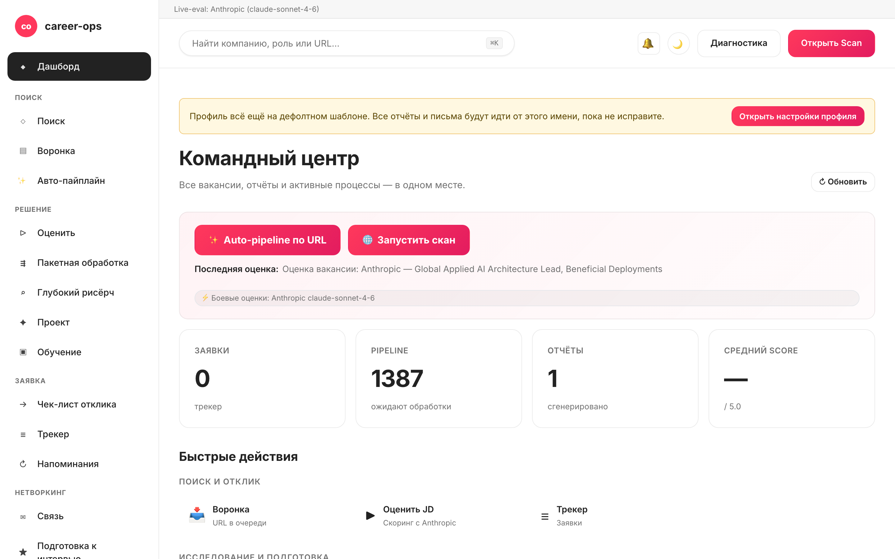

# career-ops-ui

> Лаконичный веб-интерфейс в стиле технической документации для AI-конвейера поиска работы [career-ops](https://github.com/santifer/career-ops).
> Ищите вакансии, оценивайте их, проводите углублённое исследование, подавайте заявки и ведите учёт офферов из одной вкладки браузера — без постоянных переключений между Claude Code, терминалом и markdown-файлами.

[English](README.md) | [Español](README.es.md) | [Português (Brasil)](README.pt-BR.md) | [한국어](README.ko-KR.md) | [日本語](README.ja.md) | **Русский** | [简体中文](README.zh-CN.md) | [繁體中文](README.zh-TW.md) | [Français](README.fr.md)

[](#тесты)
[](#tests)
[](#тесты)
[](#требования)
[](LICENSE)
[](https://github.com/Fighter90/career-ops-ui/releases/tag/v1.69.2)

> **🆕 Последний релиз — v1.69.2**
>
> **fix(test): `npm test` больше не перезаписывает твои реальные `config/profile.yml` / `data/scan-history.tsv`.** Один тест (`critical-fixes.test.mjs`) импортировал `prompts.mjs` (→ `paths.mjs`) в начале файла, поэтому `PROJECT_ROOT` разрешался в **реальный** родительский каталог до того, как тест задавал `CAREER_OPS_ROOT` на временный — и `PUT /api/profile` на каждом прогоне записывал фикстуру «Acceptance Test» в профиль. Теперь модуль загружается через динамический `import()` после установки переменной окружения, а `tests/test-root-isolation.test.mjs` защищает весь сьют. Без изменений production-кода.
>
> _Полный сьют **1086/1086** зелёный · i18n + документация синхронизированы во всех 9 локалях._

<!-- DO NOT REVERT: locale-specific dashboard screenshot (dashboard-ru.png). Each README uses its own ./images/dashboard-<locale>.png — never replace with dashboard-en.png. Generated by scripts/capture-dashboard-screenshots.mjs. -->


## О проекте career-ops

[career-ops](https://career-ops.org) — это open-source-система поиска работы, которая работает как набор slash-команд внутри любого AI-CLI для программирования (Claude Code, Codex, OpenCode, Qwen CLI — другие Claude-совместимые CLI работают через тот же интерфейс slash-команд). Система не привязана к конкретной модели. Она оценивает каждую вакансию относительно вашего CV по шестимерной шкале 0.0–5.0, генерирует адаптированные PDF-резюме и ведёт локальный учёт заявок — без облачных аккаунтов, телеметрии и автоматической отправки.

**Данный репозиторий (career-ops-ui)** — это веб-интерфейс поверх career-ops. CLI по-прежнему отвечает за заполнение форм (через Playwright MCP) и slash-команды; SPA добавляет CRM-подобный браузерный слой над теми же файлами `cv.md` / `data/applications.md` / `reports/`. Источник данных у CLI и SPA общий.

**Пороги действий по оценке** (см. [career-ops.org/docs](https://career-ops.org/docs)):

| Оценка | Дальнейший шаг |
|---|---|
| **≥ 4.5** | `/career-ops apply` — высокое соответствие, отправляйте сразу |
| **4.0 – 4.4** | отправляйте, или `/career-ops contacto` для тёплого intro |
| **3.5 – 3.9** | `/career-ops deep` — сначала исследование |
| **< 3.5** | пропустите, если нет конкретной причины |

**Канонические руководства** на [career-ops.org/docs](https://career-ops.org/docs):

- [Что такое career-ops](https://career-ops.org/docs/introduction/what-is-career-ops)
- [Сканирование джоб-порталов](https://career-ops.org/docs/introduction/guides/scan-job-portals)
- [Подача заявки](https://career-ops.org/docs/introduction/guides/apply-for-a-job)
- [Пакетная оценка офферов](https://career-ops.org/docs/introduction/guides/batch-evaluate-offers)
- [Настройка Playwright](https://career-ops.org/docs/introduction/guides/set-up-playwright)

## Запуск и инициализация одной командой

> **Важно — career-ops-ui — это дашборд *поверх* [`santifer/career-ops`](https://github.com/santifer/career-ops).** Он работает **внутри** проекта career-ops как `career-ops/web-ui/` и читает ваши `cv.md`, `config/`, `data/` из родительской папки через `../`. Он **не работает автономно** — вам также нужен родительский репозиторий `career-ops`. Не клонируйте его отдельно и не запускайте `init`; используйте один из двух вариантов ниже.

### Вариант 1 — один curl (рекомендуется: настраивает всё)

```bash
curl -fsSL https://raw.githubusercontent.com/Fighter90/career-ops-ui/main/bin/setup.sh | bash
```

Клонирует **оба** репозитория, создаёт структуру `career-ops/web-ui/`, устанавливает зависимости, запускает doctor и поднимает сервер по адресу http://127.0.0.1:4317 — затем открывает дашборд.

### Вариант 2 — добавить UI к существующему проекту career-ops

Если career-ops уже настроен и вам нужен только дашборд, клонируйте UI **внутрь** него как `web-ui`:

```bash
cd career-ops                                                   # ← ваш существующий проект career-ops
git clone https://github.com/Fighter90/career-ops-ui.git web-ui
cd web-ui
npm install
npx career-ops-ui init        # interactive: pick LLM provider + paste its key → parent career-ops/.env
```

Структура `web-ui/` вложенного каталога — именно то, что позволяет UI находить `../cv.md`, `../config/`, `../data/`. Выполните `npm link` **один раз**, если хотите использовать `career-ops-ui <verb>` вместо `npx career-ops-ui <verb>`.

### CLI-команды

```bash
career-ops-ui setup    # bootstrap: install deps → doctor → run (SKIP_START=1 to stop before run)
career-ops-ui init     # pick LLM provider + paste its key (interactive)
career-ops-ui doctor   # verify Node / project / keys / Playwright (exit 0 ⇔ all required green)
career-ops-ui run      # launch the server at http://127.0.0.1:4317
career-ops-ui open     # open + RAISE the dashboard tab in your browser
career-ops-ui help     # list every verb
```

Добавьте `npx ` перед командой (например, `npx career-ops-ui run`), если не выполняли `npm link`. После `setup`/`run` вкладка открывается **и поднимается на передний план** автоматически; задайте `NO_OPEN=1`, чтобы отключить авто-открытие (headless / CI).

### Выбор LLM-провайдера

`init` — это мастер провайдера: выберите **Claude / Claude Code** (`ANTHROPIC_API_KEY`), **Gemini / Gemini CLI** (`GEMINI_API_KEY`), **Codex / OpenCode CLI** (`OPENAI_API_KEY`) или **Auto** (Anthropic → запасной Gemini). Ключи вводятся с отключённым эхо и записываются в родительский `career-ops/.env` через тот же проверенный путь, что использует вкладка API-ключей `#/config`. Неинтерактивная форма для CI:

```bash
career-ops-ui init --provider claude --anthropic-key sk-ant-… --yes
career-ops-ui init --provider gemini --gemini-key …          --yes
career-ops-ui init --provider auto   --openai-key sk-…       --yes
```

Или вручную: `echo "ANTHROPIC_API_KEY=sk-ant-…" >> career-ops/.env`. Провайдер задаёт `LLM_PROVIDER` (`auto` | `claude` | `gemini`); изменить его можно в любой момент из **`#/config` → API-ключи** без перезапуска.

### Устранение проблем с `init`

Если `career-ops-ui init` завершается ошибкой или команда не найдена (часто происходит сразу после `git pull`):

```bash
cd career-ops/web-ui
npm install
npx career-ops-ui init        # npx runs the local bin even without `npm link`
```

Убедитесь:

- Вы запускаете команду **из `career-ops/web-ui/`** — не из автономного клона `career-ops-ui/`.
- **Родительская папка `career-ops/` существует** и содержит `cv.md` и `config/`. Если вы клонировали career-ops-ui отдельно — переместите его (или склонируйте заново) так, чтобы он находился по пути `career-ops/web-ui/` — или просто запустите curl из варианта 1, который сам создаёт нужную структуру.
- `career-ops-ui doctor` (или `npx career-ops-ui doctor`) покажет, чего именно не хватает.

---

## Зачем это нужно

[career-ops](https://github.com/santifer/career-ops) — мощная система поиска работы, управляемая через Claude Code: вставляете JD и получаете оценку соответствия 0–5, оптимизированное под ATS PDF-резюме и запись в трекере. Внутри Claude Code всё работает прекрасно, однако данные оказываются разбросаны по `cv.md`, `data/applications.md`, `reports/*.md`, `data/pipeline.md`, `portals.yml`, `config/profile.yml` — это легко потерять из виду и трудно охватить взглядом.

`career-ops-ui` добавляет сверху аккуратный UI:

- **Auto-pipeline** — вставьте один URL на `#/auto`, один клик: валидация → загрузка → оценка → сохранение отчёта → добавление в трекер, с живым доступным stepper и deep-link на артефакты.
- **Просмотр** трекера, отчётов и pipeline в формате CRM.
- **Запуск** сканов (Greenhouse / Ashby / Lever / Workable / SmartRecruiters / Workday **и** hh.ru / Habr Career / Trudvsem / GetMatch / GeekJob) с трансляцией логов через SSE в режиме реального времени.
- **Оценка** JD в реальном времени через Anthropic (предпочтительно) или Gemini; при отсутствии API-ключей выдаётся готовый промпт для копирования в Claude Code.
- **Глубокое исследование** компаний через Anthropic SDK с автоматической подстановкой содержимого cv / profile / mode-файлов.
- **Редактирование** `cv.md` с параллельным предпросмотром markdown и серверной защитой от XSS.
- **Сопровождение** системы: doctor, verify, normalize, dedup, merge — каждое действие в один клик.
- **Поддержка нескольких CLI:** одинаково работает из Claude Code, Codex, Cursor, Aider и Gemini CLI — `CLAUDE.md` / `AGENTS.md` / `GEMINI.md` ссылаются на единый источник истины.

Это чистые дополнения: внутри `career-ops/` ничего не изменяется. Все ваши кастомизации остаются нетронутыми.

---

## Быстрый старт

### 1. Сначала установите career-ops

```bash
git clone https://github.com/santifer/career-ops.git
cd career-ops
```

Пройдите [онбординг career-ops](https://github.com/santifer/career-ops#first-run--onboarding), чтобы файлы `cv.md`, `config/profile.yml` и `portals.yml` уже существовали.

### 2. Разместите career-ops-ui внутри

```bash
git clone https://github.com/Fighter90/career-ops-ui.git web-ui
```

В результате дерево каталогов выглядит так:

```
career-ops/
├─ cv.md
├─ portals.yml
├─ config/
├─ data/
├─ modes/
├─ reports/
├─ scan.mjs … doctor.mjs … (и т. д.)
└─ web-ui/                 ← этот репозиторий
   ├─ bin/start.sh
   ├─ package.json
   ├─ server/
   ├─ public/
   └─ tests/
```

### 3. Запуск

```bash
bash web-ui/bin/start.sh
```

Скрипт выполняет следующее:

1. Проверяет наличие Node ≥ 18.
2. Выполняет `npm install` (только при первом запуске — всего две зависимости, Express и js-yaml).
3. Поднимает Express-сервер на `127.0.0.1:4317`.
4. Открывает http://127.0.0.1:4317/ в браузере по умолчанию.

Свой порт и хост:

```bash
PORT=8080 bash web-ui/bin/start.sh
HOST=0.0.0.0 PORT=4317 bash web-ui/bin/start.sh   # доступ из локальной сети
```

Если репозиторий клонирован в другое место (не как `career-ops/web-ui`), укажите путь к career-ops через переменную окружения:

```bash
CAREER_OPS_ROOT=/path/to/career-ops bash bin/start.sh
```

---

## Первый запуск — чистое состояние

`career-ops/data/pipeline.md` поставляется с двумя QA-фикстурными URL-ами (`example.com/qa-fixture-*`), чтобы тестовый набор можно было запускать герметично. На свежем клоне Pipeline покажет `2 в ожидании` — это не реальные вакансии. Очистите их перед первым сканом:

```bash
make clean-test-fixtures
npm start
```

Откройте http://127.0.0.1:4317. Счётчик Pipeline должен показывать `0 в ожидании`.

---

## Требования

| | |
| --- | --- |
| **Node.js** | ≥ 18 (используются нативные `fetch` и `node:test`) |
| **career-ops** | Склонирован и настроен — см. выше |
| **Опционально** | `GEMINI_API_KEY` в `.env` родительского проекта (бесплатная модель `gemini-2.0-flash`) для оценки JD в один клик. Без ключа UI вернёт готовый промпт для Claude. |
| **Опционально** | Запуск с российского IP или через VPN, если hh.ru отвечает 403. Habr Career доступен с любого IP. |
| **Опционально** | Playwright (уже транзитивная зависимость career-ops) для e2e-тестов. |

---

## Возможности — постранично

| Страница         | Назначение                                                                                                       |
| ---------------- | ---------------------------------------------------------------------------------------------------------------- |
| **Дашборд**      | Сводные счётчики (заявки / pipeline / отчёты), средняя оценка, распределение по статусам, последние 5 заявок и последний отчёт. |
| **Поиск**        | **🌐 Единая кнопка Scan** — за один проход обходит все включённые источники (Greenhouse / Ashby / Lever / Workable / SmartRecruiters / Workday для EN, hh.ru + Habr Career + Trudvsem + GetMatch + GeekJob для RU). Поток логов SSE в реальном времени и кликабельная таблица результатов с фильтрами по локации, badge Remote-Hybrid, флагу релокации, зарплате и источнику; динамические chip-фильтры по стеку, уровню и ключевым словам. Карточка Active Companies перечисляет все отслеживаемые доски и состояние их API. |
| **Pipeline**     | CRUD над `data/pipeline.md`. Серверный preview-прокси (защита от SSRF, проверка редиректов на каждом hop, ограничение тела 8 KB). Прямой переход от URL к оценке. |
| **Оценка**       | Вставляете JD → **сначала Anthropic** (предпочтительно, когда заданы оба ключа), затем Gemini, затем ручной промпт-fallback. По пути Anthropic автоматически подставляются cv / profile / `_shared.md` / `oferta.md` (REVIEW-A1). Сохранение JD в `jds/` — опционально. |
| **Глубокое исследование** | Та же цепочка fallback, что и у Оценки. Anthropic в реальном времени возвращает ~10–30 KB обоснованного markdown, который сохраняется в `interview-prep/<company>-<role>.md`. |
| **Modes**        | 7 универсальных страниц режимов (`/#/project`, `/#/training`, `/#/followup`, `/#/batch`, `/#/contacto`, `/#/interview-prep`, `/#/patterns`) с той же цепочкой Anthropic / Gemini / ручной fallback. Inline-подсказки на странице режима объясняют назначение и подсказывают полезные кейсы (v1.22.0 M-1). |
| **Apply helper** | Формирует чек-лист подачи; реальное автозаполнение через Playwright остаётся за `/career-ops apply` внутри Claude Code. |
| **Трекер**       | Фильтруемая таблица над `data/applications.md` (статус, оценка, свободный текст). Запуск `normalize-statuses.mjs` / `dedup-tracker.mjs` / `merge-tracker.mjs` в один клик. Экранирование pipe и переноса строк соответствует GFM — названия вроде `"Acme \| Co"` корректно проходят round-trip. |
| **Отчёты**       | Просмотр и чтение всех отчётов в `reports/` с разобранным заголовком (Score / Legitimacy / URL). |
| **CV**           | Live-редактор markdown для `cv.md` с параллельным предпросмотром, запуском `cv-sync-check.mjs` в один клик и кнопкой 📁 Upload CV. При сохранении на сервере отрабатывает entity-aware XSS-фильтр (`<script>`, `javascript:`, `on*=`-обработчики, в том числе закодированные через HTML-сущности). |
| **Профиль**      | Доступная только для чтения витрина `config/profile.yml` и архетипов — компактная сводка для UI. |
| **App settings** | Встроенный редактор ключей из родительского `.env`: `ANTHROPIC_API_KEY`, `GEMINI_API_KEY`, переопределение моделей, порт и хост. Секреты маскируются при чтении. |
| **Health**       | Все проверки конфигурации в виде badge OK / OPTIONAL / FAIL и кнопки для запуска `doctor.mjs` и `verify-pipeline.mjs`. |
| **Help**         | Встроенное руководство пользователя в Markdown (`/#/help`), переведённое на все 8 поддерживаемых языков (en / es / pt-BR / ko-KR / ja / ru / zh-CN / zh-TW). |
| **Журнал активности** | Аудит-журнал всех изменяющих состояние запросов (writes, runs, scans). Секреты редактируются. |
| **Уведомления** 🔔 *(v1.58.34 / v1.58.35)* | Колокольчик в верхней панели с красным badge непрочитанных. Клик → правый drawer показывает последние 50 toast (per-tab, per-session) — Success / Error / Info-progress, у каждой локальное время, текст и, если есть, технический хвост `(METHOD /path · HTTP NNN)` в `<details>`. Справка **§18** документирует каждую категорию. Drawer открывается **только** по клику на колокольчик (или клавиатура Enter / Space); закрывается ×, Esc или повторным кликом по колокольчику. |

Глобальные клавиатурные сокращения:

- `Ctrl+K` / `Cmd+K` — фокус на поле глобального поиска.
- Вставка URL в глобальный поиск автоматически добавляет его в pipeline.
- `Esc` — закрытие любого открытого модального окна.

---

## Сканирование

Сканирование порталов без расхода токенов, которое реально приносит вакансии. **Одна кнопка 🌐 Scan** в UI запускает все настроенные источники в одном проходе:

- **Greenhouse / Ashby / Lever / Workable / SmartRecruiters / Workday** — публичный boards-api для каждой компании из `portals.yml::tracked_companies` с распознаваемым ATS-паттерном. Встроенный список включает Stripe, GitLab, Vercel, Cloudflare, Datadog, Discord, Elastic, Grafana Labs, CockroachDB, Fastly, Twilio, Coinbase, Reddit, Robinhood, Affirm, Lyft, Linear, Supabase, PostHog, Ramp, Modal Labs, Railway, Browserbase, JetBrains — расширяйте или сокращайте по своему усмотрению.
- **RSS-доски** — любой джоб-борд, публикующий RSS/Atom-ленту (LaraJobs, WeWorkRemotely, RemoteOK, golangprojects и др.). Добавьте `provider: rss` и URL ленты в `portals.yml` — изменения в коде не требуются.
- **hh.ru** — парсинг HTML страницы `hh.ru/search/vacancy`. Доступен с любого IP, без ключа и без прокси. (JSON-API `api.hh.ru` не используется — он теперь отдаёт 403 любому программному клиенту независимо от IP/User-Agent; сайт же отдаёт полные результаты любому браузероподобному клиенту, поэтому парсим его — так же, как Habr Career.)
- **Habr Career** — парсинг HTML страницы `career.habr.com/vacancies`. Доступен с любого IP и без авторизации.

### RSS-адаптер

Направьте сканер на любую RSS-доску, добавив запись с `provider: rss` и ключом `rss:` (или `feed_url:`) в `portals.yml`:

```yaml
tracked_companies:
  - name: LaraJobs
    provider: rss
    rss: https://larajobs.com/feed
    enabled: true
  - name: WeWorkRemotely
    provider: rss
    rss: https://weworkremotely.com/remote-jobs.rss
    enabled: true
```

Адаптер разбирает блоки `<item>` с помощью небольшого парсера на регулярных выражениях (XML-библиотека не требуется). Извлекаются `title`, `link` (→ `url`), `pubDate` (→ `date`) и `description` (→ `snippet`, теги удаляются). Удалённый формат работы определяется по паттерну `/remote|anywhere|удалённо/i` в заголовке или описании; название компании берётся из `dc:creator`, паттерна «Компания — Должность» в заголовке или имени хоста ленты как запасного варианта. Применяется тот же конвейер нормализации → фильтрации → дедупликации → добавления в pipeline, что и для ATS-адаптеров.

Все источники проходят через единый конвейер: нормализация → фильтрация (`title_filter.positive` / `title_filter.negative`) → дедупликация относительно `data/scan-history.tsv` + `data/pipeline.md` + `data/applications.md` → добавление в `data/pipeline.md` → сохранение полного набора результатов в `data/last-scan.json` для фильтруемой таблицы UI.

Конфигурация задаётся в `portals.yml`:

```yaml
title_filter:
  positive: [backend, engineer, senior, tech lead, golang, php]
  negative: [junior, intern, frontend, ios, android]
tracked_companies:
  - { name: Stripe, enabled: true, careers_url: https://job-boards.greenhouse.io/stripe }
  - { name: Linear, enabled: true, careers_url: https://jobs.ashbyhq.com/linear }
  # ...
russian_portals:
  sources: ["hh", "habr"]   # один или оба
  area: 113                  # 1=Москва, 2=СПб, 113=Россия, 1001=remote
  per_page: 50
  only_remote: false
  queries: ["Senior PHP", "Senior Go", "Tech Lead"]
```

Все источники объединены за единым SSE-эндпоинтом: `/api/stream/scan?source=ats|regional|both`. Кнопка **🌐 Scan** в UI вызывает `source=both`, поэтому каждый адаптер (Greenhouse / Ashby / Lever / Workable / SmartRecruiters / Workday + hh.ru + Habr Career + Trudvsem + GetMatch + GeekJob) работает в рамках одного соединения. Соединение корректно реагирует на `AbortSignal` при отключении клиента — никаких висящих fetch-запросов.

---

## Архитектура

```
career-ops-ui/
├─ CLAUDE.md                 # инструкции агента на уровне проекта (канонический файл)
├─ AGENTS.md                 # shim для Codex / Aider / generic CLI → CLAUDE.md
├─ GEMINI.md                 # shim для Gemini CLI → CLAUDE.md
├─ .aiignore                 # список исключений для AI-инструментов
├─ .claude/                  # конфигурация агента Claude Code
│  ├─ agents/                # 3 субагента уровня проекта (route, view, test isolation)
│  └─ commands/               # заглушки slash-команд
├─ bin/start.sh              # лаунчер «всё в одном» (Node check → npm install → server → open browser)
├─ package.json              # 2 runtime-зависимости: express, js-yaml
├─ server/
│  ├─ index.mjs              # оркестратор ~130 LOC: middleware + 12 вызовов register<Topic>Routes(app) + SPA catch-all
│  └─ lib/
│     ├─ paths.mjs           # абсолютные пути к файлам career-ops (учитывает CAREER_OPS_ROOT)
│     ├─ parsers.mjs         # парсеры markdown / pipeline / отчётов (GFM-совместимое экранирование pipe)
│     ├─ runner.mjs          # runNodeScript() + streamNodeScript() с эскалацией SIGTERM→SIGKILL и лимитом 30 мин
│     ├─ security.mjs        # isValidJobUrl, stripDangerousMarkdown, sanitizeJobDescription, sanitizePathName, isPubliclyExposed
│     ├─ safe-fetch.mjs      # safeGet — outbound GET с пинингом DNS (B-1, v1.21.0)
│     ├─ file-lock.mjs       # withFileLock — асинхронный mutex по путям (H-6, v1.21.0)
│     ├─ rate-limit.mjs      # llmRateLimit middleware (H-5, v1.21.0)
│     ├─ prompts.mjs         # bundleProjectContext, buildEvaluationPrompt, buildDeepPrompt, buildModePrompt
│     ├─ store.mjs           # safeReadApps/Pipeline/Reports, checkProfileCustomized, ensureRussianPortalsDefaults
│     ├─ anthropic.mjs       # минимальный адаптер Anthropic SDK (runAnthropic, hasAnthropicKey, hasGeminiKey)
│     ├─ env-config.mjs      # round-trip .env с маскированием секретов и валидацией
│     ├─ activity-log.mjs    # JSONL-аудит-middleware (секреты редактируются)
│     ├─ dotenv.mjs          # компактный dotenv-загрузчик
│     ├─ en-scanner.mjs      # in-process оркестратор Greenhouse/Ashby/Lever (учитывает AbortSignal)
│     ├─ ru-scanner.mjs      # in-process оркестратор hh.ru + Habr (учитывает AbortSignal)
│     ├─ sources/
│     │  ├─ greenhouse.mjs   # клиент boards-api.greenhouse.io
│     │  ├─ ashby.mjs        # клиент api.ashbyhq.com
│     │  ├─ lever.mjs        # клиент api.lever.co
│     │  ├─ hh.mjs           # клиент api.hh.ru (учитывает UA)
│     │  └─ habr.mjs         # парсер HTML career.habr.com (без cheerio, только regex)
│     └─ routes/             # 12 модулей маршрутов — по одному на тему (P-2)
│        ├─ activity.mjs     # /api/activity
│        ├─ config.mjs       # /api/config (round-trip родительского .env)
│        ├─ content.mjs      # /api/cv, /api/profile, /api/portals, /api/modes
│        ├─ health.mjs       # /api/health, /api/dashboard
│        ├─ help.mjs         # /api/help/:lang
│        ├─ jds.mjs          # CRUD над /api/jds
│        ├─ llm.mjs          # /api/evaluate, /api/deep, /api/mode/:slug, /api/apply-helper, /api/interview-prep*
│        ├─ pipeline.mjs     # /api/pipeline и SSRF-устойчивый preview-прокси
│        ├─ reports.mjs      # /api/reports
│        ├─ runners.mjs      # /api/run/* + /api/stream/{scan,liveness,pdf} + /api/output/pdfs
│        ├─ scan.mjs         # /api/stream/scan-{ru,en} + /api/scan-results
│        └─ tracker.mjs      # /api/tracker
├─ public/                   # статичный SPA — без шага сборки
│  ├─ index.html
│  ├─ css/app.css            # design tokens (палитра в стиле документации)
│  └─ js/
│     ├─ api.js              # обёртка над fetch + состояние connection-баннера + UI-хелперы + безопасный рендер markdown
│     ├─ router.js           # hash-роутер с fallback 404 и поддержкой алиасов
│     ├─ app.js              # бут + глобальные обработчики клавиатуры + мобильный sidebar drawer
│     ├─ lib/{i18n,skills}.js
│     └─ views/              # по файлу на страницу (dashboard, scan, pipeline, evaluate, deep, apply, tracker, reports, cv, settings, health, config, help, activity, mode-page)
├─ docs/                     # публичный референс: архитектура, API, потоки данных, SDD, конвенции, ревью
│  ├─ PROJECT.md             # что / зачем / для кого
│  ├─ ROADMAP.md             # текущий milestone + завершённая история
│  ├─ PRODUCTION-READINESS.md # честная оценка готовности к деплою
│  ├─ sdd/{SDD-GUIDE,CONVENTIONS}.md
│  ├─ architecture/{OVERVIEW,SERVER,FRONTEND,API,DATA-FLOWS}.md
│  └─ reviews/REVIEW-*.md
└─ tests/                    # 1000 unit + 70 Playwright + 23 e2e:full + 20 e2e:smoke
   ├─ parsers.test.mjs       # парсеры markdown / pipeline / отчётов (чистые функции)
   ├─ api.test.mjs           # каждая точка входа, эфемерный сервер, без сети
   ├─ {ru,en}-scanner.test.mjs   # mocked fetch
   ├─ pipeline-preview.test.mjs   # валидация редиректов на каждом hop (REVIEW-B1)
   ├─ ssrf-redirect-rebind.test.mjs # защита от DNS-rebind (B-1, v1.21.0)
   ├─ concurrent-tracker-write.test.mjs # race condition на параллельных записях трекера (H-6)
   ├─ rate-limit.test.mjs    # llmRateLimit на loopback и LAN (H-5)
   ├─ path-traversal.test.mjs # sanitizePathName против `..pdf`, `....md` и пр. (H-4)
   ├─ anthropic.test.mjs     # SDK-адаптер + проверка log-guard (REVIEW-B4)
   ├─ url-validation.test.mjs    # SSRF-reject sweep (FIX-M3 + M6 + M7)
   ├─ cv-xss.test.mjs        # round-trip stripDangerousMarkdown (включая entity-aware кейсы)
   ├─ jd-sanitize.test.mjs   # sanitizeJobDescription
   ├─ help.test.mjs / help-ui.test.mjs    # паритет i18n по всем 8 локалям
   ├─ playwright-smoke.mjs   # 32 browser-сценария (CV save, tracker, pipeline, evaluate, config и т. д.)
   └─ e2e{,-comprehensive}.mjs   # полный Playwright-walkthrough
```

### Почему без сборки

Vanilla HTML/CSS/JS оставляет минимально возможную поверхность атаки: один `npm install` двух зависимостей — и вы готовы к работе. Никакого Webpack, никакого Vite, никаких раздутых `node_modules`. Весь UI в минифицированном виде занимает менее 30 KB. Если в процессе разработки нужен hot-reload — `npm run dev` использует встроенный в Node `--watch`.

### Spec-Driven Development

Нетривиальные изменения проходят через GSD-конвейер (скиллы `gsd-*` из `superpowers@claude-plugins-official`):

```
discuss → spec → plan → execute → verify → review
```

Публичный референс: [`docs/sdd/SDD-GUIDE.md`](docs/sdd/SDD-GUIDE.md). Артефакты планирования лежат в `.planning/` (gitignored). Дерево `docs/` — это долгоживущий публичный контракт.

---

## Справочник API

Все эндпоинты сгруппированы под `/api/*`. Если не оговорено иное — JSON на входе и на выходе.

### Health и dashboard

| Method | Path                     | Response                                                                    |
| ------ | ------------------------ | --------------------------------------------------------------------------- |
| GET    | `/api/health`            | `{ ok, warnings, version, parentVersion, checks: [{name, ok, required, value?}] }` |
| GET    | `/api/dashboard`         | `{ counts, avgScore, byStatus, recent, pipeline, lastReport }`              |
| GET    | `/api/status/providers`  | `{ activeProvider, activeModel, keysConfigured }` — готовность LLM для онбординг-баннера + ⚡ подсказки стоимости (v1.55.3) |
| GET    | `/api/activity?limit&type` | хвост аудит-журнала `data/activity.jsonl`                                 |
| GET    | `/api/help/:lang`        | локализованное руководство в приложении (fallback: `en.md`)                 |

### App settings (round-trip родительского .env)

| Method | Path             | Назначение                                                             |
| ------ | ---------------- | ---------------------------------------------------------------------- |
| GET    | `/api/config`    | известные env-ключи с замаскированными секретами                       |
| POST   | `/api/config`    | валидация и запись родительского `.env`; изменения применяются к `process.env` на лету |

### Файлы данных

| Method | Path                                | Назначение                                                             |
| ------ | ----------------------------------- | ---------------------------------------------------------------------- |
| GET    | `/api/tracker`                      | `{ rows: [разобранный applications.md] }`                              |
| POST   | `/api/tracker`                      | body `{ company, role, score?, status?, url?, notes?, date? }` — с учётом дедупликации (без учёта регистра по company + role) |
| GET    | `/api/pipeline`                     | `{ urls: [...] }`                                                      |
| POST   | `/api/pipeline`                     | body `{ url }` → добавление в `data/pipeline.md` с дедупликацией и проверкой `isValidJobUrl` |
| GET    | `/api/pipeline/preview?url=…`       | серверный fetch-прокси (per-hop SSRF-проверка, ≤3 редиректов, лимит 8 KB) |
| DELETE | `/api/pipeline?url=…`               | удаление URL                                                           |
| GET    | `/api/reports`                      | разобранный список `reports/*.md`                                      |
| GET    | `/api/reports/:slug`                | полный markdown и разобранный заголовок                                |
| GET    | `/api/jds`                          | список сохранённых JD-файлов                                           |
| GET    | `/api/jds/:name`                    | text/plain — исходный JD                                               |
| POST   | `/api/jds`                          | body `{ text, slug? }` → сохранение в `jds/`                           |
| DELETE | `/api/jds/:name`                    | unlink (обязателен суффикс `.txt`)                                     |
| GET    | `/api/cv`                           | `{ markdown }`                                                         |
| PUT    | `/api/cv`                           | body `{ markdown }` → запись `cv.md` (с очисткой от XSS, ≤1 MB)        |
| GET    | `/api/profile`                      | `{ profile: yaml-parsed, raw: text }`                                  |
| GET    | `/api/portals`                      | `{ portals: yaml-parsed, raw: text }`                                  |
| GET    | `/api/modes`                        | список mode-файлов                                                     |
| GET    | `/api/modes/:name`                  | text/plain — исходный mode-промпт                                      |
| GET    | `/api/output/pdfs`                  | список сгенерированных PDF                                             |
| GET    | `/api/output/pdfs/:name`            | скачивание (`Content-Disposition: attachment`)                         |
| GET    | `/api/interview-prep`               | список сохранённых файлов deep-research                                |
| GET    | `/api/interview-prep/:name`         | `{ name, markdown }`                                                   |
| DELETE | `/api/interview-prep/:name`         | unlink (обязателен суффикс `.md`)                                      |

### Скрипт-раннеры (буферизованные, одноразовые)

| Method | Path                    | Wraps                       |
| ------ | ----------------------- | --------------------------- |
| POST   | `/api/run/doctor`       | `node doctor.mjs`           |
| POST   | `/api/run/verify`       | `node verify-pipeline.mjs`  |
| POST   | `/api/run/normalize`    | `node normalize-statuses.mjs` |
| POST   | `/api/run/dedup`        | `node dedup-tracker.mjs`    |
| POST   | `/api/run/merge`        | `node merge-tracker.mjs`    |
| POST   | `/api/run/sync-check`   | `node cv-sync-check.mjs`    |

Все буферизованные запуски ограничены 60 с; эскалация SIGTERM → SIGKILL через 5-секундный grace-период.

### Потоки (SSE)

| Method | Path                          | Что транслирует                    |
| ------ | ----------------------------- | ---------------------------------- |
| GET    | `/api/stream/scan`            | legacy `node scan.mjs` (subprocess)|
| GET    | `/api/stream/scan?source=ats\|regional\|both` | консолидированный SSE in-process-сканера — параметры: `dryRun=1`, `company=…` (только для ATS). |
| GET    | `/api/stream/liveness`        | `node check-liveness.mjs`          |
| GET    | `/api/stream/pdf`             | `node generate-pdf.mjs`            |

Типы SSE-событий:

```
event: start    data: { script, args?, writeFiles? }
event: log      data: { stream: "stdout"|"stderr", line: string }
event: done     data: { code, counts?, errors? }
event: error    data: { message }
```

### LLM-эндпоинты (Anthropic-first → Gemini → ручной fallback)

| Method | Path                                | Назначение                                                                       |
| ------ | ----------------------------------- | -------------------------------------------------------------------------------- |
| POST   | `/api/evaluate`                     | body `{ jd, save? }` → оценка JD (секции A–G согласно `oferta.md`)               |
| POST   | `/api/evaluate/test-gemini`         | smoke-проверка `GEMINI_API_KEY`                                                  |
| POST   | `/api/evaluate/test-anthropic`      | smoke-проверка `ANTHROPIC_API_KEY`                                               |
| POST   | `/api/deep`                         | body `{ company, role?, run? }` → промпт для deep-research или обоснованный markdown в реальном времени |
| POST   | `/api/mode/:slug`                   | универсальный mode-раннер; allowlist: `batch`, `contacto`, `followup`, `interview-prep`, `patterns`, `project`, `training` |
| POST   | `/api/apply-helper`                 | body `{ url, jd? }` → чек-лист подачи                                            |
| GET    | `/api/scan-results`                 | `{ en: {when, fresh[], filtered[], errors[]}, ru: { ... } }` — последний скан    |
| GET    | `/api/scan/regional/config`         | актуальная конфигурация регионального сканера (queries, negatives, sources). |

Когда на `/api/deep` или `/api/mode/:slug` передан `run: true`, сервер выбирает Anthropic (при наличии обоих ключей), подставляет `cv.md` + `config/profile.yml` + `modes/_shared.md` + соответствующий mode-шаблон в блок `<project_context>` и возвращает обоснованный markdown модели напрямую. Мягкий лимит: 200 KB на собранный промпт — переполнение приводит к 413.

`/api/evaluate`, `/api/deep`, `/api/mode/:slug` и `/api/auto-pipeline` дополнительно покрыты middleware `llmRateLimit` (см. раздел *Заметки по безопасности*).

---

## Тесты

```bash
npm test                       # 1000 unit/integration-теста
npm run test:e2e               # 20 smoke e2e (поднимает собственный сервер)
npm run test:e2e:full          # 23 comprehensive e2e
npm run test:e2e:browser       # 70 Playwright browser-smoke
npm run test:coverage          # то же, что `npm test`, плюс V8-покрытие
```

| Сьют                       | Тестов | Что покрывает                                                                                              |
| --------------------------- | ----- | ---------------------------------------------------------------------------------------------------------- |
| `node --test tests/*.test.mjs` (unit + integration) | **1000** | Каждый эндпоинт, эфемерный сервер, без сети. Включая парсеры, сканер (mocked), runner, anthropic, заголовки безопасности, XSS, sanitize JD, валидацию URL, защиту от DNS-rebind, состояние гонки на трекере, rate-limit, path-traversal, паритет i18n. |
| `tests/e2e.mjs` (smoke)      | 20    | Playwright headless: каждый маршрут рендерится, базовые сценарии работают.                                 |
| `tests/e2e-comprehensive.mjs` | 23    | Полный Playwright-walkthrough: 11 маршрутов + 12 функциональных сценариев.                                 |
| `tests/playwright-smoke.mjs` (`npm run test:e2e:browser`) | **32** | Browser-driven smoke: рендер дашборда, навигация, переключение языка, 404, health, tracker round-trip (BF-1), pipeline add + invalid-URL sweep, пустые reports, evaluate manual fallback, маскирование ключей в config, XSS-strip на PUT CV, pipeline preview 400. |
| **Итого**                   | **549** | **0 fails, 0 flakes**                                                                                   |

Покрытие: ~93 % строк / ~83 % веток через `--experimental-test-coverage`.

Парсеры — чистые функции (без I/O) — тестируются на реальных фрагментах данных из `applications.md`, `pipeline.md` и `reports/*.md`. API-тесты поднимают Express-приложение на эфемерном порту и проходят каждый эндпоинт от начала и до конца. Тесты сканера мокают `fetch`, поэтому проходят даже когда hh.ru блокирует ваш IP. Playwright-смоук работает против in-process-сервера и подтягивает Playwright через `node_modules` родительского проекта — никаких новых зависимостей в `web-ui/` не появляется.

CI прогоняет матрицу unit + e2e + Playwright на каждый push в `main` под Node 18 / 20 / 22.

---

## Конфигурация

Переменные окружения (читаются на старте сервера, все опциональны, кроме явно отмеченных):

| Var                  | Default            | Назначение                                                                          |
| -------------------- | ------------------ | ----------------------------------------------------------------------------------- |
| `PORT`               | `4317`             | Порт привязки Express                                                               |
| `HOST`               | `127.0.0.1`        | Хост привязки Express. CSP подключается на не-loopback; auth-gate запланирован на v2.0.0. |
| `CAREER_OPS_ROOT`    | `..` от скрипта    | Откуда брать `cv.md`, `data/`, `portals.yml`, `modes/` и т. д.                       |
| `ANTHROPIC_API_KEY`  | unset              | Включает live-режим для `/api/evaluate`, `/api/deep`, `/api/mode/:slug` (предпочтительный путь при двух заданных ключах). |
| `ANTHROPIC_MODEL`    | `claude-sonnet-4-6` | Переопределение модели Anthropic.                                                  |
| `GEMINI_API_KEY`     | unset              | Прокидывается в `gemini-eval.mjs` и используется как fallback для `/api/evaluate`.   |
| `GEMINI_MODEL`       | `gemini-2.0-flash` | Переопределение модели Gemini.                                                      |
| `OPENAI_API_KEY`     | unset              | Headless live-eval (3-й в порядке `auto`) + родительский Codex/OpenAI CLI.          |
| `OPENAI_MODEL`       | `gpt-5-codex`      | Переопределение модели OpenAI.                                                      |
| `QWEN_API_KEY`       | unset              | Headless live-eval через DashScope (OpenAI-совместимый, 4-й в порядке `auto`).      |
| `QWEN_MODEL`         | `qwen-max`         | Переопределение модели Qwen.                                                        |
| `OPENROUTER_API_KEY` | unset              | Headless live-eval через OpenRouter — один ключ, 300+ моделей (5-й / последний в `auto`). |
| `OPENROUTER_MODEL`   | `openrouter/auto`  | id `vendor/model`. Каталог грузится вживую из `GET /api/openrouter/models`.         |
| `LLM_RATE_LIMIT`     | `10/60s`           | Настройка лимита LLM-эндпоинтов в формате `N/Ws` (см. *Заметки по безопасности*).   |

Расширение `portals.yml`, которое распознаёт данный UI (добавьте к существующему файлу в родительском проекте):

```yaml
russian_portals:
  sources: ["hh", "habr"]
  area: 113          # hh.ru area id
  per_page: 50
  only_remote: false
  queries: ["Senior PHP", "Тимлид Go", ...]
```

В каждой записи компании также можно явно задать `api:` URL. Готовые блоки для 24 проверенных компаний приведены в [`docs/portals-examples.md`](docs/portals-examples.md) (в этом репозитории).

---

## Заметки по безопасности

- Сервер по умолчанию слушает `127.0.0.1` — без явного `HOST=0.0.0.0` наружу не выставляется.
- **Санитизация путей (v1.21.0)**: каждый параметр маршрута `:name` / `:slug` проходит через единую функцию `sanitizePathName()` в `server/lib/security.mjs` — удаление символов вне `[\w-.]`, отбрасывание ведущих точек, схлопывание внутренних серий точек, лимит 200 символов, пустая строка → 400. Эта функция заменила 10 разбросанных по коду regex-копий, которые раньше пропускали `..pdf` и `....md` (фикс H-4).
- **Защита от DNS-rebind (v1.21.0)**: `/api/pipeline/preview` и `/api/auto-pipeline` ходят наружу через `server/lib/safe-fetch.mjs::safeGet` — один DNS-lookup, прибитое TCP-соединение, SNI/Host, нацеленные на исходный hostname. Второй lookup не делается, TOCTOU-окно закрыто (фикс B-1).
- **Mutex на конкурентную запись (v1.21.0)**: `tracker.mjs`, `pipeline.mjs` (POST + DELETE) и шаг записи трекера в `auto-pipeline.mjs` оборачивают read-modify-write в `withFileLock(path, fn)` из `server/lib/file-lock.mjs`. Параллельные POST больше не теряют строки (фикс H-6 — состояние гонки на трекере).
- **Rate-limit LLM-эндпоинтов (v1.21.0)**: `/api/evaluate`, `/api/deep`, `/api/mode/:slug` и `/api/auto-pipeline` обёрнуты middleware `llmRateLimit` из `server/lib/rate-limit.mjs`. **На loopback — no-op**; при `HOST=0.0.0.0` — 10 запросов в минуту на IP. Лимит настраивается через `LLM_RATE_LIMIT="N/Ws"`. При превышении возвращается 429 с заголовком `Retry-After` (фикс H-5).
- **XSS-strip для CV (v1.22.0)**: `stripDangerousMarkdown` теперь учитывает HTML-сущности — декодирует `&lt;`, `&gt;`, `&#NN;`, `&#xHH;` до прохода regex, поэтому payload-ы вида `&lt;script&gt;` и `java&#115;cript:` больше не проходят мимо фильтра (фикс M-4).
- **WCAG 1.4.1 — не только цвет (v1.22.0)**: на пилюлях оценок и баннере соединения добавлены текстовые/иконочные подсказки рядом с цветовой индикацией (фикс M-3).
- Subprocess-вызовы используют `spawn` с массивом аргументов — **никакой shell-интерполяции, ни при каких условиях**. Запуск `bash` идёт с флагами `--noprofile --norc`, чтобы игнорировать `~/.bashrc`.
- Стримовые эндпоинты убивают дочерний процесс при отключении клиента (никаких висящих сканеров).
- Запись на диск ограничена известными путями career-ops: `data/`, `jds/`, `cv.md`, `config/`, `portals.yml`, `output/`, `reports/`, `interview-prep/`, `modes/_profile.md`. За пределы этого списка сервер не пишет ни при каких условиях.
- Баннер соединения пингует `/api/health` с экспоненциальной задержкой (3 с → 6 с → 12 с → 24 с → 60 с) пока соединение потеряно, и автоматически очищается после восстановления (v1.22.0 M-6).

---

## Ограничения

Режимы, целиком работающие через LLM (`oferta`, `deep`, `contacto`, `apply`, `batch`, `patterns`, `followup`), требуют доступа к LLM для реальной работы. Веб-UI предлагает три варианта:

1. **Anthropic (предпочтительно)** — задайте `ANTHROPIC_API_KEY` в `.env` родительского проекта. Запрос идёт через `runAnthropic` с автоматической подстановкой `cv.md` / `config/profile.yml` / `modes/_shared.md` / шаблона режима (REVIEW-A1). Подтверждено в live-режиме начиная с v1.8.0 на `claude-sonnet-4-6`, возвращавшей 26 KB обоснованного markdown для одного вызова deep-research.
2. **`gemini-eval.mjs`** в качестве fallback — работает «из коробки», когда задан только `GEMINI_API_KEY`.
3. **Готовый промпт для копирования** — если ключи не заданы, UI собирает форматированный промпт для Claude Code / ChatGPT / Gemini Web.

Имеющийся внутри Claude Code сценарий `/career-ops apply` с Playwright по-прежнему остаётся единственным способом действительно автозаполнить формы заявок — *Apply helper* в UI вместо этого выдаёт чек-лист.

Оценку production-готовности (deployment-гейты, реестр рисков, отложенные работы) см. в [`docs/PRODUCTION-READINESS.md`](docs/PRODUCTION-READINESS.md). TL;DR: проект готов к single-tenant loopback; выставление в LAN ожидает auth-gate из v2.0 P-12.

---

## Локализация

Интерфейс поддерживает **8 локалей** — `en`, `es`, `pt-BR`, `ko`, `ja`, `ru`, `zh-CN`, `zh-TW`. С **v1.60.0 (I18N-SPLIT)** переводы хранятся **по одному файлу на язык** в [`public/js/lib/locales/`](public/js/lib/locales/) — `i18n-dict.<lang>.js`, плоская таблица `ключ → строка` — плюс общий `i18n-dict.aliases.js`. [`i18n-dict.js`](public/js/lib/i18n-dict.js) собирает их в `window.__I18N_DICT`; [`i18n.js`](public/js/lib/i18n.js) разрешает `t('ключ', 'fallback')`. Без сборки и без fetch — переводчик правит один файл языка.

**Добавить или изменить строку:** добавьте один и тот же ключ во все 8 файлов локалей (паритет проверяется тестами), используйте через `data-i18n="scan.newButton"` или `t('scan.newButton')` и запустите `npm test`.

```js
// public/js/lib/locales/i18n-dict.en.js   →   'scan.newButton': 'Run scan',
// public/js/lib/locales/i18n-dict.es.js   →   'scan.newButton': 'Ejecutar búsqueda',
```

📖 **Полное руководство:** [`docs/LOCALIZATION.md`](docs/LOCALIZATION.md) — раскладка по локалям, механизм `@alias`, добавление новой локали по шагам и все i18n-проверки CI.

---

## Contributing

Issues и PR приветствуются. Правила:

- Перед push выполняйте `npm test` — **1000 проверок green** — это минимальная планка (плюс 70 Playwright, если изменения касаются UI).
- Нетривиальные изменения проходят через GSD-конвейер. См. [`docs/sdd/SDD-GUIDE.md`](docs/sdd/SDD-GUIDE.md).
- Не модифицируйте ничего в родительском `career-ops/` из этого репозитория. Смысл проекта именно в том, что это неинвазивный overlay. Жёсткие правила — в [`CLAUDE.md`](CLAUDE.md).
- Conventional commits: `feat`, `fix`, `refactor`, `docs`, `test`, `chore`, `perf`, `ci`. Опциональный scope: `feat(scan):`. Breaking change: `feat!:`.
- Тесты должны быть CI-изолированы — фикстуры поднимаются через `mkdtempSync` или `CAREER_OPS_ROOT=$(mktemp -d)`.

Работаете в не-Claude CLI (Codex, Aider, Cursor, Gemini)? Прочитайте [`AGENTS.md`](AGENTS.md) или [`GEMINI.md`](GEMINI.md) — оба ссылаются на канонический `CLAUDE.md`.

---

---

## 🌍 Getting Started — первые шаги после установки

После установки в одну команду у вас есть два пустых клона репозиториев с
скаффолд-файлами `cv.md`, `config/profile.yml`, `portals.yml`,
`data/applications.md` и `data/pipeline.md`, заполненными маркерами
**EDIT ME**. Health-страница после первого запуска должна целиком гореть
зелёным. Замените заглушки на реальные данные:

### 1. Создайте CV (`cv.md`)

Три варианта:

- **Вариант A — вставить существующее резюме:** откройте `career-ops/cv.md`
  и замените EDIT-ME-заглушки на реальное резюме в чистом markdown
  (секции: Summary, Experience, Projects, Education, Skills). Чем проще,
  тем лучше — `career-ops` читает файл как plain text.
- **Вариант B — загрузить через UI:** в боковой панели нажмите **CV** →
  **📁 Upload CV** → выберите свой файл `.md` / `.txt` → проверьте
  предпросмотр → нажмите **💾 Save**.
- **Вариант C — отдать LinkedIn-URL Claude Code:** откройте Claude Code
  в `career-ops/`, запустите `/career-ops`, вставьте свой LinkedIn-URL и
  попросите *«extract my CV from this and write it to cv.md»*.

Все метрики делайте конкретными (например, *«снизил p99 latency на 38 %»*,
а не *«улучшил производительность»*). Конвейер оценки читает метрики
непосредственно из этого файла.

### 2. Отредактируйте профиль (`config/profile.yml`)

```bash
$EDITOR career-ops/config/profile.yml
```

Замените заглушки на полное имя, email, локацию, LinkedIn, целевые роли,
архетипы и целевую зарплату. **Архетипы** — самое важное поле: именно через
них каждый JD сопоставляется с вами.

### 3. Настройте сканер (`portals.yml`)

```bash
$EDITOR career-ops/portals.yml
```

Задайте `title_filter.positive` (например, `"PHP"`, `"Go"`, `"Backend"`,
`"Senior"`) и `title_filter.negative` (например, `"Junior"`, `"Java"`,
`"iOS"`) в соответствии со своим стеком и грейдом. Встроенный список
`tracked_companies` уже содержит 3 проверенные доски Greenhouse / Ashby
(GitLab, Vercel, Linear). 24+ дополнительных готовых блока — в
[`docs/portals-examples.md`](docs/portals-examples.md).

Если нужен скан hh.ru / Habr Career, отредактируйте блок
`russian_portals:`, созданный setup-скриптом — добавьте свои поисковые
запросы (например, `"Senior PHP"`, `"Тимлид Go"`).

### 4. (Опционально) API-ключи LLM

При наличии обоих ключей UI предпочитает Anthropic. Любой из ключей или
оба отсутствуют — всё равно будет работать: без ключа **Evaluate** вернёт
готовый промпт для копирования в Claude Code.

```bash
# Anthropic (предпочтительно)
echo "ANTHROPIC_API_KEY=sk-ant-..." >> career-ops/.env
# Gemini (fallback)
echo "GEMINI_API_KEY=AIza..." >> career-ops/.env
```

Либо задайте их через страницу **App settings** в UI (`/#/config`) — тот же
файл, с маскированием при чтении и мгновенным применением к `process.env`.

### 5. Проверьте и приступайте к работе

Перезагрузите Health-страницу — каждая обязательная проверка должна стать
зелёной. Дальше:

1. Нажмите **🌐 Scan** → подождите ~5 секунд → пройдут Greenhouse / Ashby /
   Lever / Workable / SmartRecruiters / Workday + hh.ru / Habr Career,
   вакансии появятся в таблице ниже.
2. Клик по заголовку → исходная вакансия открывается в новой вкладке.
3. Фильтруйте chip-кнопками стека (PHP / Go / Backend / Senior), пока не
   увидите что-то перспективное.
4. Скопируйте URL → вставьте в **Pipeline** → нажмите **Evaluate**, чтобы
   получить оценку 0–5 в реальном времени (Anthropic / Gemini) или
   ручной промпт.
5. Отчёты попадают в `reports/`, трекер — в `data/applications.md`,
   результаты deep-research — в `interview-prep/`. Всё доступно в UI.

> Переводы этого руководства живут в README на каждом языке:
> [Español](README.es.md) · [Português (Brasil)](README.pt-BR.md) ·
> [한국어](README.ko-KR.md) · [日本語](README.ja.md) ·
> [Русский](README.ru.md) · [简体中文](README.zh-CN.md) ·
> [繁體中文](README.zh-TW.md)

---

## Лицензия

MIT. См. [LICENSE](LICENSE).

Построено поверх [career-ops](https://github.com/santifer/career-ops) от [santifer](https://santifer.io). Спасибо за блестяще спроектированный конвейер.

## Участники

Спасибо всем, кто помогает развивать career-ops-ui. Проект поддерживает [Fighter90](https://github.com/Fighter90), а улучшают его вклады сообщества — полный список доступен на [графе участников](https://github.com/Fighter90/career-ops-ui/graphs/contributors).

[](https://github.com/Fighter90/career-ops-ui/graphs/contributors)
