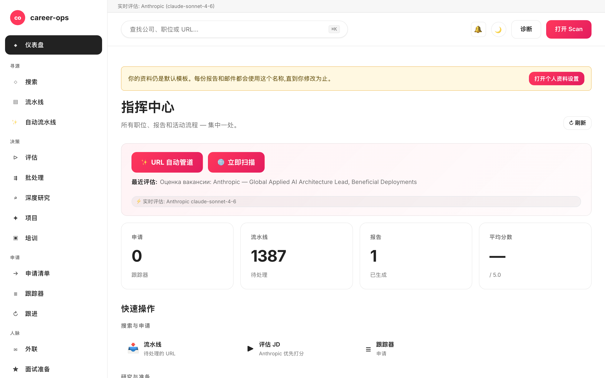

# career-ops-ui

> 一套简洁的、文档风格 Web 界面,为 [career-ops](https://github.com/santifer/career-ops) AI 求职流水线而生。
> 在浏览器的一个标签页里完成搜索、评估、深度调研、投递与跟踪 —— 无需在 Claude Code、终端与 markdown 文件之间反复切换。

[English](README.md) | [Español](README.es.md) | [Português (Brasil)](README.pt-BR.md) | [한국어](README.ko-KR.md) | [日本語](README.ja.md) | [Русский](README.ru.md) | **简体中文** | [繁體中文](README.zh-TW.md) | [Français](README.fr.md)

[](#tests)
[](#tests)
[](#tests)
[](#requirements)
[](LICENSE)
[](https://github.com/Fighter90/career-ops-ui/releases/tag/v1.69.2)

> **🆕 最新版本 — v1.69.2**
>
> **fix(test)：`npm test` 不再覆盖你真实的 `config/profile.yml` / `data/scan-history.tsv`。** 某个测试（`critical-fixes.test.mjs`）在文件顶部导入了 `prompts.mjs`（→ `paths.mjs`），导致在该测试将 `CAREER_OPS_ROOT` 设为临时目录之前，`PROJECT_ROOT` 就解析到了**真实**父目录 —— 于是 `PUT /api/profile` 每次运行都会把「Acceptance Test」夹具写入你的档案。现在改为在设置环境变量后通过动态 `import()` 加载，并由 `tests/test-root-isolation.test.mjs` 保护整个测试套件。无生产代码改动。
>
> _完整套件 **1086/1086** 通过 · i18n 与文档已在全部 9 个语言同步。_

<!-- DO NOT REVERT: locale-specific dashboard screenshot (dashboard-zh-CN.png). Each README uses its own ./images/dashboard-<locale>.png — never replace with dashboard-en.png. Generated by scripts/capture-dashboard-screenshots.mjs. -->


## 关于 career-ops

[career-ops](https://career-ops.org) 是一套开源求职系统,以 slash 命令的形式运行在任意 AI 编码 CLI(Claude Code、Codex、OpenCode、Qwen CLI — 其他 Claude 兼容 CLI 也通过相同的斜杠命令接口运行)中。模型无关。它基于六维 0.0–5.0 评分体系,将每个职位与你的 CV 匹配,生成定制 PDF 简历,并在本地跟踪每一次投递 —— 无云端账户、无遥测、无自动提交。

**本仓库(career-ops-ui)** 是其上层的 Web 界面。CLI 仍负责表单填写(经由 Playwright MCP)与 slash 命令模式;SPA 则在同一份 `cv.md` / `data/applications.md` / `reports/` 文件之上,提供 CRM 风格的浏览器视图。二者共用同一份数据。

**按 Score 的行动阈值**(摘自 [career-ops.org/docs](https://career-ops.org/docs)):

| Score | 下一步 |
|---|---|
| **≥ 4.5** | `/career-ops apply` —— 高度匹配,立即投递 |
| **4.0 – 4.4** | 投递,或 `/career-ops contacto` 走熟人引荐 |
| **3.5 – 3.9** | `/career-ops deep` —— 先做调研 |
| **< 3.5** | 除非有特殊理由,否则跳过 |

**规范指南** 位于 [career-ops.org/docs](https://career-ops.org/docs):

- [What is career-ops](https://career-ops.org/docs/introduction/what-is-career-ops)
- [Scan job portals](https://career-ops.org/docs/introduction/guides/scan-job-portals)
- [Apply for a job](https://career-ops.org/docs/introduction/guides/apply-for-a-job)
- [Batch-evaluate offers](https://career-ops.org/docs/introduction/guides/batch-evaluate-offers)
- [Set up Playwright](https://career-ops.org/docs/introduction/guides/set-up-playwright)

## 一条命令启动并初始化

> **重要 —— career-ops-ui 是建构于 [`santifer/career-ops`](https://github.com/santifer/career-ops) *之上*的仪表盘。** 它作为 `career-ops/web-ui/` **运行在** career-ops 项目内部,并通过 `../` 读取父目录中的 `cv.md`、`config/`、`data/`。它**无法单独运行** —— 你还需要父仓库 `career-ops`。请勿单独克隆后直接运行 `init`;请使用以下两个选项之一。

### 选项 1 —— 一条 curl（推荐:一键配置一切）

```bash
curl -fsSL https://raw.githubusercontent.com/Fighter90/career-ops-ui/main/bin/setup.sh | bash
```

同时克隆**两个**仓库,整理 `career-ops/web-ui/` 目录结构,安装依赖,运行 doctor,并在 http://127.0.0.1:4317 启动服务器 —— 然后打开仪表盘。

### 选项 2 —— 将 UI 添加到现有的 career-ops 项目

如果你已配置好 career-ops 并只需要仪表盘,则将 UI 作为 `web-ui` 克隆到**其内部**:

```bash
cd career-ops                                                   # ← 你现有的 career-ops 项目
git clone https://github.com/Fighter90/career-ops-ui.git web-ui
cd web-ui
npm install
npx career-ops-ui init        # interactive: pick LLM provider + paste its key → parent career-ops/.env
```

嵌套的 `web-ui/` 结构正是让 UI 能够解析 `../cv.md`、`../config/`、`../data/` 的原因。如果你希望直接输入 `career-ops-ui <verb>` 而非 `npx career-ops-ui <verb>`,请**一次性**运行 `npm link`。

### CLI 命令

```bash
career-ops-ui setup    # bootstrap: install deps → doctor → run (SKIP_START=1 to stop before run)
career-ops-ui init     # pick LLM provider + paste its key (interactive)
career-ops-ui doctor   # verify Node / project / keys / Playwright (exit 0 ⇔ all required green)
career-ops-ui run      # launch the server at http://127.0.0.1:4317
career-ops-ui open     # open + RAISE the dashboard tab in your browser
career-ops-ui help     # list every verb
```

若未执行 `npm link`,请在命令前加上 `npx `(例如 `npx career-ops-ui run`)。`setup`/`run` 之后,标签页会自动打开**并被带到最前面**;设置 `NO_OPEN=1` 可禁用自动打开(headless / CI)。

### 选择 LLM 提供方

`init` 是提供方向导 —— 可选择 **Claude / Claude Code**(`ANTHROPIC_API_KEY`)、**Gemini / Gemini CLI**(`GEMINI_API_KEY`)、**Codex / OpenCode CLI**(`OPENAI_API_KEY`),或 **Auto**(Anthropic → Gemini 回退)。密钥在关闭回显的情况下输入,并通过与 `#/config` API 密钥标签页相同的已校验路径写入上层的 `career-ops/.env`。用于 CI 的非交互式形式:

```bash
career-ops-ui init --provider claude --anthropic-key sk-ant-… --yes
career-ops-ui init --provider gemini --gemini-key …          --yes
career-ops-ui init --provider auto   --openai-key sk-…       --yes
```

或手动设置:`echo "ANTHROPIC_API_KEY=sk-ant-…" >> career-ops/.env`。提供方设置 `LLM_PROVIDER`(`auto` | `claude` | `gemini`);随时可从 **`#/config` → API 密钥** 更改,无需重启。

### `init` 故障排除

如果 `career-ops-ui init` 失败或找不到命令(常见于 `git pull` 之后):

```bash
cd career-ops/web-ui
npm install
npx career-ops-ui init        # npx runs the local bin even without `npm link`
```

请确认:

- 你是从 **`career-ops/web-ui/` 内部**运行命令 —— 而非从独立克隆的 `career-ops-ui/` 中。
- **父目录 `career-ops/` 存在**且包含 `cv.md` 和 `config/`。如果你单独克隆了 career-ops-ui,请将其移动(或重新克隆)到 `career-ops/web-ui/` —— 或直接运行选项 1 中的 curl,它会自动整理目录结构。
- `career-ops-ui doctor`(或 `npx career-ops-ui doctor`)会精确显示缺少什么。

---

## 为什么需要它?

[career-ops](https://github.com/santifer/career-ops) 是一套由 Claude Code 驱动的强力求职系统:粘贴 JD,即可得到 0–5 适配评分、ATS 优化后的 PDF,以及一条跟踪记录。它在 Claude Code 中体验良好,但数据散落于 `cv.md`、`data/applications.md`、`reports/*.md`、`data/pipeline.md`、`portals.yml`、`config/profile.yml` —— 容易遗失,难以快速浏览。

`career-ops-ui` 在其之上加上一层精致 UI:

- **Auto-pipeline** —— 在 `#/auto` 粘贴一个 URL,一键:校验 → 抓取 → 评估 → 保存报告 → 加入跟踪器,带实时无障碍 stepper 与产物深链。
- **浏览** 跟踪表、报告与流水线,如同操作 CRM。
- **触发** 扫描(Greenhouse / Ashby / Lever / Workable / SmartRecruiters / Workday **以及** hh.ru / Habr Career / Trudvsem / GetMatch / GeekJob),实时查看 SSE 日志。
- **评估** 通过 Anthropic(首选)或 Gemini 实时评估 JD;未配置 API key 时,返回一个可复制到 Claude Code 的 prompt。
- **深度调研** 通过 Anthropic SDK 实时调研公司,自动内联 cv / profile / mode 文件。
- **编辑** `cv.md`,提供并排 markdown 预览与服务端 XSS 清理。
- **维护** 系统:doctor、verify、normalize、dedup、merge —— 均为一键完成。
- **多 CLI:** 在 Claude Code、Codex、Cursor、Aider 或 Gemini CLI 中等价驱动 —— `CLAUDE.md` / `AGENTS.md` / `GEMINI.md` 均指向同一份事实来源。

它完全是加法:`career-ops/` 内部一字不改。你的所有定制照旧属于你。

---

## 快速上手

### 1. 先安装 career-ops

```bash
git clone https://github.com/santifer/career-ops.git
cd career-ops
```

按照 [career-ops 入门指南](https://github.com/santifer/career-ops#first-run--onboarding) 操作,确保 `cv.md`、`config/profile.yml`、`portals.yml` 已就位。

### 2. 在其中放入 career-ops-ui

```bash
git clone https://github.com/Fighter90/career-ops-ui.git web-ui
```

此时目录结构如下:

```
career-ops/
├─ cv.md
├─ portals.yml
├─ config/
├─ data/
├─ modes/
├─ reports/
├─ scan.mjs … doctor.mjs … (etc)
└─ web-ui/                 ← 本仓库
   ├─ bin/start.sh
   ├─ package.json
   ├─ server/
   ├─ public/
   └─ tests/
```

### 3. 启动

```bash
bash web-ui/bin/start.sh
```

启动脚本会执行:

1. 检查 Node ≥ 18。
2. `npm install`(仅首次运行,仅两个依赖 —— Express + js-yaml)。
3. 在 `127.0.0.1:4317` 启动 Express 服务器。
4. 在默认浏览器中打开 http://127.0.0.1:4317/。

自定义端口 / 主机:

```bash
PORT=8080 bash web-ui/bin/start.sh
HOST=0.0.0.0 PORT=4317 bash web-ui/bin/start.sh   # 暴露到局域网
```

如果你将仓库克隆到其他位置(非 `career-ops/web-ui`),通过环境变量指向 career-ops 即可:

```bash
CAREER_OPS_ROOT=/path/to/career-ops bash bin/start.sh
```

---

## 首次运行 — 清洁状态

`career-ops/data/pipeline.md` 附带两个 QA 测试夹具 URL (`example.com/qa-fixture-*`),以便测试套件能够密封运行。在新克隆中,Pipeline 显示 `2 个待处理` — 这些不是真实职位。首次扫描前请清理:

```bash
make clean-test-fixtures
npm start
```

打开 http://127.0.0.1:4317。Pipeline 计数器应显示 `0 个待处理`。

---

## 环境要求

| | |
| --- | --- |
| **Node.js** | ≥ 18(原生 `fetch`、`node:test`) |
| **career-ops** | 已克隆并完成入门 —— 见上文 |
| **可选** | 父项目 `.env` 中的 `GEMINI_API_KEY`(免费层模型 `gemini-2.0-flash`)用于一键 JD 评估;未配置时,UI 返回一个可粘贴至 Claude 的 prompt。 |
| **可选** | 若 hh.ru 返回 403,请使用俄罗斯 IP / VPN。Habr Career 不受 IP 限制。 |
| **可选** | Playwright(已是 career-ops 的间接依赖),用于 e2e 测试套件。 |

---

## 各页面功能

| 页面             | 功能说明                                                                                                                                |
| ---------------- | --------------------------------------------------------------------------------------------------------------------------------------- |
| **Dashboard**    | 聚合计数(apps / pipeline / reports)、平均分、按状态分布、最新 5 条投递 + 最新报告。                                                   |
| **Scan**         | **🌐 单按钮扫描** —— 一键运行所有已启用来源(EN:Greenhouse / Ashby / Lever / Workable / SmartRecruiters / Workday;RU:hh.ru + Habr Career + Trudvsem + GetMatch + GeekJob)。SSE 实时日志 + 可点击结果表格(支持 location / Remote-Hybrid 徽章 / relocation 标志 / 薪资 / 来源筛选,以及动态 stack / level / keyword chip)。Active-Companies 卡片列出每个已跟踪 board 及其 API 健康状态。 |
| **Pipeline**     | 对 `data/pipeline.md` 进行 CRUD。服务端预览代理(SSRF 安全、逐跳 redirect 校验、8 KB 响应体上限)。可从 URL 直接跳转评估。               |
| **Evaluate**     | 粘贴 JD → **Anthropic 优先**(两个 key 同时存在时首选),其次 Gemini,最后手动 prompt 回退。Anthropic 路径自动内联 cv / profile / `_shared.md` / `oferta.md`(REVIEW-A1)。可选将 JD 存入 `jds/`。 |
| **Deep research**| 与 Evaluate 共用同一条回退链。实时 Anthropic 返回约 10–30 KB 的有据 markdown,并写入 `interview-prep/<company>-<role>.md`。              |
| **Modes**        | 7 个通用 mode 页面(`/#/project`、`/#/training`、`/#/followup`、`/#/batch`、`/#/contacto`、`/#/interview-prep`、`/#/patterns`),共用同一条 Anthropic / Gemini / 手动回退链;v1.22.0 在每个 mode 页内联显示提示用法说明。 |
| **Apply helper** | 生成投递核对清单;真正的 Playwright 表单填写仍由 Claude Code 内的 `/career-ops apply` 完成。                                             |
| **Tracker**      | 基于 `data/applications.md` 的可筛选表格(状态、分数、自由文本)。一键 `normalize-statuses.mjs` / `dedup-tracker.mjs` / `merge-tracker.mjs`。管道符与换行符转义符合 GFM —— 形如 `"Acme \| Co"` 的名称可无损往返。 |
| **Reports**      | 浏览并阅读 `reports/` 下的每份报告,解析 header(Score / Legitimacy / URL)。                                                            |
| **CV**           | `cv.md` 的实时 markdown 编辑器,并排预览 + 一键 `cv-sync-check.mjs` + 📁 上传 CV。保存时服务端 XSS 清理(`<script>`、`javascript:`、`on*=` 等)。 |
| **Profile**      | `config/profile.yml` + archetypes 的只读视图 —— 面向 UI 的友好摘要。                                                                    |
| **App settings** | UI 内编辑父项目 `.env` 配置:`ANTHROPIC_API_KEY`、`GEMINI_API_KEY`、模型覆盖、端口 / 主机。读取时密钥被遮蔽。                            |
| **Health**       | 全部启动检查以 OK / OPTIONAL / FAIL 徽章呈现 + 一键运行 `doctor.mjs` 与 `verify-pipeline.mjs`。                                          |
| **Help**         | 应用内 Markdown 用户手册(`/#/help`),覆盖全部 8 种语言(en / es / pt-BR / ko-KR / ja / ru / zh-CN / zh-TW)。                          |
| **Activity log** | 所有写入、运行、扫描等状态变更请求的审计日志。密钥已脱敏。                                                                              |
| **通知** 🔔 *(v1.58.34 / v1.58.35)* | 顶栏铃铛 + 红色未读徽章。点击 → 右侧抽屉展示最近 50 条 toast(按标签页/会话)— 成功 / 错误 / 信息-进度,每条带本地时间、消息,及在需要时把 `(METHOD /path · HTTP NNN)` 后缀放入 `<details>`。帮助 **§18** 描述每个类别。抽屉**仅在点击铃铛时打开**(或键盘 Enter / Space);通过 ×、Esc 或再次点击铃铛关闭。|

全局键盘快捷键:

- `Ctrl+K` / `Cmd+K` —— 聚焦全局搜索。
- 在全局搜索中粘贴 URL,自动加入 pipeline。
- `Esc` —— 关闭任意打开的模态框。

---

## Scan

零 token 的 portal 扫描,实打实地返回职位。UI 中的 **一个 🌐 Scan 按钮**,在单次连接中跑完所有已配置的来源:

- **Greenhouse / Ashby / Lever / Workable / SmartRecruiters / Workday** —— 对 `portals.yml::tracked_companies` 中所有匹配 ATS 模式的公司调用公开 boards-api。预设清单覆盖 Stripe、GitLab、Vercel、Cloudflare、Datadog、Discord、Elastic、Grafana Labs、CockroachDB、Fastly、Twilio、Coinbase、Reddit、Robinhood、Affirm、Lyft、Linear、Supabase、PostHog、Ramp、Modal Labs、Railway、Browserbase、JetBrains —— 可自由增减。
- **RSS 招聘板** —— 支持任意提供 RSS/Atom Feed 的招聘板(LaraJobs、WeWorkRemotely、RemoteOK、golangprojects 等)。只需在 `portals.yml` 中添加 `provider: rss` 与 feed URL,无需修改代码。
- **hh.ru** —— 抓取 `hh.ru/search/vacancy` 的 HTML。任何 IP 都可用,无需密钥或代理。(不再使用 JSON API `api.hh.ru`:它现在无论 IP/User-Agent 都对所有程序化客户端返回 403;网站则像 Habr Career 一样向任何类浏览器客户端返回完整结果。)
- **Habr Career** —— 对 `career.habr.com/vacancies` 进行 HTML 抓取。不限 IP、无需鉴权。

### RSS 适配器

在 `portals.yml` 中添加带有 `provider: rss` 和 `rss:`（或 `feed_url:`）键的条目,即可将任意 RSS 招聘板接入扫描器:

```yaml
tracked_companies:
  - name: LaraJobs
    provider: rss
    rss: https://larajobs.com/feed
    enabled: true
  - name: WeWorkRemotely
    provider: rss
    rss: https://weworkremotely.com/remote-jobs.rss
    enabled: true
```

适配器使用小型正则解析器(无需 XML 库)解析 `<item>` 块。提取 `title`、`link`(→ `url`)、`pubDate`(→ `date`)和 `description`(→ `snippet`,去除 HTML 标签)。远程工作状态通过标题或描述中的 `/remote|anywhere/i` 模式推断;公司名依次从 `dc:creator`、标题中的「公司 — 职位」模式或 feed 主机名获取。与 ATS 适配器相同,结果经过标准化 → 过滤 → 去重 → 追加至 pipeline 的完整流程。

所有来源走同一条流水线:normalize → 过滤(`title_filter.positive` / `title_filter.negative`)→ 对照 `data/scan-history.tsv` + `data/pipeline.md` + `data/applications.md` 去重 → 追加到 `data/pipeline.md` → 完整结果集保存至 `data/last-scan.json`,供 UI 可筛选表格使用。

通过 `portals.yml` 配置:

```yaml
title_filter:
  positive: [backend, engineer, senior, tech lead, golang, php]
  negative: [junior, intern, frontend, ios, android]
tracked_companies:
  - { name: Stripe, enabled: true, careers_url: https://job-boards.greenhouse.io/stripe }
  - { name: Linear, enabled: true, careers_url: https://jobs.ashbyhq.com/linear }
  # ...
russian_portals:
  sources: ["hh", "habr"]   # 一个或两个
  area: 113                  # 1=莫斯科,2=圣彼得堡,113=俄罗斯,1001=远程
  per_page: 50
  only_remote: false
  queries: ["Senior PHP", "Senior Go", "Tech Lead"]
```

所有来源汇入同一个 SSE 端点:`/api/stream/scan?source=ats|regional|both`。**🌐 Scan** 按钮调用 `source=both`,从而在一个连接中完成所有 adapter(Greenhouse / Ashby / Lever / Workable / SmartRecruiters / Workday + hh.ru + Habr Career + Trudvsem + GetMatch + GeekJob)的扫描。客户端断开时尊重 `AbortSignal` —— 不会留下孤儿 fetch。

---

## 架构

```
career-ops-ui/
├─ CLAUDE.md                 # 项目级 agent 说明(规范)
├─ AGENTS.md                 # Codex / Aider / 通用 CLI 垫片 → CLAUDE.md
├─ GEMINI.md                 # Gemini CLI 垫片 → CLAUDE.md
├─ .aiignore                 # AI 工具的排除清单
├─ .claude/                  # Claude Code agent 配置
│  ├─ agents/                # 3 个项目专用子 agent(路由、视图、测试隔离)
│  └─ commands/               # slash 命令存根
├─ bin/start.sh              # 一键启动脚本(Node 检查 → npm install → server → 打开浏览器)
├─ package.json              # 2 个运行时依赖:express、js-yaml
├─ server/
│  ├─ index.mjs              # ~130 LOC 编排器:中间件 + 12 个 register<Topic>Routes(app) 调用 + SPA catch-all
│  └─ lib/
│     ├─ paths.mjs           # career-ops 文件的绝对路径(感知 CAREER_OPS_ROOT)
│     ├─ parsers.mjs         # markdown / pipeline / report 解析器(符合 GFM 的管道符转义)
│     ├─ runner.mjs          # runNodeScript() + streamNodeScript(),SIGTERM→SIGKILL 升级 + 30 分钟上限
│     ├─ security.mjs        # isValidJobUrl、stripDangerousMarkdown、sanitizeJobDescription、sanitizePathName、isPubliclyExposed
│     ├─ safe-fetch.mjs      # 一次 DNS 查询、固定 TCP 连接的 safeGet(防 DNS rebind / TOCTOU)
│     ├─ file-lock.mjs       # withFileLock() —— 按文件互斥,串行化读-改-写
│     ├─ rate-limit.mjs      # llmRateLimit —— LAN 暴露时按 IP 限流的 LLM 端点
│     ├─ prompts.mjs         # bundleProjectContext、buildEvaluationPrompt、buildDeepPrompt、buildModePrompt
│     ├─ store.mjs           # safeReadApps/Pipeline/Reports、checkProfileCustomized、ensureRussianPortalsDefaults
│     ├─ anthropic.mjs       # 最小 Anthropic SDK 适配器(runAnthropic、hasAnthropicKey、hasGeminiKey)
│     ├─ env-config.mjs      # .env 往返,带密钥遮蔽 + 校验
│     ├─ activity-log.mjs    # JSONL 审计日志中间件(密钥已脱敏)
│     ├─ dotenv.mjs          # 轻量 dotenv 加载器
│     ├─ en-scanner.mjs      # 进程内 Greenhouse/Ashby/Lever 编排器(支持 AbortSignal)
│     ├─ ru-scanner.mjs      # 进程内 hh.ru + Habr 编排器(支持 AbortSignal)
│     ├─ sources/
│     │  ├─ greenhouse.mjs   # boards-api.greenhouse.io 客户端
│     │  ├─ ashby.mjs        # api.ashbyhq.com 客户端
│     │  ├─ lever.mjs        # api.lever.co 客户端
│     │  ├─ hh.mjs           # api.hh.ru 客户端(UA 感知)
│     │  └─ habr.mjs         # career.habr.com HTML 解析器(无 cheerio,仅 regex)
│     └─ routes/             # 12 个路由模块 —— 一个主题一个(P-2)
│        ├─ activity.mjs     # /api/activity
│        ├─ config.mjs       # /api/config(父项目 .env 往返)
│        ├─ content.mjs      # /api/cv、/api/profile、/api/portals、/api/modes
│        ├─ health.mjs       # /api/health、/api/dashboard
│        ├─ help.mjs         # /api/help/:lang
│        ├─ jds.mjs          # /api/jds CRUD
│        ├─ llm.mjs          # /api/evaluate、/api/deep、/api/mode/:slug、/api/apply-helper、/api/interview-prep*
│        ├─ pipeline.mjs     # /api/pipeline + SSRF 安全的预览代理
│        ├─ reports.mjs      # /api/reports
│        ├─ runners.mjs      # /api/run/* + /api/stream/{scan,liveness,pdf} + /api/output/pdfs
│        ├─ scan.mjs         # /api/stream/scan-{ru,en} + /api/scan-results
│        └─ tracker.mjs      # /api/tracker
├─ public/                   # 静态 SPA —— 无构建步骤
│  ├─ index.html
│  ├─ css/app.css            # 设计 tokens(docs 风格调色板;WCAG 1.4.1 增加形状/图标冗余线索)
│  └─ js/
│     ├─ api.js              # fetch 封装 + 连接横幅状态 + UI 辅助 + 安全 markdown 渲染
│     ├─ router.js           # 基于 hash 的路由,带 404 回退 + 别名支持
│     ├─ app.js              # 启动 + 全局键盘处理 + 移动端侧边栏抽屉
│     ├─ lib/{i18n,skills}.js
│     └─ views/              # 每页一个文件(dashboard、scan、pipeline、evaluate、deep、apply、tracker、reports、cv、settings、health、config、help、activity、mode-page)
├─ docs/                     # 公共参考:架构、API、数据流、SDD、约定、reviews
│  ├─ PROJECT.md             # 是什么 / 为什么 / 给谁
│  ├─ ROADMAP.md             # 当前 milestone + 已完成历史
│  ├─ PRODUCTION-READINESS.md # 诚实的部署门评估
│  ├─ sdd/{SDD-GUIDE,CONVENTIONS}.md
│  ├─ architecture/{OVERVIEW,SERVER,FRONTEND,API,DATA-FLOWS}.md
│  └─ reviews/REVIEW-*.md
└─ tests/                    # 419 unit + 12 Playwright + 23 e2e:full + 20 e2e:smoke
   ├─ parsers.test.mjs       # markdown / pipeline / report 解析器(纯函数)
   ├─ api.test.mjs           # 每个端点,临时端口,无外网
   ├─ {ru,en}-scanner.test.mjs   # mock 后的 fetch
   ├─ pipeline-preview.test.mjs   # 逐跳 redirect 校验(REVIEW-B1)
   ├─ ssrf-redirect-rebind.test.mjs # DNS rebind / TOCTOU 关闭路径
   ├─ concurrent-tracker-write.test.mjs # 并发写入互斥校验
   ├─ path-traversal.test.mjs # sanitizePathName 黑盒回归
   ├─ rate-limit.test.mjs    # llmRateLimit 行为
   ├─ anthropic.test.mjs     # SDK 适配器 + 日志保护(REVIEW-B4)
   ├─ url-validation.test.mjs    # SSRF 拒绝扫描(FIX-M3 + M6 + M7)
   ├─ cv-xss.test.mjs        # stripDangerousMarkdown 往返(entity-aware)
   ├─ jd-sanitize.test.mjs   # sanitizeJobDescription
   ├─ help.test.mjs / help-ui.test.mjs    # 8 种语言下的 i18n 对等性
   ├─ playwright-smoke.mjs   # 12 个浏览器流程(CV 保存、tracker、pipeline、evaluate、config 等)
   └─ e2e{,-comprehensive}.mjs   # 完整 Playwright walkthrough
```

### 为什么没有构建步骤?

原生 HTML/CSS/JS 让攻击面与上手成本都极小:`npm install` 两个依赖即可运行。没有 Webpack、没有 Vite、没有失控的 `node_modules`。整个 UI 压缩后 < 30 KB。如需开发期热重载,`npm run dev` 使用 Node 内建的 `--watch`。

### 规范驱动开发(Spec-Driven Development)

非平凡变更走 GSD 流水线(来自 `superpowers@claude-plugins-official` 的 `gsd-*` 技能):

```
discuss → spec → plan → execute → verify → review
```

公共参考:[`docs/sdd/SDD-GUIDE.md`](docs/sdd/SDD-GUIDE.md)。规划产物位于 `.planning/`(已 gitignore)。`docs/` 目录是长期存在的公共契约。

---

## API 参考

所有端点位于 `/api/*`。除非另注,均为 JSON 进 / JSON 出。

### Health & dashboard

| Method | 路径                     | 响应                                                                          |
| ------ | ------------------------ | ----------------------------------------------------------------------------- |
| GET    | `/api/health`            | `{ ok, warnings, version, parentVersion, checks: [{name, ok, required, value?}] }` |
| GET    | `/api/dashboard`         | `{ counts, avgScore, byStatus, recent, pipeline, lastReport }`                |
| GET    | `/api/status/providers`  | `{ activeProvider, activeModel, keysConfigured }` —— 用于引导横幅 + ⚡ 费用提示的 LLM 就绪状态 (v1.55.3) |
| GET    | `/api/activity?limit&type` | `data/activity.jsonl` 审计日志尾部                                            |
| GET    | `/api/help/:lang`        | 本地化的应用内用户手册(回退至 `en.md`)                                      |

### 应用设置(父项目 .env 往返)

| Method | 路径             | 用途                                                                   |
| ------ | ---------------- | ---------------------------------------------------------------------- |
| GET    | `/api/config`    | 已知 env keys,密钥已遮蔽                                              |
| POST   | `/api/config`    | 校验 + 写入父项目 `.env`;原地应用至 `process.env`                     |

### 数据文件

| Method | 路径                                | 用途                                                                   |
| ------ | ----------------------------------- | ---------------------------------------------------------------------- |
| GET    | `/api/tracker`                      | `{ rows: [parsed applications.md] }`                                   |
| POST   | `/api/tracker`                      | body `{ company, role, score?, status?, url?, notes?, date? }` —— 去重感知(company + role 不区分大小写) |
| GET    | `/api/pipeline`                     | `{ urls: [...] }`                                                      |
| POST   | `/api/pipeline`                     | body `{ url }` → 写入 `data/pipeline.md`,带去重 + `isValidJobUrl` |
| GET    | `/api/pipeline/preview?url=…`       | 服务端 fetch 代理(逐跳 SSRF 检查,≤3 redirects,8 KB 上限)            |
| DELETE | `/api/pipeline?url=…`               | 删除一个 URL                                                           |
| GET    | `/api/reports`                      | 已解析的 `reports/*.md` 列表                                           |
| GET    | `/api/reports/:slug`                | 完整 markdown + 解析后的 header                                        |
| GET    | `/api/jds`                          | 已保存的 JD 文件列表                                                   |
| GET    | `/api/jds/:name`                    | text/plain —— 原始 JD                                                  |
| POST   | `/api/jds`                          | body `{ text, slug? }` → 写入 `jds/`                                   |
| DELETE | `/api/jds/:name`                    | unlink(需 `.txt` 后缀)                                                |
| GET    | `/api/cv`                           | `{ markdown }`                                                         |
| PUT    | `/api/cv`                           | body `{ markdown }` → 写入 `cv.md`(XSS 清理,≤1 MB)                  |
| GET    | `/api/profile`                      | `{ profile: yaml-parsed, raw: text }`                                  |
| GET    | `/api/portals`                      | `{ portals: yaml-parsed, raw: text }`                                  |
| GET    | `/api/modes`                        | mode 文件列表                                                          |
| GET    | `/api/modes/:name`                  | text/plain —— 原始 mode prompt                                         |
| GET    | `/api/output/pdfs`                  | 已生成 PDF 列表                                                        |
| GET    | `/api/output/pdfs/:name`            | 下载(`Content-Disposition: attachment`)                              |
| GET    | `/api/interview-prep`               | 已保存的深度调研文件列表                                               |
| GET    | `/api/interview-prep/:name`         | `{ name, markdown }`                                                   |
| DELETE | `/api/interview-prep/:name`         | unlink(需 `.md` 后缀)                                                 |

### 脚本运行器(buffered,一次性)

| Method | 路径                    | 实际包装                    |
| ------ | ----------------------- | --------------------------- |
| POST   | `/api/run/doctor`       | `node doctor.mjs`           |
| POST   | `/api/run/verify`       | `node verify-pipeline.mjs`  |
| POST   | `/api/run/normalize`    | `node normalize-statuses.mjs` |
| POST   | `/api/run/dedup`        | `node dedup-tracker.mjs`    |
| POST   | `/api/run/merge`        | `node merge-tracker.mjs`    |
| POST   | `/api/run/sync-check`   | `node cv-sync-check.mjs`    |

所有 buffered 运行上限 60 秒;5 秒宽限期后 SIGTERM → SIGKILL 升级。

### 流式(SSE)

| Method | 路径                          | 流式输出                            |
| ------ | ----------------------------- | ----------------------------------- |
| GET    | `/api/stream/scan`            | 旧版 `node scan.mjs`(子进程)      |
| GET    | `/api/stream/scan?source=ats\|regional\|both` | 合并的进程内扫描 SSE —— 查询参数:`dryRun=1`、`company=…`(仅 ATS)。 |
| GET    | `/api/stream/liveness`        | `node check-liveness.mjs`           |
| GET    | `/api/stream/pdf`             | `node generate-pdf.mjs`             |

SSE 事件类型:

```
event: start    data: { script, args?, writeFiles? }
event: log      data: { stream: "stdout"|"stderr", line: string }
event: done     data: { code, counts?, errors? }
event: error    data: { message }
```

### LLM 端点(Anthropic 优先 → Gemini → 手动回退)

| Method | 路径                                | 用途                                                                             |
| ------ | ----------------------------------- | -------------------------------------------------------------------------------- |
| POST   | `/api/evaluate`                     | body `{ jd, save? }` → JD 评估(按 `oferta.md` 的 A–G 段落)                     |
| POST   | `/api/evaluate/test-gemini`         | `GEMINI_API_KEY` 烟雾检查                                                        |
| POST   | `/api/evaluate/test-anthropic`      | `ANTHROPIC_API_KEY` 烟雾检查                                                     |
| POST   | `/api/deep`                         | body `{ company, role?, run? }` → 深度调研 prompt 或实时有据 markdown            |
| POST   | `/api/mode/:slug`                   | 通用 mode 运行器;allowlist:`batch`、`contacto`、`followup`、`interview-prep`、`patterns`、`project`、`training` |
| POST   | `/api/apply-helper`                 | body `{ url, jd? }` → 投递核对清单                                               |
| GET    | `/api/scan-results`                 | `{ en: {when, fresh[], filtered[], errors[]}, ru: { ... } }` —— 最近一次扫描     |
| GET    | `/api/scan/regional/config`         | 当前生效的区域扫描器配置(queries、negatives、sources)。                          |

当 `/api/deep` 或 `/api/mode/:slug` 携带 `run: true` 时,服务器优先使用 Anthropic(两个 key 同时存在时),将 `cv.md` + `config/profile.yml` + `modes/_shared.md` + 对应 mode 模板内联进 `<project_context>` 块,直接返回模型给出的有据 markdown。软上限:已组装 prompt 200 KB —— 超出返回 413。

---

## 测试

```bash
npm test                       # 419 个单元 / 集成测试
npm run test:e2e               # 20 个烟雾 e2e(启动自带服务器)
npm run test:e2e:full          # 23 个综合 e2e
npm run test:e2e:browser       # 70 个 Playwright 浏览器烟雾
npm run test:coverage          # 同 `npm test`,附加 V8 覆盖率
```

| 套件                       | 测试数 | 内容                                                                                                       |
| --------------------------- | ----- | ---------------------------------------------------------------------------------------------------------- |
| `node --test tests/*.test.mjs`(unit + integration) | **419** | 每个端点,临时端口,无外网。覆盖 parser、scanner(已 mock)、runner、anthropic、安全 header、XSS(含实体解码)、JD sanitize、URL 校验、SSRF 重定向 / rebind、并发互斥、路径遍历、速率限制、i18n 对等。 |
| `tests/e2e.mjs`(smoke)      | 20    | Playwright headless:每个路由可渲染,基础流程。                                                            |
| `tests/e2e-comprehensive.mjs` | 23    | 完整 Playwright walkthrough:11 个路由 + 12 个功能流程。                                                   |
| `tests/playwright-smoke.mjs`(`npm run test:e2e:browser`) | **12** | 浏览器驱动的烟雾:dashboard 渲染、导航、语言切换、404、health、tracker 往返(BF-1)、pipeline 添加 + 无效 URL 扫描、reports 空、evaluate 手动回退、config keys 遮蔽、CV PUT XSS 清理、pipeline preview 400。 |
| **总计**                   | **1000** | **0 失败,0 flake**                                                                                       |

覆盖率:通过 `--experimental-test-coverage` 得 ~93% 行 / ~83% 分支。

解析器是纯函数(无 I/O)—— 针对 `applications.md`、`pipeline.md`、`reports/*.md` 的真实数据片段进行测试。API 测试在临时端口启动 Express 应用,对每个端点端到端演练。Scanner 测试 mock 了 `fetch`,即便 hh.ru 屏蔽你的 IP 也照样通过。Playwright 浏览器烟雾针对进程内服务器运行,通过父项目的 `node_modules` 解析 Playwright —— `web-ui/` 不引入任何新依赖。

CI 在每次推送到 `main` 时,针对 Node 18 / 20 / 22 运行 unit + e2e + Playwright 矩阵。

---

## 配置

环境变量(服务器启动时读取,除非另注均为可选):

| 变量                 | 默认值              | 用途                                                                              |
| -------------------- | ------------------- | --------------------------------------------------------------------------------- |
| `PORT`               | `4317`              | Express 绑定端口                                                                  |
| `HOST`               | `127.0.0.1`         | Express 绑定主机。非 loopback 时附加 CSP;auth gate 计划于 v2.0.0 上线。           |
| `CAREER_OPS_ROOT`    | 脚本所在目录上一级  | 查找 `cv.md`、`data/`、`portals.yml`、`modes/` 等的根。                            |
| `ANTHROPIC_API_KEY`  | 未设置              | 启用 `/api/evaluate`、`/api/deep`、`/api/mode/:slug` 的实时模式(两个 key 同时存在时首选)。 |
| `ANTHROPIC_MODEL`    | `claude-sonnet-4-6` | 覆盖 Anthropic 模型。                                                             |
| `GEMINI_API_KEY`     | 未设置              | 转发给 `gemini-eval.mjs`,并作为 `/api/evaluate` 的回退。                         |
| `GEMINI_MODEL`       | `gemini-2.0-flash`  | 覆盖 Gemini 模型。                                                                |
| `OPENAI_API_KEY`     | unset               | 无头实时评估（`auto` 顺序第 3 位）+ 父项目 Codex/OpenAI CLI 流程。                |
| `OPENAI_MODEL`       | `gpt-5-codex`       | 覆盖 OpenAI 模型。                                                                |
| `QWEN_API_KEY`       | unset               | 经 DashScope（OpenAI 兼容）的无头实时评估（`auto` 顺序第 4 位）。                 |
| `QWEN_MODEL`         | `qwen-max`          | 覆盖 Qwen 模型。                                                                  |
| `OPENROUTER_API_KEY` | unset               | 经 OpenRouter 的无头实时评估 —— 一个 key、300+ 模型（`auto` 第 5 位/最后）。      |
| `OPENROUTER_MODEL`   | `openrouter/auto`   | `vendor/model` id。目录从 `GET /api/openrouter/models` 实时加载。                 |
| `LLM_RATE_LIMIT`     | `10/60s`            | LLM 端点的速率限制(`N/Ws` 形式);`HOST=127.0.0.1` 时不生效。                    |
| `(server uses default UA)` | 未设置        | 覆盖 hh.ru User-Agent(有助于减少非俄罗斯 IP 的 403)                              |

本 UI 识别的 `portals.yml` 扩展(添加到父项目中现有的同名文件即可):

```yaml
russian_portals:
  sources: ["hh", "habr"]
  area: 113          # hh.ru area id
  per_page: 50
  only_remote: false
  queries: ["Senior PHP", "Тимлид Go", ...]
```

也可为任意公司条目显式扩展一个 `api:` URL。参见 [`docs/portals-examples.md`](docs/portals-examples.md)(本仓库)中 24 家已验证公司的可直接粘贴片段。

---

## 安全说明

- 服务器默认绑定 `127.0.0.1` —— 除非显式 `HOST=0.0.0.0`,否则不会暴露至公网。
- **路径净化(v1.21.0)**:每个 `:name` / `:slug` 路由参数都经过 `server/lib/security.mjs::sanitizePathName()` —— 剔除非 `[\w-.]` 字符,丢弃前导点串,合并内部点串,限长 200 字符,空值返回 400。该函数替换了此前 10 处重复的 regex,后者会让 `..pdf` / `....md` 漏网。
- **DNS rebind 防御(v1.21.0)**:`/api/pipeline/preview` 与 `/api/auto-pipeline` 走 `server/lib/safe-fetch.mjs::safeGet` —— 单次 DNS 查询、固定 TCP 连接、SNI 与 Host 头指向原始主机名。没有第二次查询,也就没有 TOCTOU 窗口。
- **并发写入互斥(v1.21.0)**:`tracker.mjs`、`pipeline.mjs`(POST + DELETE),以及 `auto-pipeline.mjs` 中的 tracker 步骤,均通过 `server/lib/file-lock.mjs::withFileLock(path, fn)` 将读-改-写包裹起来。并发 POST 不再丢行,杜绝竞态条件。
- **LLM 速率限制(v1.21.0)**:`/api/evaluate`、`/api/deep`、`/api/mode/:slug`、`/api/auto-pipeline` 接入 `server/lib/rate-limit.mjs` 的 `llmRateLimit`。**loopback 上为 no-op**;`HOST=0.0.0.0` 时按 IP 限制为 10 次 / 分钟。可通过 `LLM_RATE_LIMIT="N/Ws"` 调整。命中限制返回 429 + `Retry-After`。
- **CV XSS 清理(v1.22.0 加固)**:`stripDangerousMarkdown` 已具备实体感知能力 —— 在 regex 清理之前先解码 `&lt;`、`&gt;`、`&#NN;`、`&#xHH;`,从而封堵 `&lt;script&gt;`、`java&#115;cript:` 等绕过载荷。
- 子进程调用一律使用 `spawn` + 参数数组 —— **绝不发生 shell 插值**。`bash` runner 启用 `--noprofile --norc`,忽略 `~/.bashrc`。
- 流式端点在客户端断开时杀掉子进程,杜绝孤儿 scanner。
- 写入端点仅触碰已知 career-ops 路径:`data/`、`jds/`、`cv.md`、`config/`、`portals.yml`、`output/`、`reports/`、`interview-prep/`、`modes/_profile.md`。绝不写入其他位置。
- 连接横幅以指数退避(3 s → 6 s → 12 s → 24 s → 60 s)ping `/api/health`,断开期间持续重试,恢复时自动清除(v1.22.0 M-6)。
- 颜色之外的视觉冗余:状态徽章同时附带形状 / 图标线索,满足 WCAG 1.4.1(色彩不是唯一传达手段)。

---

## 限制

完全 LLM 驱动的 modes(`oferta`、`deep`、`contacto`、`apply`、`batch`、`patterns`、`followup`)真正运行时需要 LLM。Web UI 提供三档选项:

1. **Anthropic(首选)** —— 在父项目 `.env` 中设置 `ANTHROPIC_API_KEY`。请求经 `runAnthropic` 路由,自动内联 `cv.md` / `config/profile.yml` / `modes/_shared.md` / mode 模板(REVIEW-A1)。自 v1.8.0 起已实测,`claude-sonnet-4-6` 对一次深度调研调用返回 26 KB 的有据 markdown。
2. **`gemini-eval.mjs`** 作为回退 —— 仅设置 `GEMINI_API_KEY` 时开箱即用。
3. **复制粘贴 prompt** —— 未设置任何 key 时,UI 生成一个适配 Claude Code / ChatGPT / Gemini Web 的可直接使用 prompt。

Claude Code 中现有的 `/career-ops apply` Playwright 表单填写流程,仍是真正自动填写投递表单的唯一手段 —— UI 的 *Apply helper* 改为生成核对清单。

关于 production-readiness 评估(部署门、风险登记、待办工作),见 [`docs/PRODUCTION-READINESS.md`](docs/PRODUCTION-READINESS.md)。TL;DR:可用于单租户 loopback;LAN 暴露须等待 v2.0 的 P-12 auth gate。

---

## 本地化(Localization)

界面提供 **8 种语言** — `en`、`es`、`pt-BR`、`ko`、`ja`、`ru`、`zh-CN`、`zh-TW`。自 **v1.60.0 (I18N-SPLIT)** 起,翻译以**每种语言一个文件**存放在 [`public/js/lib/locales/`](public/js/lib/locales/) —— `i18n-dict.<lang>.js`(扁平的 `键 → 字符串` 表)外加共享的 `i18n-dict.aliases.js`。[`i18n-dict.js`](public/js/lib/i18n-dict.js) 将它们装配为 `window.__I18N_DICT`;[`i18n.js`](public/js/lib/i18n.js) 负责解析 `t('键', 'fallback')`。无构建、无 fetch —— 译者只需编辑单个语言文件。

**新增或修改文案:** 将同一个键加入全部 8 个语言文件(由测试强制保证一致性),通过 `data-i18n="scan.newButton"` 或 `t('scan.newButton')` 使用,然后运行 `npm test`。

```js
// public/js/lib/locales/i18n-dict.en.js   →   'scan.newButton': 'Run scan',
// public/js/lib/locales/i18n-dict.es.js   →   'scan.newButton': 'Ejecutar búsqueda',
```

📖 **完整指南:** [`docs/LOCALIZATION.md`](docs/LOCALIZATION.md) —— 按语言的布局、`@alias` 机制、如何新增语言,以及所有 i18n CI 关卡。

---

## 贡献

欢迎 issues 与 PR。家规如下:

- 推送前先跑 `npm test` —— **1000 项全绿** 是底线(触碰 UI 时再加上 70 个 Playwright)。
- 非平凡变更走 GSD 流水线。见 [`docs/sdd/SDD-GUIDE.md`](docs/sdd/SDD-GUIDE.md)。
- 不要从本仓库内修改父 `career-ops/` 项目的任何文件。这是一个非侵入式叠加层 —— 这是整件事的意义所在。硬性规则见 [`CLAUDE.md`](CLAUDE.md)。
- 约定式提交:`feat`、`fix`、`refactor`、`docs`、`test`、`chore`、`perf`、`ci`。可选 scope:`feat(scan):`。破坏性变更:`feat!:`。
- 测试必须 CI 隔离 —— 通过 `mkdtempSync` 或 `CAREER_OPS_ROOT=$(mktemp -d)` 引导 fixtures。

从非 Claude CLI(Codex、Aider、Cursor、Gemini)驱动?阅读 [`AGENTS.md`](AGENTS.md) 或 [`GEMINI.md`](GEMINI.md) —— 二者都垫片至规范的 `CLAUDE.md`。

---

---

## 🌍 Getting Started —— 安装后的第一步

一键安装后,你得到两个空的 git 仓库,以及带 **EDIT ME** 标记的 `cv.md`、`config/profile.yml`、`portals.yml`、`data/applications.md`、`data/pipeline.md` 脚手架文件。Health 页面首次启动时应当全绿。请用你的真实数据替换占位符:

### 1. 创建你的 CV(`cv.md`)

三种方式任选其一:

- **方式 A —— 粘贴现有简历:** 打开 `career-ops/cv.md`,用你的真实简历(干净的 markdown,含 Summary / Experience / Projects / Education / Skills 等章节)替换 EDIT-ME 占位符。越简单越好 —— `career-ops` 将其当作纯文本读取。
- **方式 B —— 从 UI 上传:** 点击侧边栏 **CV** → **📁 上传 CV** → 选择 `.md` / `.txt` 文件 → 检查预览 → 点击 **💾 保存**。
- **方式 C —— 把 LinkedIn URL 交给 Claude Code:** 在 `career-ops/` 中打开 Claude Code,运行 `/career-ops`,粘贴你的 LinkedIn URL,要求 *"extract my CV from this and write it to cv.md"*。

让每个指标都尽量具体(例如 *"reduced p99 latency by 38%"* 而非 *"improved performance"*)。评估流水线直接从该文件提取指标。

### 2. 编辑你的 profile(`config/profile.yml`)

```bash
$EDITOR career-ops/config/profile.yml
```

替换全名、邮箱、所在地、LinkedIn、目标角色、archetypes、薪资目标等占位符。**archetypes** 是最关键的字段 —— 它决定每条 JD 如何与你匹配。

### 3. 调整扫描器(`portals.yml`)

```bash
$EDITOR career-ops/portals.yml
```

将 `title_filter.positive`(例如 `"PHP"`、`"Go"`、`"Backend"`、`"Senior"`)与 `title_filter.negative`(例如 `"Junior"`、`"Java"`、`"iOS"`)调整为你的技术栈与资历。预设的 `tracked_companies` 列表已经包含 3 个已验证的 Greenhouse / Ashby board(GitLab、Vercel、Linear)。更多 24+ 个可直接粘贴的片段,见 [`docs/portals-examples.md`](docs/portals-examples.md)。

如果你想扫描 hh.ru / Habr Career,请编辑安装脚本生成的 `russian_portals:` 块 —— 加入你的查询(例如 `"Senior PHP"`、`"Тимлид Go"`)。

### 4.(可选)LLM API keys

两者同时存在时,UI 优先选用 Anthropic;只设一个或都不设也可以 —— 未设置时,**Evaluate** 改为返回适用于 Claude Code 的复制粘贴 prompt。

```bash
# Anthropic(首选)
echo "ANTHROPIC_API_KEY=sk-ant-..." >> career-ops/.env
# Gemini(回退)
echo "GEMINI_API_KEY=AIza..." >> career-ops/.env
```

也可在 UI 的 **App settings** 页(`/#/config`)中设置 —— 同一份文件,读取时遮蔽,立即应用至 `process.env`。

### 5. 验证并开始工作

刷新 Health 页面 —— 每个 required 检查都应是绿色。然后:

1. 点击 **🌐 Scan** → 等待约 5 秒 → Greenhouse / Ashby / Lever / Workable / SmartRecruiters / Workday + hh.ru / Habr Career 完成扫描,职位出现在下方表格。
2. 点击任意标题 → 原始招聘信息在新标签页中打开。
3. 用 stack chip(PHP / Go / Backend / Senior)过滤,直到找到值得跟进的职位。
4. 复制 URL → 粘贴到 **Pipeline** → 点击 **Evaluate**,实时打 0–5 分(Anthropic / Gemini),或获取手动 prompt。
5. 报告落在 `reports/`,跟踪表写入 `data/applications.md`,实时深度调研存入 `interview-prep/`。全部可在 UI 中查阅。

> 本指南的翻译位于各语言版本的 README:
> [Español](README.es.md) · [Português (Brasil)](README.pt-BR.md) ·
> [한국어](README.ko-KR.md) · [日本語](README.ja.md) ·
> [Русский](README.ru.md) · [简体中文](README.zh-CN.md) ·
> [繁體中文](README.zh-TW.md)

---

## 许可证

MIT。详见 [LICENSE](LICENSE)。

基于 [santifer](https://santifer.io) 的 [career-ops](https://github.com/santifer/career-ops) 构建。感谢这条出色的流水线。

## 贡献者

感谢每一位帮助构建 career-ops-ui 的人。本项目由 [Fighter90](https://github.com/Fighter90) 维护，并在社区贡献下不断改进——完整名单见[贡献者图谱](https://github.com/Fighter90/career-ops-ui/graphs/contributors)。

[](https://github.com/Fighter90/career-ops-ui/graphs/contributors)
