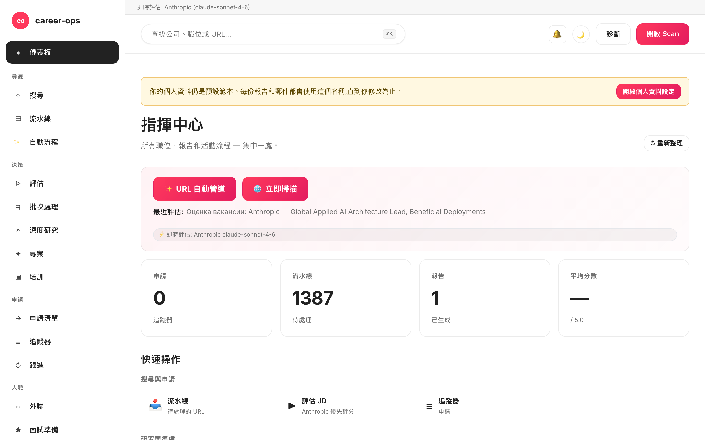

# career-ops-ui

> 為 [career-ops](https://github.com/santifer/career-ops) AI 求職流水線打造的簡潔 docs-style 網頁介面。
> 在單一瀏覽器分頁中完成搜尋、評估、深度研究、投遞與追蹤每一個職缺 — 無須再於 Claude Code、終端機與 markdown 檔案之間來回切換。

[English](README.md) | [Español](README.es.md) | [Português (Brasil)](README.pt-BR.md) | [한국어](README.ko-KR.md) | [日本語](README.ja.md) | [Русский](README.ru.md) | [简体中文](README.zh-CN.md) | **繁體中文** | [Français](README.fr.md)

[](#tests)
[](#tests)
[](#tests)
[](#requirements)
[](LICENSE)
[](https://github.com/Fighter90/career-ops-ui/releases/tag/v1.69.2)

> **🆕 最新版本 — v1.69.2**
>
> **fix(test)：`npm test` 不再覆寫你真實的 `config/profile.yml` / `data/scan-history.tsv`。** 某個測試（`critical-fixes.test.mjs`）在檔案頂部匯入了 `prompts.mjs`（→ `paths.mjs`），導致在該測試將 `CAREER_OPS_ROOT` 設為暫存目錄之前，`PROJECT_ROOT` 就解析到了**真實**父目錄 —— 於是 `PUT /api/profile` 每次執行都會把「Acceptance Test」夾具寫入你的檔案。現在改為在設定環境變數後透過動態 `import()` 載入，並由 `tests/test-root-isolation.test.mjs` 保護整個測試套件。無正式環境程式碼變更。
>
> _完整套件 **1086/1086** 通過 · i18n 與文件已在全部 9 種語言同步。_

<!-- DO NOT REVERT: locale-specific dashboard screenshot (dashboard-zh-TW.png). Each README uses its own ./images/dashboard-<locale>.png — never replace with dashboard-en.png. Generated by scripts/capture-dashboard-screenshots.mjs. -->


## 關於 career-ops

[career-ops](https://career-ops.org) 是一套開源求職系統,以 slash 指令的形式運行於任何 AI 編碼 CLI(Claude Code、Codex、OpenCode、Qwen CLI — 其他 Claude 相容 CLI 也透過相同的斜線指令介面運作)之內。模型無關。它以六維度 0.0–5.0 評分準則將每一筆職缺與你的 CV 進行配對、產生量身打造的 PDF 履歷,並在本機追蹤每一次投遞 — 不需要雲端帳號、不收集遙測資料、絕不自動送出。

**本儲存庫(career-ops-ui)** 是建構於其上的精緻網頁介面。CLI 仍負責表單填寫(透過 Playwright MCP)與 slash 指令模式;SPA 則在相同的 `cv.md` / `data/applications.md` / `reports/` 檔案之上,提供 CRM 風格的瀏覽器介面。兩者共用同一份資料。

**依分數區分的行動門檻**(出自 [career-ops.org/docs](https://career-ops.org/docs)):

| 分數 | 下一步 |
|---|---|
| **≥ 4.5** | `/career-ops apply` — 高度匹配,立即送出 |
| **4.0 – 4.4** | 直接送出,或執行 `/career-ops contacto` 取得 warm intro |
| **3.5 – 3.9** | `/career-ops deep` — 先進行調研 |
| **< 3.5** | 除非另有特殊理由,否則略過 |

**規範性指南**位於 [career-ops.org/docs](https://career-ops.org/docs):

- [What is career-ops](https://career-ops.org/docs/introduction/what-is-career-ops)
- [Scan job portals](https://career-ops.org/docs/introduction/guides/scan-job-portals)
- [Apply for a job](https://career-ops.org/docs/introduction/guides/apply-for-a-job)
- [Batch-evaluate offers](https://career-ops.org/docs/introduction/guides/batch-evaluate-offers)
- [Set up Playwright](https://career-ops.org/docs/introduction/guides/set-up-playwright)

## 一鍵啟動並初始化

> **重要 — career-ops-ui 是建構於 [`santifer/career-ops`](https://github.com/santifer/career-ops) *之上*的儀表板。** 它作為 `career-ops/web-ui/` **運行在** career-ops 專案**內部**,並透過 `../` 讀取父目錄中的 `cv.md`、`config/`、`data/`。它**無法單獨運行** — 你還需要父儲存庫 `career-ops`。請勿單獨 clone 後直接執行 `init`;請使用以下兩個選項之一。

### 選項 1 — 單一 curl（推薦:一鍵配置一切）

```bash
curl -fsSL https://raw.githubusercontent.com/Fighter90/career-ops-ui/main/bin/setup.sh | bash
```

同時 clone **兩個**儲存庫、整理 `career-ops/web-ui/` 目錄結構、安裝相依套件、執行 doctor,並在 http://127.0.0.1:4317 啟動伺服器 — 然後開啟儀表板。

### 選項 2 — 將 UI 加入現有的 career-ops 專案

如果你已配置好 career-ops 並只需要儀表板,可將 UI 作為 `web-ui` clone 到**其內部**:

```bash
cd career-ops                                                   # ← 你現有的 career-ops 專案
git clone https://github.com/Fighter90/career-ops-ui.git web-ui
cd web-ui
npm install
npx career-ops-ui init        # interactive: pick LLM provider + paste its key → parent career-ops/.env
```

嵌套的 `web-ui/` 結構正是讓 UI 能夠解析 `../cv.md`、`../config/`、`../data/` 的原因。如果你希望直接輸入 `career-ops-ui <verb>` 而非 `npx career-ops-ui <verb>`,請**一次性**執行 `npm link`。

### CLI 指令

```bash
career-ops-ui setup    # bootstrap: install deps → doctor → run (SKIP_START=1 to stop before run)
career-ops-ui init     # pick LLM provider + paste its key (interactive)
career-ops-ui doctor   # verify Node / project / keys / Playwright (exit 0 ⇔ all required green)
career-ops-ui run      # launch the server at http://127.0.0.1:4317
career-ops-ui open     # open + RAISE the dashboard tab in your browser
career-ops-ui help     # list every verb
```

若未執行 `npm link`,請在指令前加上 `npx `(例如 `npx career-ops-ui run`)。`setup`/`run` 之後,分頁會自動開啟**並被帶到最前面**;設定 `NO_OPEN=1` 可停用自動開啟(headless / CI)。

### 選擇 LLM 供應商

`init` 是供應商精靈 — 可選擇 **Claude / Claude Code**(`ANTHROPIC_API_KEY`)、**Gemini / Gemini CLI**(`GEMINI_API_KEY`)、**Codex / OpenCode CLI**(`OPENAI_API_KEY`),或 **Auto**(Anthropic → Gemini 後備)。金鑰於關閉回顯的狀態下輸入,並透過與 `#/config` API 金鑰分頁相同的已驗證路徑寫入上層的 `career-ops/.env`。CI 用的非互動式形式:

```bash
career-ops-ui init --provider claude --anthropic-key sk-ant-… --yes
career-ops-ui init --provider gemini --gemini-key …          --yes
career-ops-ui init --provider auto   --openai-key sk-…       --yes
```

或手動設定:`echo "ANTHROPIC_API_KEY=sk-ant-…" >> career-ops/.env`。供應商設定 `LLM_PROVIDER`(`auto` | `claude` | `gemini`);隨時可從 **`#/config` → API 金鑰** 變更,無須重新啟動。

### `init` 故障排除

如果 `career-ops-ui init` 失敗或找不到指令(常見於 `git pull` 之後):

```bash
cd career-ops/web-ui
npm install
npx career-ops-ui init        # npx runs the local bin even without `npm link`
```

請確認:

- 你是從 **`career-ops/web-ui/` 內部**執行指令 — 而非從單獨 clone 的 `career-ops-ui/` 中。
- **父目錄 `career-ops/` 存在**且包含 `cv.md` 和 `config/`。如果你單獨 clone 了 career-ops-ui,請將其移動(或重新 clone)到 `career-ops/web-ui/` — 或直接執行選項 1 中的 curl,它會自動整理目錄結構。
- `career-ops-ui doctor`(或 `npx career-ops-ui doctor`)會精確顯示缺少什麼。

---

## 為什麼?

[career-ops](https://github.com/santifer/career-ops) 是一套強大、由 Claude Code 驅動的求職系統:貼上 JD → 取得 0-5 適配分數、ATS 最佳化的 PDF,以及一筆追蹤器條目。它在 Claude Code 中運作良好,但資料散落於 `cv.md`、`data/applications.md`、`reports/*.md`、`data/pipeline.md`、`portals.yml`、`config/profile.yml` — 容易遺失,難以瀏覽。

`career-ops-ui` 在其上加上一層精緻 UI:

- **Auto-pipeline** —— 在 `#/auto` 貼上一個 URL,一鍵:驗證 → 擷取 → 評估 → 儲存報告 → 加入追蹤器,帶即時無障礙 stepper 與產物深連。
- **瀏覽** 追蹤器、報告與流水線,如同 CRM 一般。
- **觸發** 掃描(Greenhouse / Ashby / Lever / Workable / SmartRecruiters / Workday **以及** hh.ru / Habr Career / Trudvsem / GetMatch / GeekJob),並即時觀看 SSE 日誌。
- **評估** JD,優先透過 Anthropic(較佳)或 Gemini;若未設定 API 金鑰,則回傳給 Claude Code 使用的複製貼上 prompt。
- **深度研究** 公司,透過 Anthropic SDK 即時執行,並自動內嵌 cv / profile / mode 等檔案。
- **編輯** `cv.md`,提供並排 markdown 預覽以及伺服端 XSS 過濾。
- **維運** 系統:doctor、verify、normalize、dedup、merge — 每項一鍵完成。
- **多 CLI:** 可由 Claude Code、Codex、Cursor、Aider 或 Gemini CLI 以相同方式驅動 — `CLAUDE.md` / `AGENTS.md` / `GEMINI.md` 等橋接檔指向單一事實來源。

純加法:`career-ops/` 內部不會被修改。所有自訂內容仍屬於你自己。

---

## 快速開始

### 1. 先安裝 career-ops

```bash
git clone https://github.com/santifer/career-ops.git
cd career-ops
```

依照 [career-ops onboarding](https://github.com/santifer/career-ops#first-run--onboarding) 完成設定,使 `cv.md`、`config/profile.yml`、`portals.yml` 皆已存在。

### 2. 將 career-ops-ui 放入其中

```bash
git clone https://github.com/Fighter90/career-ops-ui.git web-ui
```

你的目錄結構現在會像這樣:

```
career-ops/
├─ cv.md
├─ portals.yml
├─ config/
├─ data/
├─ modes/
├─ reports/
├─ scan.mjs … doctor.mjs … (其餘)
└─ web-ui/                 ← 本儲存庫
   ├─ bin/start.sh
   ├─ package.json
   ├─ server/
   ├─ public/
   └─ tests/
```

### 3. 啟動

```bash
bash web-ui/bin/start.sh
```

該指令會:

1. 檢查 Node ≥ 18。
2. `npm install`(僅首次執行,只有兩個相依套件 — Express + js-yaml)。
3. 在 `127.0.0.1:4317` 啟動 Express 伺服器。
4. 在預設瀏覽器中開啟 http://127.0.0.1:4317/。

自訂連接埠 / 主機:

```bash
PORT=8080 bash web-ui/bin/start.sh
HOST=0.0.0.0 PORT=4317 bash web-ui/bin/start.sh   # 對 LAN 開放
```

若你將儲存庫 clone 至其他位置(非 `career-ops/web-ui`),透過環境變數指向 career-ops:

```bash
CAREER_OPS_ROOT=/path/to/career-ops bash bin/start.sh
```

---

## 首次執行 — 清潔狀態

`career-ops/data/pipeline.md` 附帶兩個 QA 測試夾具 URL (`example.com/qa-fixture-*`),以便測試套件能夠密封執行。在新克隆中,Pipeline 顯示 `2 個待處理` — 這些不是真實職位。首次掃描前請清理:

```bash
make clean-test-fixtures
npm start
```

打開 http://127.0.0.1:4317。Pipeline 計數器應顯示 `0 個待處理`。

---

## 系統需求

| | |
| --- | --- |
| **Node.js** | ≥ 18(使用原生 `fetch`、`node:test`) |
| **career-ops** | 已 clone 並完成 onboarding — 見上文 |
| **選用** | 於父專案 `.env` 中設定 `GEMINI_API_KEY`(免費層模型 `gemini-2.0-flash`)以啟用一鍵 JD 評估。否則 UI 會回傳給 Claude 使用的複製貼上 prompt。 |
| **選用** | 若 hh.ru 回傳 403,請從俄羅斯 IP / VPN 執行。Habr Career 則不受 IP 限制。 |
| **選用** | Playwright(已是 career-ops 的傳遞性相依套件)用於執行 e2e 測試套件。 |

---

## 各頁面功能

| 頁面             | 功能說明                                                                                                            |
| ---------------- | ------------------------------------------------------------------------------------------------------------------ |
| **Dashboard**    | 彙總計數(apps / pipeline / reports)、平均分數、依狀態分類、最新 5 筆 apps + 最新報告。                              |
| **Scan**         | **🌐 單一 Scan 按鈕** — 一次執行所有已啟用的來源(EN:Greenhouse / Ashby / Lever / Workable / SmartRecruiters / Workday,RU:hh.ru + Habr Career + Trudvsem + GetMatch + GeekJob)。即時 SSE 日誌串流 + 可點擊結果表,具備 location / Remote-Hybrid 徽章 / relocation 旗標 / salary / source 篩選器與動態 stack / level / keyword chip。Active-Companies 卡片列出每個受追蹤的 board 及其 API 健康狀態。 |
| **Pipeline**     | 對 `data/pipeline.md` 進行 CRUD。伺服端 preview proxy(SSRF-safe、逐 hop redirect 驗證、8 KB body cap)。可從 URL 直接跳至評估。 |
| **Evaluate**     | 貼上 JD → **Anthropic 優先**(兩把金鑰皆有時較佳),其次 Gemini,最後為手動 prompt fallback。Anthropic 路徑會自動內嵌 cv / profile / `_shared.md` / `oferta.md`(REVIEW-A1)。可選擇將 JD 儲存至 `jds/`。 |
| **Deep research**| 與 Evaluate 採用相同的 fallback 鏈。即時 Anthropic 會回傳約 10-30 KB 經資料佐證的 markdown,並存至 `interview-prep/<company>-<role>.md`。 |
| **Modes**        | 7 個通用 mode 頁面(`/#/project`、`/#/training`、`/#/followup`、`/#/batch`、`/#/contacto`、`/#/interview-prep`、`/#/patterns`),具備相同的 Anthropic / Gemini / 手動 fallback,並提供內聯提示說明各模式用途。 |
| **Apply helper** | 產生送出申請的檢查清單;實際的 Playwright 表單填寫仍位於 Claude Code 中的 `/career-ops apply`。 |
| **Tracker**      | 對 `data/applications.md` 的可篩選表(狀態、分數、自由文字)。一鍵執行 `normalize-statuses.mjs` / `dedup-tracker.mjs` / `merge-tracker.mjs`。pipe 與換行的 escape 符合 GFM — 如 `"Acme \| Co"` 這樣的名稱可無損 round-trip。 |
| **Reports**      | 瀏覽並閱讀 `reports/` 下的每一份報告,並解析其 header(Score / Legitimacy / URL)。                                  |
| **CV**           | `cv.md` 的即時 markdown 編輯器,具備並排預覽 + 一鍵 `cv-sync-check.mjs` + 📁 上傳 CV。儲存時於伺服端進行 XSS 過濾(`<script>`、`javascript:`、`on*=` 處理器)。 |
| **Profile**      | `config/profile.yml` + archetypes 的唯讀檢視 — UI 友善摘要。                                                          |
| **App settings** | UI 內建編輯器,可編輯父專案 `.env` 中的金鑰:`ANTHROPIC_API_KEY`、`GEMINI_API_KEY`、模型 override、port / host。讀取時 secrets 會被遮罩。 |
| **Health**       | 所有 setup 檢查以 OK / OPTIONAL / FAIL 徽章呈現 + 用於執行 `doctor.mjs` 與 `verify-pipeline.mjs` 的按鈕。              |
| **Help**         | 應用程式內的 Markdown 使用指南(`/#/help`),已本地化為所有 8 種支援語言(en / es / pt-BR / ko-KR / ja / ru / zh-CN / zh-TW)。 |
| **Activity log** | 每一筆會改變狀態的請求(寫入、執行、掃描)的稽核軌跡。secrets 會被遮蔽。 |
| **通知** 🔔 *(v1.58.34 / v1.58.35)* | 頂列鈴鐺 + 紅色未讀徽章。點擊 → 右側抽屜展示最近 50 條 toast(按分頁/作業階段)— 成功 / 錯誤 / 資訊-進度,每條帶本地時間、訊息,及在需要時把 `(METHOD /path · HTTP NNN)` 後綴放入 `<details>`。說明 **§18** 描述每個類別。抽屜**僅在點擊鈴鐺時開啟**(或鍵盤 Enter / Space);透過 ×、Esc 或再次點擊鈴鐺關閉。|

全域鍵盤快捷鍵:

- `Ctrl+K` / `Cmd+K` — 聚焦全域搜尋。
- 將 URL 貼入全域搜尋,會自動將其加入 pipeline。
- `Esc` — 關閉任何已開啟的 modal。

---

## Scan

零 token 的入口網站掃描,實際會回傳職缺。UI 中的 **單一 🌐 Scan 按鈕** 會在一次掃描中走過所有已設定的來源:

- **Greenhouse / Ashby / Lever / Workable / SmartRecruiters / Workday** — 對 `portals.yml::tracked_companies` 中所有具備可辨識 ATS 樣式的公司呼叫公開 boards-api。內建清單涵蓋 Stripe、GitLab、Vercel、Cloudflare、Datadog、Discord、Elastic、Grafana Labs、CockroachDB、Fastly、Twilio、Coinbase、Reddit、Robinhood、Affirm、Lyft、Linear、Supabase、PostHog、Ramp、Modal Labs、Railway、Browserbase、JetBrains — 可自由擴充或精簡。
- **RSS 招募看板** — 支援任何提供 RSS/Atom feed 的招募看板(LaraJobs、WeWorkRemotely、RemoteOK、golangprojects 等)。只需在 `portals.yml` 中加入 `provider: rss` 與 feed URL 即可,無需修改程式碼。
- **hh.ru** — 抓取 `hh.ru/search/vacancy` 的 HTML。任何 IP 皆可用,無需金鑰或代理。(不再使用 JSON API `api.hh.ru`:它現在無論 IP/User-Agent 都對所有程式化用戶端回傳 403;網站則像 Habr Career 一樣向任何類瀏覽器用戶端回傳完整結果。)
- **Habr Career** — 對 `career.habr.com/vacancies` 進行 HTML 抓取。不受 IP 限制,無需認證。

### RSS 適配器

在 `portals.yml` 中新增包含 `provider: rss` 及 `rss:`(或 `feed_url:`)鍵的條目,即可將任意 RSS 招募看板接入掃描器:

```yaml
tracked_companies:
  - name: LaraJobs
    provider: rss
    rss: https://larajobs.com/feed
    enabled: true
  - name: WeWorkRemotely
    provider: rss
    rss: https://weworkremotely.com/remote-jobs.rss
    enabled: true
```

適配器使用小型正則運算式解析器(無需 XML 函式庫)解析 `<item>` 區塊。提取 `title`、`link`(→ `url`)、`pubDate`(→ `date`)與 `description`(→ `snippet`,去除 HTML 標籤)。遠端工作狀態透過標題或描述中的 `/remote|anywhere/i` 樣式判定;公司名稱依序從 `dc:creator`、標題中「公司 — 職位」樣式或 feed 主機名稱取得。與 ATS 適配器相同,結果均歷經正規化 → 篩選 → 去重 → 追加至 pipeline 的完整流程。

所有來源皆走相同的 pipeline:normalize → filter(`title_filter.positive` / `title_filter.negative`)→ 對 `data/scan-history.tsv` + `data/pipeline.md` + `data/applications.md` 進行 dedup → append 至 `data/pipeline.md` → 將完整結果集存至 `data/last-scan.json` 以供 UI 的可篩選表使用。

透過 `portals.yml` 進行設定:

```yaml
title_filter:
  positive: [backend, engineer, senior, tech lead, golang, php]
  negative: [junior, intern, frontend, ios, android]
tracked_companies:
  - { name: Stripe, enabled: true, careers_url: https://job-boards.greenhouse.io/stripe }
  - { name: Linear, enabled: true, careers_url: https://jobs.ashbyhq.com/linear }
  # ...
russian_portals:
  sources: ["hh", "habr"]   # 擇一或兩者
  area: 113                  # 1=Moscow, 2=SPb, 113=Russia, 1001=remote
  per_page: 50
  only_remote: false
  queries: ["Senior PHP", "Senior Go", "Tech Lead"]
```

所有來源流經單一 SSE 端點:`/api/stream/scan?source=ats|regional|both`。UI 的 **🌐 Scan** 按鈕呼叫 `source=both`,因此所有 adapter(Greenhouse / Ashby / Lever / Workable / SmartRecruiters / Workday + hh.ru + Habr Career + Trudvsem + GetMatch + GeekJob)會在同一條連線中執行。client 斷線時會 honor `AbortSignal` — 不會殘留 fetch。

---

## 架構

```
career-ops-ui/
├─ CLAUDE.md                 # 專案層級 agent 指令(規範)
├─ AGENTS.md                 # Codex / Aider / 一般 CLI 橋接 → CLAUDE.md
├─ GEMINI.md                 # Gemini CLI 橋接 → CLAUDE.md
├─ .aiignore                 # AI 工具的排除清單
├─ .claude/                  # Claude Code agent 設定
│  ├─ agents/                # 3 個專案專屬 subagent(route、view、test isolation)
│  └─ commands/               # slash 指令 stub
├─ bin/start.sh              # 一鍵啟動器(Node 檢查 → npm install → 啟動伺服器 → 開啟瀏覽器)
├─ package.json              # 2 個 runtime 相依:express、js-yaml
├─ server/
│  ├─ index.mjs              # ~130 LOC 編排器:middleware + 12 個 register<Topic>Routes(app) 呼叫 + SPA catch-all
│  └─ lib/
│     ├─ paths.mjs           # career-ops 檔案的絕對路徑(感知 CAREER_OPS_ROOT)
│     ├─ parsers.mjs         # markdown / pipeline / report 解析器(符合 GFM 的 pipe escape)
│     ├─ runner.mjs          # runNodeScript() + streamNodeScript(),具備 SIGTERM→SIGKILL 升級與 30 分鐘上限
│     ├─ security.mjs        # isValidJobUrl、stripDangerousMarkdown、sanitizeJobDescription、sanitizePathName、isPubliclyExposed
│     ├─ safe-fetch.mjs      # DNS 固定 fetch,封堵 DNS rebind 與 TOCTOU 競爭條件
│     ├─ file-lock.mjs       # 依檔案路徑互斥的 withFileLock(),用於 read-modify-write 序列化
│     ├─ rate-limit.mjs      # llmRateLimit middleware(loopback 為 no-op;非 loopback 預設 10 req/min/IP)
│     ├─ prompts.mjs         # bundleProjectContext、buildEvaluationPrompt、buildDeepPrompt、buildModePrompt
│     ├─ store.mjs           # safeReadApps/Pipeline/Reports、checkProfileCustomized、ensureRussianPortalsDefaults
│     ├─ anthropic.mjs       # 精簡的 Anthropic SDK adapter(runAnthropic、hasAnthropicKey、hasGeminiKey)
│     ├─ env-config.mjs      # `.env` round-trip,具備 secret 遮罩 + 驗證
│     ├─ activity-log.mjs    # JSONL 稽核軌跡 middleware(secrets 已遮蔽)
│     ├─ dotenv.mjs          # 迷你 dotenv 載入器
│     ├─ en-scanner.mjs      # in-process Greenhouse/Ashby/Lever 編排器(支援 AbortSignal)
│     ├─ ru-scanner.mjs      # in-process hh.ru + Habr 編排器(支援 AbortSignal)
│     ├─ sources/
│     │  ├─ greenhouse.mjs   # boards-api.greenhouse.io client
│     │  ├─ ashby.mjs        # api.ashbyhq.com client
│     │  ├─ lever.mjs        # api.lever.co client
│     │  ├─ hh.mjs           # api.hh.ru client(UA-aware)
│     │  └─ habr.mjs         # career.habr.com HTML parser(無 cheerio,純 regex)
│     └─ routes/             # 12 個路由模組 — 每個主題一個(P-2)
│        ├─ activity.mjs     # /api/activity
│        ├─ config.mjs       # /api/config(父專案 .env round-trip)
│        ├─ content.mjs      # /api/cv、/api/profile、/api/portals、/api/modes
│        ├─ health.mjs       # /api/health、/api/dashboard
│        ├─ help.mjs         # /api/help/:lang
│        ├─ jds.mjs          # /api/jds CRUD
│        ├─ llm.mjs          # /api/evaluate、/api/deep、/api/mode/:slug、/api/apply-helper、/api/interview-prep*
│        ├─ pipeline.mjs     # /api/pipeline + SSRF-safe preview proxy
│        ├─ reports.mjs      # /api/reports
│        ├─ runners.mjs      # /api/run/* + /api/stream/{scan,liveness,pdf} + /api/output/pdfs
│        ├─ scan.mjs         # /api/stream/scan-{ru,en} + /api/scan-results
│        └─ tracker.mjs      # /api/tracker
├─ public/                   # 靜態 SPA — 無建置步驟
│  ├─ index.html
│  ├─ css/app.css            # 設計 token(docs-style 調色盤),WCAG 1.4.1 視覺冗餘線索(色彩搭配圖示/形狀)
│  └─ js/
│     ├─ api.js              # fetch wrapper + connection-banner 狀態 + UI helpers + 安全 markdown renderer
│     ├─ router.js           # 基於 hash 的 router,具備 404 fallback + alias 支援
│     ├─ app.js              # boot + 全域鍵盤處理器 + 行動裝置 sidebar drawer
│     ├─ lib/{i18n,skills}.js
│     └─ views/              # 每個頁面一個檔案(dashboard、scan、pipeline、evaluate、deep、apply、tracker、reports、cv、settings、health、config、help、activity、mode-page)
├─ docs/                     # 公開參考:架構、API、資料流、SDD、規約、reviews
│  ├─ PROJECT.md             # what / why / for-whom
│  ├─ ROADMAP.md             # 目前的 milestone + 已完成歷史
│  ├─ PRODUCTION-READINESS.md # 誠實的部署 gate 評估
│  ├─ sdd/{SDD-GUIDE,CONVENTIONS}.md
│  ├─ architecture/{OVERVIEW,SERVER,FRONTEND,API,DATA-FLOWS}.md
│  └─ reviews/REVIEW-*.md
└─ tests/                    # 1000 unit + 70 Playwright + 23 e2e:full + 20 e2e:smoke
   ├─ parsers.test.mjs       # markdown / pipeline / report 解析器(純函式)
   ├─ api.test.mjs           # 每個端點、暫時性伺服器、無網路
   ├─ {ru,en}-scanner.test.mjs   # 已 mock 的 fetch
   ├─ pipeline-preview.test.mjs   # 逐 hop redirect 驗證(REVIEW-B1)
   ├─ ssrf-redirect-rebind.test.mjs  # DNS rebind / TOCTOU 抗性回歸測試
   ├─ concurrent-tracker-write.test.mjs  # 檔案互斥下的並行 POST 回歸測試
   ├─ rate-limit.test.mjs    # llmRateLimit 行為(loopback no-op、429 + Retry-After)
   ├─ path-traversal.test.mjs    # sanitizePathName 統一回歸測試
   ├─ anthropic.test.mjs     # SDK adapter + log-guard 測試(REVIEW-B4)
   ├─ url-validation.test.mjs    # SSRF reject 掃描(FIX-M3 + M6 + M7)
   ├─ cv-xss.test.mjs        # stripDangerousMarkdown round-trip(實體感知)
   ├─ jd-sanitize.test.mjs   # sanitizeJobDescription
   ├─ help.test.mjs / help-ui.test.mjs    # 所有 8 個 locale 的 i18n parity
   ├─ playwright-smoke.mjs   # 32 個瀏覽器流程(CV 儲存、tracker、pipeline、evaluate、config 等)
   └─ e2e{,-comprehensive}.mjs   # 完整 Playwright walkthrough
```

### 為何沒有建置步驟?

純 HTML/CSS/JS 讓表面積極小:`npm install` 兩個相依套件即可執行。沒有 Webpack、沒有 Vite、沒有令人崩潰的 `node_modules`。整個 UI 壓縮後 < 30 KB。若你想要開發時 hot-reload,`npm run dev` 會使用 Node 內建的 `--watch`。

### Spec-Driven Development

非微不足道的變更會走 GSD pipeline(來自 `superpowers@claude-plugins-official` 的 `gsd-*` skill):

```
discuss → spec → plan → execute → verify → review
```

公開參考:[`docs/sdd/SDD-GUIDE.md`](docs/sdd/SDD-GUIDE.md)。所有規劃產出位於 `.planning/`(gitignored)。`docs/` 目錄樹是長期存在的公開契約。

---

## API 參考

所有端點皆位於 `/api/*`。除非另有註明,皆為 JSON in / JSON out。

### Health & dashboard

| Method | Path                     | Response                                                                    |
| ------ | ------------------------ | --------------------------------------------------------------------------- |
| GET    | `/api/health`            | `{ ok, warnings, version, parentVersion, checks: [{name, ok, required, value?}] }` |
| GET    | `/api/dashboard`         | `{ counts, avgScore, byStatus, recent, pipeline, lastReport }`              |
| GET    | `/api/status/providers`  | `{ activeProvider, activeModel, keysConfigured }` —— 用於引導橫幅 + ⚡ 費用提示的 LLM 就緒狀態 (v1.55.3) |
| GET    | `/api/activity?limit&type` | `data/activity.jsonl` 稽核軌跡的 tail                                      |
| GET    | `/api/help/:lang`        | 本地化的應用程式內使用指南(fallback:`en.md`)                                |

### App settings(父專案 .env round-trip)

| Method | Path             | 目的                                                                  |
| ------ | ---------------- | --------------------------------------------------------------------- |
| GET    | `/api/config`    | 已知環境變數金鑰,secrets 已遮罩                                       |
| POST   | `/api/config`    | 驗證 + 寫入父專案 `.env`;原地套用至 `process.env`                     |

### 資料檔案

| Method | Path                                | 目的                                                                |
| ------ | ----------------------------------- | ------------------------------------------------------------------- |
| GET    | `/api/tracker`                      | `{ rows: [parsed applications.md] }`                                |
| POST   | `/api/tracker`                      | body `{ company, role, score?, status?, url?, notes?, date? }` — 具備 dedup(company + role 大小寫不敏感),於 `withFileLock` 下序列化寫入 |
| GET    | `/api/pipeline`                     | `{ urls: [...] }`                                                   |
| POST   | `/api/pipeline`                     | body `{ url }` → 透過 dedup + `isValidJobUrl` 加入 `data/pipeline.md`,於檔案互斥保護下執行 |
| GET    | `/api/pipeline/preview?url=…`       | 伺服端 fetch proxy(DNS 固定、逐 hop SSRF 檢查、≤3 redirects、8 KB cap) |
| DELETE | `/api/pipeline?url=…`               | 移除一個 URL                                                         |
| GET    | `/api/reports`                      | `reports/*.md` 的解析列表                                            |
| GET    | `/api/reports/:slug`                | 完整 markdown + 解析 header                                          |
| GET    | `/api/jds`                          | 已儲存的 JD 檔案列表                                                  |
| GET    | `/api/jds/:name`                    | text/plain — 原始 JD                                                 |
| POST   | `/api/jds`                          | body `{ text, slug? }` → 存至 `jds/`                                 |
| DELETE | `/api/jds/:name`                    | unlink(需 `.txt` 副檔名,經 `sanitizePathName` 統一處理)              |
| GET    | `/api/cv`                           | `{ markdown }`                                                       |
| PUT    | `/api/cv`                           | body `{ markdown }` → 寫入 `cv.md`(經實體感知 XSS 過濾、≤1 MB)        |
| GET    | `/api/profile`                      | `{ profile: yaml-parsed, raw: text }`                                |
| GET    | `/api/portals`                      | `{ portals: yaml-parsed, raw: text }`                                |
| GET    | `/api/modes`                        | mode 檔案列表                                                         |
| GET    | `/api/modes/:name`                  | text/plain — 原始 mode prompt                                        |
| GET    | `/api/output/pdfs`                  | 已產生 PDF 的列表                                                     |
| GET    | `/api/output/pdfs/:name`            | 下載(`Content-Disposition: attachment`)                            |
| GET    | `/api/interview-prep`               | 已儲存深度研究檔案的列表                                              |
| GET    | `/api/interview-prep/:name`         | `{ name, markdown }`                                                 |
| DELETE | `/api/interview-prep/:name`         | unlink(需 `.md` 副檔名)                                              |

### Script runners(buffered、一次性)

| Method | Path                    | 包裝                       |
| ------ | ----------------------- | --------------------------- |
| POST   | `/api/run/doctor`       | `node doctor.mjs`           |
| POST   | `/api/run/verify`       | `node verify-pipeline.mjs`  |
| POST   | `/api/run/normalize`    | `node normalize-statuses.mjs` |
| POST   | `/api/run/dedup`        | `node dedup-tracker.mjs`    |
| POST   | `/api/run/merge`        | `node merge-tracker.mjs`    |
| POST   | `/api/run/sync-check`   | `node cv-sync-check.mjs`    |

所有 buffered 執行上限 60 秒;5 秒寬限期後 SIGTERM → SIGKILL 升級。

### Streams(SSE)

| Method | Path                          | Streams                            |
| ------ | ----------------------------- | ---------------------------------- |
| GET    | `/api/stream/scan`            | legacy `node scan.mjs`(subprocess)|
| GET    | `/api/stream/scan?source=ats\|regional\|both` | 合併的 in-process scanner SSE — query:`dryRun=1`、`company=…`(僅 ATS)。 |
| GET    | `/api/stream/liveness`        | `node check-liveness.mjs`          |
| GET    | `/api/stream/pdf`             | `node generate-pdf.mjs`            |

SSE 事件類型:

```
event: start    data: { script, args?, writeFiles? }
event: log      data: { stream: "stdout"|"stderr", line: string }
event: done     data: { code, counts?, errors? }
event: error    data: { message }
```

### LLM 端點(Anthropic 優先 → Gemini → 手動 fallback)

| Method | Path                                | 目的                                                                              |
| ------ | ----------------------------------- | --------------------------------------------------------------------------------- |
| POST   | `/api/evaluate`                     | body `{ jd, save? }` → JD 評估(依 `oferta.md` 的 A–G 區段)— 套用 `llmRateLimit` |
| POST   | `/api/evaluate/test-gemini`         | 對 `GEMINI_API_KEY` 進行 smoke 檢查                                                |
| POST   | `/api/evaluate/test-anthropic`      | 對 `ANTHROPIC_API_KEY` 進行 smoke 檢查                                             |
| POST   | `/api/deep`                         | body `{ company, role?, run? }` → 深度研究 prompt 或即時 grounded markdown — 套用 `llmRateLimit` |
| POST   | `/api/mode/:slug`                   | 通用 mode runner;allowlist:`batch`、`contacto`、`followup`、`interview-prep`、`patterns`、`project`、`training` — 套用 `llmRateLimit` |
| POST   | `/api/apply-helper`                 | body `{ url, jd? }` → 申請檢查清單                                                  |
| POST   | `/api/auto-pipeline`                | body `{ url }` → 自動評估後寫入 tracker(DNS 固定 fetch + 檔案互斥)                |
| GET    | `/api/scan-results`                 | `{ en: {when, fresh[], filtered[], errors[]}, ru: { ... } }` — 最後一次掃描         |
| GET    | `/api/scan/regional/config`         | 有效的 regional-scanner 設定(queries、negatives、sources)。 |

當 `/api/deep` 或 `/api/mode/:slug` 設定 `run: true` 時,伺服器會優先採用 Anthropic(兩把金鑰皆有時),將 `cv.md` + `config/profile.yml` + `modes/_shared.md` + 相關 mode 模板 內嵌至 `<project_context>` 區塊,並直接回傳模型輸出的 grounded markdown。軟上限:組裝後的 prompt 200 KB — 超出會回傳 413。

`llmRateLimit` 在 loopback 為 no-op;當 `HOST=0.0.0.0` 時預設 10 req/min/IP,並可透過 `LLM_RATE_LIMIT="N/Ws"` 調整。超過限額時回傳 429 並附 `Retry-After` header。

---

## 測試

```bash
npm test                       # 1000 個 unit/integration 測試
npm run test:e2e               # 20 個 smoke e2e(自行啟動伺服器)
npm run test:e2e:full          # 23 個 comprehensive e2e
npm run test:e2e:browser       # 70 個 Playwright 瀏覽器 smoke
npm run test:coverage          # 同 `npm test`,加上 V8 coverage
```

| Suite                       | 測試數 | 內容                                                                                                         |
| --------------------------- | ----- | ------------------------------------------------------------------------------------------------------------ |
| `node --test tests/*.test.mjs`(unit + integration) | **1000** | 每個端點、暫時性伺服器、無網路。涵蓋解析器、scanner(已 mock)、runner、anthropic、CSP / 安全 header、實體感知 XSS、JD sanitize、URL 驗證、SSRF redirect rebind、檔案互斥下的並行 tracker 寫入、`llmRateLimit`、路徑統一 sanitization、i18n parity。 |
| `tests/e2e.mjs`(smoke)      | 20    | Playwright headless:每條路由可渲染、基本流程。                                                              |
| `tests/e2e-comprehensive.mjs` | 23    | 完整 Playwright walkthrough:11 條路由 + 12 條功能流程。                                                      |
| `tests/playwright-smoke.mjs`(`npm run test:e2e:browser`) | **32** | 瀏覽器驅動 smoke:dashboard render、navigation、語言切換、404、health、tracker round-trip(BF-1)、pipeline add + 無效 URL 掃描、reports empty、evaluate 手動 fallback、config 金鑰遮罩、CV PUT XSS strip、pipeline preview 400、WCAG 1.4.1 視覺冗餘線索回歸。 |
| **總計**                   | **549+** | **0 fails、0 flakes**                                                                                       |

Coverage:透過 `--experimental-test-coverage` ~93% 列 / ~83% 分支。

解析器為純函式(無 I/O)— 對來自 `applications.md`、`pipeline.md`、`reports/*.md` 的真實資料片段進行測試。API 測試在暫時連接埠上 boot Express app,並對每個端點執行端到端測試。Scanner 測試會 mock `fetch`,因此即使 hh.ru 封鎖你的 IP 仍會通過。Playwright 瀏覽器 smoke 對 in-process 伺服器執行,並透過父專案的 `node_modules` 解析 Playwright — `web-ui/` 中沒有新相依套件。

CI 在每次推到 `main` 時對 Node 18 / 20 / 22 執行 unit + e2e + Playwright 矩陣。

---

## 設定

環境變數(在伺服器啟動時讀取,除註明外皆為選用):

| 變數                  | 預設值             | 目的                                                                                  |
| -------------------- | ------------------ | ------------------------------------------------------------------------------------- |
| `PORT`               | `4317`             | Express 綁定的連接埠                                                                   |
| `HOST`               | `127.0.0.1`        | Express 綁定的 host。非 loopback 時會附加 CSP 與 `llmRateLimit`;auth gate 計畫於 v2.0.0。 |
| `CAREER_OPS_ROOT`    | 由 script 取 `..`  | `cv.md`、`data/`、`portals.yml`、`modes/` 等檔案的所在位置。                            |
| `ANTHROPIC_API_KEY`  | unset              | 啟用 `/api/evaluate`、`/api/deep`、`/api/mode/:slug` 的 live 模式(兩把金鑰皆有時較佳)。 |
| `ANTHROPIC_MODEL`    | `claude-sonnet-4-6` | Override Anthropic 模型。                                                            |
| `GEMINI_API_KEY`     | unset              | 轉發給 `gemini-eval.mjs`,並作為 `/api/evaluate` 的 fallback。                          |
| `GEMINI_MODEL`       | `gemini-2.0-flash` | Override Gemini 模型。                                                                |
| `OPENAI_API_KEY`     | unset              | 無頭即時評估（`auto` 順序第 3 位）+ 父專案 Codex/OpenAI CLI 流程。                |
| `OPENAI_MODEL`       | `gpt-5-codex`      | Override OpenAI 模型。                                                              |
| `QWEN_API_KEY`       | unset              | 經 DashScope（OpenAI 相容）的無頭即時評估（`auto` 順序第 4 位）。                 |
| `QWEN_MODEL`         | `qwen-max`         | Override Qwen 模型。                                                                |
| `OPENROUTER_API_KEY` | unset              | 經 OpenRouter 的無頭即時評估 —— 一個 key、300+ 模型（`auto` 第 5 位/最後）。      |
| `OPENROUTER_MODEL`   | `openrouter/auto`  | `vendor/model` id。目錄從 `GET /api/openrouter/models` 即時載入。                 |
| `LLM_RATE_LIMIT`     | `10/60s`           | 調整 `llmRateLimit` 視窗;格式 `N/Ws` 或 `N/Wm`(loopback 時忽略)。                    |
| `(伺服器使用預設 UA)` | unset              | Override hh.ru User-Agent(有助於降低非 RU IP 的 403)                                  |

本 UI 認可的 `portals.yml` 擴充(加入父專案中既有的檔案):

```yaml
russian_portals:
  sources: ["hh", "habr"]
  area: 113          # hh.ru area id
  per_page: 50
  only_remote: false
  queries: ["Senior PHP", "Тимлид Go", ...]
```

你也可以對任何公司條目擴充明確的 `api:` URL。詳見本儲存庫的 [`docs/portals-examples.md`](docs/portals-examples.md),內含 24 間經驗證公司可直接貼上的區塊。

---

## 安全說明

- 伺服器預設綁定至 `127.0.0.1` — 除非顯式設定 `HOST=0.0.0.0`,否則不會對網際網路暴露。
- **路徑統一處理(v1.21.0)**:每一個 `:name` / `:slug` 路由參數皆經過 `server/lib/security.mjs` 中的 `sanitizePathName()` — 過濾非 `[\w-.]`、去除前導 dot-runs、合併內部 dot-runs、上限 200 字元,空字串回傳 400。此函式取代了先前 10 處重複的 regex 副本,封堵了像 `..pdf` / `....md` 這類過去能穿透的路徑。
- **DNS rebind 防護(v1.21.0)**:`/api/pipeline/preview` 與 `/api/auto-pipeline` 透過 `server/lib/safe-fetch.mjs::safeGet` 路由 — 僅一次 DNS 查詢、固定 TCP 連線,SNI 與 Host header 指向原始 hostname。沒有第二次查詢,也沒有 TOCTOU 競爭條件視窗。
- **並行寫入互斥(v1.21.0)**:`tracker.mjs`、`pipeline.mjs`(POST + DELETE)以及 `auto-pipeline.mjs` 的 tracker 階段皆以 `server/lib/file-lock.mjs` 提供的 `withFileLock(path, fn)` 包裹其 read-modify-write 序列。並行 POST 不會再丟失資料列。
- **LLM 速率限制(v1.21.0)**:`/api/evaluate`、`/api/deep`、`/api/mode/:slug`、`/api/auto-pipeline` 皆套用 `server/lib/rate-limit.mjs` 中的 `llmRateLimit`。**loopback 為 no-op**;`HOST=0.0.0.0` 時預設 10 req/min/IP。可透過 `LLM_RATE_LIMIT="N/Ws"` 設定,逾額回傳 429 並附 `Retry-After`。
- **CV XSS 過濾強化(v1.22.0)**:`stripDangerousMarkdown` 現已實體感知 — 在套用 regex 過濾前會先解碼 `&lt;`、`&gt;`、`&#NN;`、`&#xHH;`,使得 `&lt;script&gt;` 與 `java&#115;cript:` 這類 payload 無從繞過。
- Subprocess 呼叫一律使用 `spawn` 搭配參數陣列 — **絕無 shell interpolation**。`bash` runner 透過 `--noprofile --norc` 忽略 `~/.bashrc`。
- 串流端點在 client 斷線時會 kill 子處理程序(無孤兒 scanner)。
- 寫入端點只觸碰已知的 career-ops 路徑:`data/`、`jds/`、`cv.md`、`config/`、`portals.yml`、`output/`、`reports/`、`interview-prep/`、`modes/_profile.md`。其他位置一概不碰。
- 連線橫幅在斷線時以指數退避(3 秒 → 6 秒 → 12 秒 → 24 秒 → 60 秒)ping `/api/health`,並在恢復時自動清除(v1.22.0 M-6)。
- 介面遵循 WCAG 1.4.1 — 任何僅以色彩傳達的狀態皆會以圖示、形狀或文字標籤提供視覺冗餘線索。

---

## 限制

完全由 LLM 驅動的模式(`oferta`、`deep`、`contacto`、`apply`、`batch`、`patterns`、`followup`)實際執行需要一個 LLM。Web UI 提供三個選項:

1. **Anthropic(較佳)** — 在父專案 `.env` 中設定 `ANTHROPIC_API_KEY`。透過 `runAnthropic` 路由,並自動內嵌 `cv.md` / `config/profile.yml` / `modes/_shared.md` / mode 模板(REVIEW-A1)。已於 v1.8.0+ 驗證 live 運作,使用 `claude-sonnet-4-6` 為一次深度研究呼叫回傳 26 KB 經資料佐證的 markdown。
2. **`gemini-eval.mjs`** 作為 fallback — 只要設定 `GEMINI_API_KEY` 即可開箱使用。
3. **複製貼上 prompt** — 未設定任何金鑰時,UI 會產生格式化的現成 prompt,可貼給 Claude Code / ChatGPT / Gemini Web。

Claude Code 中既有的 `/career-ops apply` Playwright 表單填寫流程,仍是唯一能真正自動填寫申請表單的途徑 — UI 中的 *Apply helper* 僅產生檢查清單。

關於 production-readiness 評估(部署 gate、風險登錄、遞延項目),請見 [`docs/PRODUCTION-READINESS.md`](docs/PRODUCTION-READINESS.md)。TL;DR:可用於 single-tenant loopback;LAN 暴露需等待 v2.0 的 P-12 auth gate。

---

## 在地化(Localization)

介面提供 **8 種語言** — `en`、`es`、`pt-BR`、`ko`、`ja`、`ru`、`zh-CN`、`zh-TW`。自 **v1.60.0 (I18N-SPLIT)** 起,翻譯以**每種語言一個檔案**存放於 [`public/js/lib/locales/`](public/js/lib/locales/) —— `i18n-dict.<lang>.js`(扁平的 `鍵 → 字串` 表)外加共用的 `i18n-dict.aliases.js`。[`i18n-dict.js`](public/js/lib/i18n-dict.js) 將它們組裝為 `window.__I18N_DICT`;[`i18n.js`](public/js/lib/i18n.js) 負責解析 `t('鍵', 'fallback')`。無建置、無 fetch —— 譯者只需編輯單一語言檔案。

**新增或修改文案:** 將同一個鍵加入全部 8 個語言檔案(由測試強制保證一致性),透過 `data-i18n="scan.newButton"` 或 `t('scan.newButton')` 使用,然後執行 `npm test`。

```js
// public/js/lib/locales/i18n-dict.en.js   →   'scan.newButton': 'Run scan',
// public/js/lib/locales/i18n-dict.es.js   →   'scan.newButton': 'Ejecutar búsqueda',
```

📖 **完整指南:** [`docs/LOCALIZATION.md`](docs/LOCALIZATION.md) —— 按語言的佈局、`@alias` 機制、如何新增語言,以及所有 i18n CI 關卡。

---

## 貢獻

歡迎 Issues 與 PRs。House rules:

- 推送前執行 `npm test` — **1000 項檢查綠燈**為門檻(若觸碰 UI 則加上 70 個 Playwright)。
- 非微不足道的變更請走 GSD pipeline。詳見 [`docs/sdd/SDD-GUIDE.md`](docs/sdd/SDD-GUIDE.md)。
- 不要從本儲存庫內修改父專案 `career-ops/` 內的任何東西。重點在於這是一個非侵入式 overlay。Hard rules 位於 [`CLAUDE.md`](CLAUDE.md)。
- Conventional commits:`feat`、`fix`、`refactor`、`docs`、`test`、`chore`、`perf`、`ci`。選填 scope:`feat(scan):`。Breaking change:`feat!:`。
- 測試必須 CI 隔離 — 透過 `mkdtempSync` 或 `CAREER_OPS_ROOT=$(mktemp -d)` 建立 fixture。

從非 Claude CLI(Codex、Aider、Cursor、Gemini)驅動本儲存庫?請閱讀 [`AGENTS.md`](AGENTS.md) 或 [`GEMINI.md`](GEMINI.md) — 兩者皆橋接至規範性的 `CLAUDE.md`。

---

---

## 🌍 Getting Started — 安裝後的第一步

一鍵安裝後,你會獲得兩個空的 git clone,並以腳手架方式建立 `cv.md`、`config/profile.yml`、`portals.yml`、`data/applications.md`、`data/pipeline.md` 等檔案,其中包含 **EDIT ME** 標記。首次啟動時 Health 頁面應已全部綠燈。請以你的真實資料取代預留位置:

### 1. 建立你的 CV(`cv.md`)

你有三種選項:

- **選項 A — 貼上現有履歷:** 開啟 `career-ops/cv.md`,以乾淨的 markdown 將 EDIT-ME 預留位置替換為真實履歷
  (區段:Summary、Experience、Projects、Education、Skills)。越簡單越好 — `career-ops` 將其視為純文字讀取。
- **選項 B — 從 UI 上傳:** 在側欄點擊 **CV** → **📁 Upload CV** → 選擇你的 `.md` / `.txt` 檔 → 檢視預覽 →
  點擊 **💾 Save**。
- **選項 C — 將你的 LinkedIn URL 交給 Claude Code:** 於 `career-ops/` 中開啟 Claude Code,
  執行 `/career-ops`,貼上你的 LinkedIn URL,並要求
  *「從這裡擷取我的 CV,並寫入 cv.md」*。

讓每個指標都具體(例如 *「將 p99 延遲降低 38%」* 而非
*「改善效能」*)。評估流水線會直接從此檔案讀取指標。

### 2. 編輯你的 profile(`config/profile.yml`)

```bash
$EDITOR career-ops/config/profile.yml
```

替換姓名全稱、電子郵件、所在地、LinkedIn、目標角色、archetypes、薪資目標等預留位置。**archetypes** 是最重要的欄位 — 它們是每一個 JD 對你進行配對的依據。

### 3. 調整 scanner(`portals.yml`)

```bash
$EDITOR career-ops/portals.yml
```

將 `title_filter.positive`(例如 `"PHP"`、`"Go"`、`"Backend"`、`"Senior"`)與 `title_filter.negative`(例如 `"Junior"`、`"Java"`、`"iOS"`)設為你的技術棧與資歷層級。內建的 `tracked_companies` 清單已包含 3 個經驗證的 Greenhouse / Ashby board(GitLab、Vercel、Linear)。若需 24+ 個可直接貼上的區塊,請見 [`docs/portals-examples.md`](docs/portals-examples.md)。

若你希望啟用 hh.ru / Habr Career 掃描,請編輯 setup script 建立的 `russian_portals:` 區塊 — 加入你的搜尋 query(例如 `"Senior PHP"`、`"Тимлид Go"`)。

### 4. (選用)LLM API 金鑰

當兩者皆存在時,UI 會優先採用 Anthropic 而非 Gemini。任何一個或皆無都可以 — 無金鑰時,**Evaluate** 會回傳給 Claude Code 使用的複製貼上 prompt。

```bash
# Anthropic(較佳)
echo "ANTHROPIC_API_KEY=sk-ant-..." >> career-ops/.env
# Gemini(fallback)
echo "GEMINI_API_KEY=AIza..." >> career-ops/.env
```

或透過 UI 的 **App settings** 頁面(`/#/config`)設定 — 同一個檔案、讀取時遮罩、立即套用至 `process.env`。

### 5. 驗證並開始工作

重新整理 Health 頁面 — 每一個必要的檢查應為綠燈。然後:

1. 點擊 **🌐 Scan** → 等待約 5 秒 → Greenhouse / Ashby / Lever / Workable / SmartRecruiters / Workday +
   hh.ru / Habr Career 已被掃描,職缺出現在下方表格中。
2. 點擊任何標題 → 原始職缺貼文於新分頁開啟。
3. 依照 stack chip(PHP / Go / Backend / Senior)篩選,直到看到有潛力的職缺。
4. 複製 URL → 貼入 **Pipeline** → 點擊 **Evaluate** 以即時打 0-5 分
   (Anthropic / Gemini)或取得手動 prompt。
5. 報告會落在 `reports/`,tracker 在 `data/applications.md`,
   即時深度研究在 `interview-prep/`。皆可於 UI 中檢視。

> 本指南的翻譯版本位於各語言專屬 README:
> [Español](README.es.md) · [Português (Brasil)](README.pt-BR.md) ·
> [한국어](README.ko-KR.md) · [日本語](README.ja.md) ·
> [Русский](README.ru.md) · [简体中文](README.zh-CN.md) ·
> [繁體中文](README.zh-TW.md)

---

## License

MIT。詳見 [LICENSE](LICENSE)。

基於 [santifer](https://santifer.io) 的 [career-ops](https://github.com/santifer/career-ops) 構建。感謝這條精彩的流水線。

## 貢獻者

感謝每一位協助打造 career-ops-ui 的人。本專案由 [Fighter90](https://github.com/Fighter90) 維護，並在社群貢獻下持續改善——完整名單請見[貢獻者圖譜](https://github.com/Fighter90/career-ops-ui/graphs/contributors)。

[](https://github.com/Fighter90/career-ops-ui/graphs/contributors)
